# 18.SpringCloud Alibaba Nacos服务注册和配置中心

官网文档：

https://github.com/alibaba/Nacos

https://nacos.io/zh-cn/index.html

https://spring-cloud-alibaba-group.github.io/github-pages/greenwich/spring-cloud-alibaba.html#_spring_cloud_alibaba_nacos_discovery

## 18.1.Nacos简介

**为什么叫Nacos**

Nacos: **Dynamic Naming and Configuration Service**，前四个字母分别为Naming和Configuration的前两个字母，最后的s为Service。


**Nacos是什么？**

一个更易于构建云原生应用的动态服务发现、配置管理和服务管理平台。

Nacos就是注册中心 + 配置中心的组合，等价于 <font color=red>Nacos = Eureka+Config +Bus</font>


**能干嘛？**

替代Eureka做服务注册中心

替代Config做服务配置中心


**去哪里下？**

https://github.com/alibaba/Nacos

官网文档

>  https://nacos.io/zh-cn/index.html
>
> https://spring-cloud-alibaba-group.github.io/github-pages/greenwich/spring-cloud-alibaba.html#_spring_cloud_alibaba_nacos_discovery


各种注册中心的比较

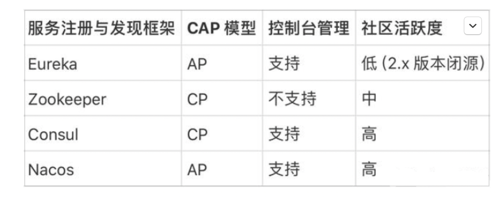


## 18.2.安装并运行Nacos


1. 准备好Java8+Maven环境
2. 先从官网下载Nacos https://github.com/alibaba/nacos/releases 建议跟教程保持一致下载1.1.4版本 https://github.com/alibaba/nacos/releases/tag/1.1.4
3. 解压安装包，直接运行bin目录下的startup.cmd `startup.cmd -m standalone`
4. 命令运行成功后直接访问http://localhost:8848/nacos 默认账号密码都是nacos

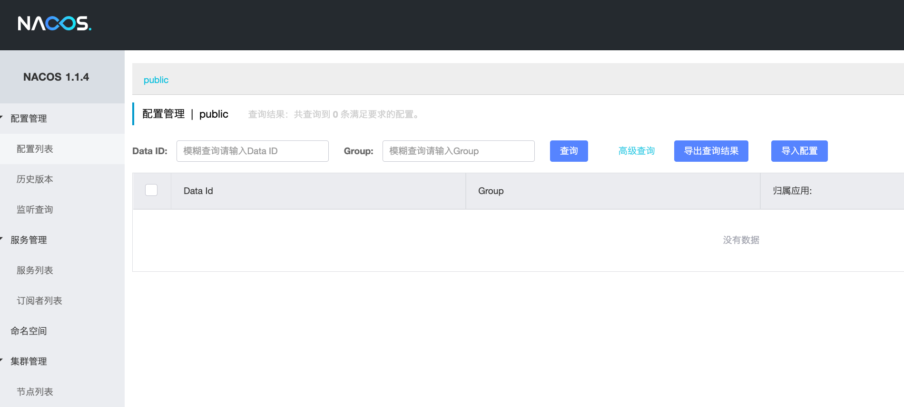


## 18.3.**Nacos作为服务注册中心演示**

官网文档：https://spring-cloud-alibaba-group.github.io/github-pages/greenwich/spring-cloud-alibaba.html#_spring_cloud_alibaba_nacos_config


### 18.3.1.**基于Nacos的服务提供者**

#### 18.3.1.1.新建cloudalibaba-provider-payment9001

略


#### 18.3.1.2.pom

父pom

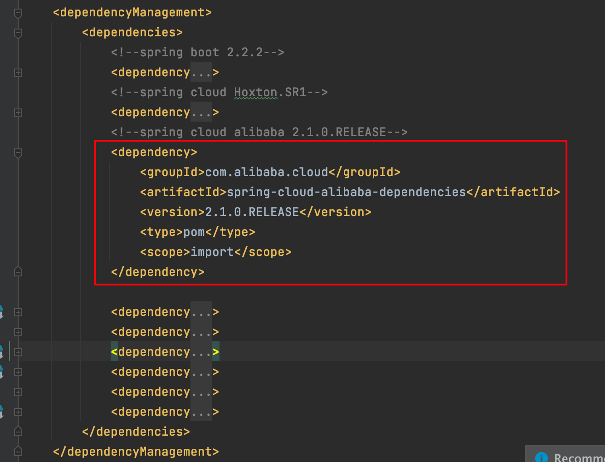


**cloudalibaba-provider-payment9001 pom**

引入spring-cloud-starter-alibaba-nacos-discovery依赖

```xml
<?xml version="1.0" encoding="UTF-8"?>
<project xmlns="http://maven.apache.org/POM/4.0.0"
         xmlns:xsi="http://www.w3.org/2001/XMLSchema-instance"
         xsi:schemaLocation="http://maven.apache.org/POM/4.0.0 http://maven.apache.org/xsd/maven-4.0.0.xsd">
    <parent>
        <artifactId>cloud2020-learn</artifactId>
        <groupId>com.atguigu.springcloud</groupId>
        <version>1.0-SNAPSHOT</version>
    </parent>
    <modelVersion>4.0.0</modelVersion>

    <artifactId>cloudalibaba-provider-payment9001</artifactId>

    <properties>
        <maven.compiler.source>8</maven.compiler.source>
        <maven.compiler.target>8</maven.compiler.target>
    </properties>

    <dependencies>
        <!--SpringCloud ailibaba nacos -->
        <dependency>
            <groupId>com.alibaba.cloud</groupId>
            <artifactId>spring-cloud-starter-alibaba-nacos-discovery</artifactId>
        </dependency>

        <dependency>
            <groupId>org.springframework.boot</groupId>
            <artifactId>spring-boot-starter-web</artifactId>
        </dependency>
        <dependency>
            <groupId>org.springframework.boot</groupId>
            <artifactId>spring-boot-starter-actuator</artifactId>
        </dependency>
        <!--devtools-->
        <dependency>
            <groupId>org.springframework.boot</groupId>
            <artifactId>spring-boot-devtools</artifactId>
            <scope>runtime</scope>
            <optional>true</optional>
        </dependency>
        <dependency>
            <groupId>org.projectlombok</groupId>
            <artifactId>lombok</artifactId>
            <optional>true</optional>
        </dependency>
        <dependency>
            <groupId>org.springframework.boot</groupId>
            <artifactId>spring-boot-starter-test</artifactId>
            <scope>test</scope>
        </dependency>
    </dependencies>
</project>
```


#### 18.3.1.3.yml

```yaml
server:
  port: 9001
spring:
  application:
    name: nacos-payment-provider
  cloud:
    nacos:
      discovery:
        server-addr: localhost:8848 # 配置Nacos地址

# 暴露监控端点
management:
  endpoints:
    web:
      exposure:
        include: "*"
```


#### 18.3.1.4.主启动

```java
package com.atguigu.springcloud.alibaba;

import org.springframework.boot.SpringApplication;
import org.springframework.boot.autoconfigure.SpringBootApplication;
import org.springframework.cloud.client.discovery.EnableDiscoveryClient;

/**
 * @author caojx created on 2022/6/15 2:16 PM
 */
@EnableDiscoveryClient
@SpringBootApplication
public class PaymentMain9001 {

    public static void main(String[] args) {
        SpringApplication.run(PaymentMain9001.class, args);
    }
}

```


#### 18.3.1.5.业务类

```java
package com.atguigu.springcloud.alibaba.controller;

import org.springframework.beans.factory.annotation.Value;
import org.springframework.web.bind.annotation.GetMapping;
import org.springframework.web.bind.annotation.PathVariable;
import org.springframework.web.bind.annotation.RestController;

/**
 * @author caojx created on 2022/6/15 2:23 PM
 */
@RestController
public class PaymentController {

    @Value("${server.port}")
    private String serverPort;

    @GetMapping("/payment/nacos/{id}")
    public String getPayment(@PathVariable("id") Integer id) {
        return "nacos registry, serverPort: " + serverPort + " \t id" + id;
    }
}
```


#### 18.3.1.6.测试

访问：http://localhost:9001/payment/nacos/1 `nacos registry, serverPort: 9001 id1`

nacos 控制台：http://localhost:8848/nacos/#/serviceManagement?dataId=&group=&appName=&namespace=

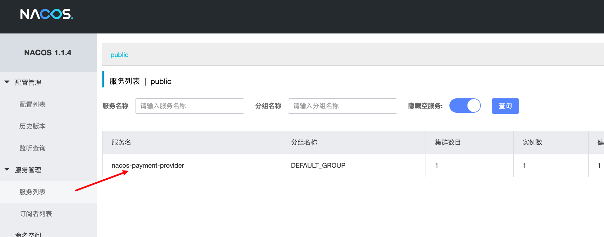


nacos服务注册中心+服务提供者9001都OK了


#### 18.3.1.7.为了演示nacos的负载均衡，参照9001新建9002

新建模块cloudalibaba-provider-payment9002，复制9001相关代码，修改端口为9002，其他的跟9001保持一致


#### 18.3.2.**基于Nacos的服务消费者**

#### 18.3.2.1.新建cloudalibaba-consumer-nacos-order83

略


#### 18.3.2.2.pom

引入了：spring-cloud-starter-alibaba-nacos-discovery 依赖

```xml
<?xml version="1.0" encoding="UTF-8"?>
<project xmlns="http://maven.apache.org/POM/4.0.0"
         xmlns:xsi="http://www.w3.org/2001/XMLSchema-instance"
         xsi:schemaLocation="http://maven.apache.org/POM/4.0.0 http://maven.apache.org/xsd/maven-4.0.0.xsd">
    <parent>
        <artifactId>cloud2020-learn</artifactId>
        <groupId>com.atguigu.springcloud</groupId>
        <version>1.0-SNAPSHOT</version>
    </parent>
    <modelVersion>4.0.0</modelVersion>

    <artifactId>cloudalibaba-consumer-nacos-order83</artifactId>

    <properties>
        <maven.compiler.source>8</maven.compiler.source>
        <maven.compiler.target>8</maven.compiler.target>
    </properties>

    <dependencies>
        <!--SpringCloud ailibaba nacos -->
        <dependency>
            <groupId>com.alibaba.cloud</groupId>
            <artifactId>spring-cloud-starter-alibaba-nacos-discovery</artifactId>
        </dependency>

        <dependency>
            <groupId>org.springframework.boot</groupId>
            <artifactId>spring-boot-starter-web</artifactId>
        </dependency>
        <dependency>
            <groupId>org.springframework.boot</groupId>
            <artifactId>spring-boot-starter-actuator</artifactId>
        </dependency>
        <!--devtools-->
        <dependency>
            <groupId>org.springframework.boot</groupId>
            <artifactId>spring-boot-devtools</artifactId>
            <scope>runtime</scope>
            <optional>true</optional>
        </dependency>
        <dependency>
            <groupId>org.projectlombok</groupId>
            <artifactId>lombok</artifactId>
            <optional>true</optional>
        </dependency>
        <dependency>
            <groupId>org.springframework.boot</groupId>
            <artifactId>spring-boot-starter-test</artifactId>
            <scope>test</scope>
        </dependency>
    </dependencies>
</project>
```


**注意：spring-cloud-starter-alibaba-nacos-discovery 内部引入了ribbon ，nacos可以支持负载均衡**

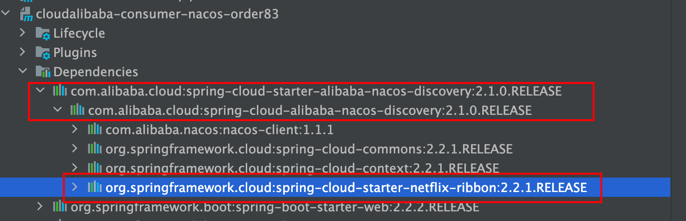

#### 18.3.2.3.yml

```yaml
server:
  port: 83

spring:
  application:
    name: nacos-order-consumer
  cloud:
    nacos:
      discovery:
        server-addr: localhost:8848 # 配置Nacos地址

# 消费者将要去访问的微服务名称 ( 注册成功进 nacos 的微服务提供者 )，这个配置是自定义的配置
service-url:
 nacos-user-service: http://nacos-payment-provider

```


#### 18.3.2.4.主启动

```java
package com.atguigu.springcloud.alibaba;

import org.springframework.boot.SpringApplication;
import org.springframework.boot.autoconfigure.SpringBootApplication;
import org.springframework.cloud.client.discovery.EnableDiscoveryClient;

/**
 * @author caojx created on 2022/6/15 2:30 PM
 */
@SpringBootApplication
@EnableDiscoveryClient
public class OrderNacosMain83 {

    public static void main(String[] args) {
        SpringApplication.run(OrderNacosMain83.class, args);
    }
}

```


#### 18.3.2.5.业务类


ApplicationContextConfig 配置 声明RestTemplate，并支持负载均衡

```java
package com.atguigu.springcloud.alibaba.config;

import org.springframework.cloud.client.loadbalancer.LoadBalanced;
import org.springframework.context.annotation.Bean;
import org.springframework.context.annotation.Configuration;
import org.springframework.web.client.RestTemplate;

/**
 * @author caojx created on 2022/6/15 2:30 PM
 */
@Configuration
public class ApplicationContextConfig {

    @Bean
    @LoadBalanced
    public RestTemplate getRestTemplate() {
        return new RestTemplate();
    }
}
```


OrderNacosController.java

```java
package com.atguigu.springcloud.alibaba.controller;


import lombok.extern.slf4j.Slf4j;
import org.springframework.beans.factory.annotation.Value;
import org.springframework.web.bind.annotation.GetMapping;
import org.springframework.web.bind.annotation.PathVariable;
import org.springframework.web.bind.annotation.RequestMapping;
import org.springframework.web.bind.annotation.RestController;
import org.springframework.web.client.RestTemplate;

import javax.annotation.Resource;

/**
 * @author caojx created on 2022/6/15 2:30 PM
 */
@Slf4j
@RestController
public class OrderNacosController {

    @Resource
    private RestTemplate restTemplate;

    // 读取配置的服务提供者地址
    @Value("${service-url.nacos-user-service}")
    private String serverURL;

    @GetMapping(value = "/consumer/payment/nacos/{id}")
    public String paymentInfo(@PathVariable("id") Long id) {
        return restTemplate.getForObject(serverURL + "/payment/nacos/" + id, String.class);
    }

}
```


#### 18.3.2.6.测试

1. 启动nacos

2. 启动9001、9002

3. 启动83

4. nacos控制台 http://localhost:8848/nacos/#/serviceManagement?dataId=&group=&appName=&namespace=

   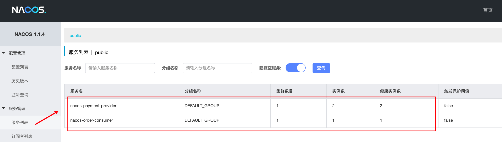

5. 访问 http://localhost:83/consumer/payment/nacos/1  结果 9001、9002 交替出现，即负载均衡


### 18.3.3.**服务注册中心对比**

#### 18.3.3.1.Nacos全景图所示

nacos 可以跟如下这些技术整合，nacos想全景覆盖，所有支持AP和CP切换

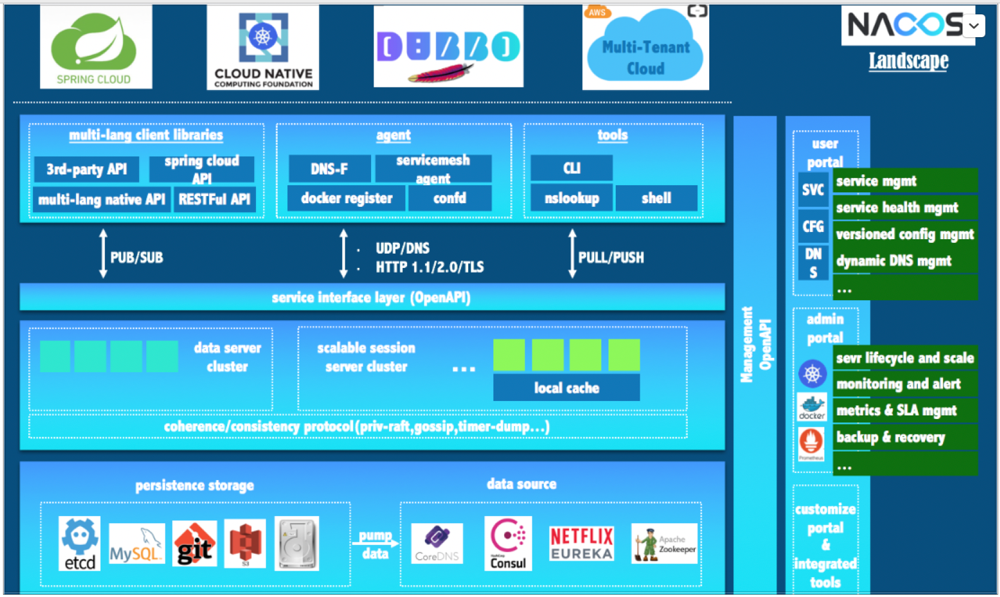


#### 18.3.3.2.Nacos和CAP

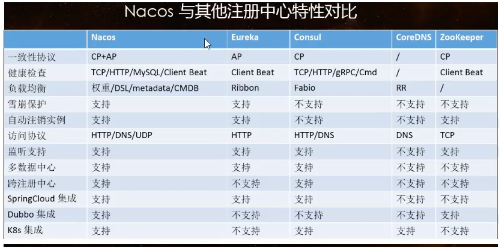


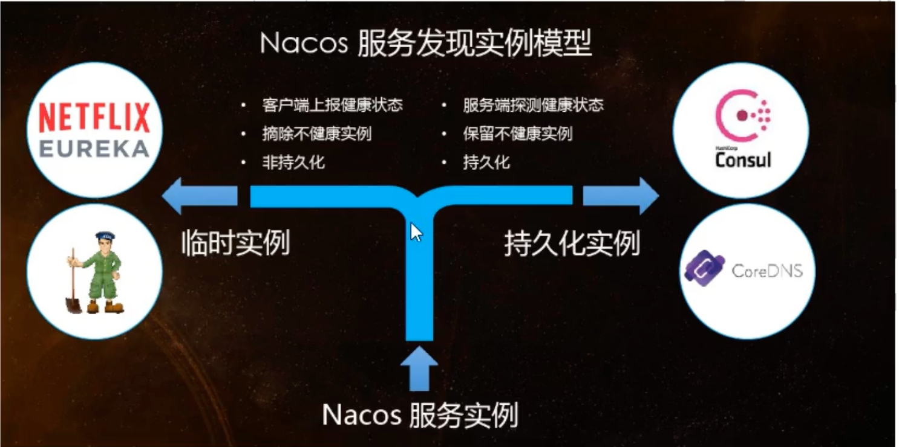


#### 18.3.3.3.Nacos 支持AP和CP模式的切换

<font color=red>C是所有节点在同一时间看到的数据是一致的；而A的定义是所有的请求都会收到响应。 </font>


<font color=blue>何时选择使用何种模式？ </font>

一般来说，

推荐AP模式：

>  如果不需要存储服务级别的信息且服务实例是通过nacos-client注册，并能够保持心跳上报，那么就可以选择AP模式。当前主流的服务如 Spring cloud 和 Dubbo 服务，都适用于AP模式，AP模式为了服务的可能性而减弱了一致性，因此AP模式下只支持注册临时实例。


推荐CP模式：

>  如果需要在服务级别编辑或者存储配置信息，那么 CP 是必须，K8S服务和DNS服务则适用于CP模式。
>
> CP模式下则支持注册持久化实例，此时则是以 Raft 协议为集群运行模式，该模式下注册实例之前必须先注册服务，如果服务不存在，则会返回错误。


**NACOS切换模式**

`curl -X PUT '$NACOS_SERVER:8848/nacos/v1/ns/operator/switches?entry=serverMode&value=CP'`


## 18.4.**Nacos作为服务配置中心演示**

官网文档：https://spring-cloud-alibaba-group.github.io/github-pages/greenwich/spring-cloud-alibaba.html#_spring_cloud_alibaba_nacos_config


以前我们使用SpringCloudConfg + SpringCloudBus 整合实现了配置中心的功能，现在我们使用nacos作为配置中心演示


### 18.4.1.**Nacos作为配置中心-基础配置**


#### 18.4.1.1.cloudalibaba-config-nacos-client3377 模块

##### 18.4.1.1.1.新建cloudalibaba-config-nacos-client3377 模块

略

##### 18.4.1.1.2.pom

```xml
<?xml version="1.0" encoding="UTF-8"?>
<project xmlns="http://maven.apache.org/POM/4.0.0"
         xmlns:xsi="http://www.w3.org/2001/XMLSchema-instance"
         xsi:schemaLocation="http://maven.apache.org/POM/4.0.0 http://maven.apache.org/xsd/maven-4.0.0.xsd">
    <parent>
        <artifactId>cloud2020-learn</artifactId>
        <groupId>com.atguigu.springcloud</groupId>
        <version>1.0-SNAPSHOT</version>
    </parent>
    <modelVersion>4.0.0</modelVersion>

    <artifactId>cloudalibaba-config-nacos-client3377</artifactId>

    <properties>
        <maven.compiler.source>8</maven.compiler.source>
        <maven.compiler.target>8</maven.compiler.target>
    </properties>

    <dependencies>
        <!--SpringCloud ailibaba nacos -->
        <dependency>
            <groupId>com.alibaba.cloud</groupId>
            <artifactId>spring-cloud-starter-alibaba-nacos-config</artifactId>
        </dependency>

        <dependency>
            <groupId>com.alibaba.cloud</groupId>
            <artifactId>spring-cloud-starter-alibaba-nacos-discovery</artifactId>
        </dependency>

        <dependency>
            <groupId>org.springframework.boot</groupId>
            <artifactId>spring-boot-starter-web</artifactId>
        </dependency>
        <dependency>
            <groupId>org.springframework.boot</groupId>
            <artifactId>spring-boot-starter-actuator</artifactId>
        </dependency>
        <!--devtools-->
        <dependency>
            <groupId>org.springframework.boot</groupId>
            <artifactId>spring-boot-devtools</artifactId>
            <scope>runtime</scope>
            <optional>true</optional>
        </dependency>
        <dependency>
            <groupId>org.projectlombok</groupId>
            <artifactId>lombok</artifactId>
            <optional>true</optional>
        </dependency>
        <dependency>
            <groupId>org.springframework.boot</groupId>
            <artifactId>spring-boot-starter-test</artifactId>
            <scope>test</scope>
        </dependency>
    </dependencies>
</project>

```


##### 18.4.1.1.3.yml

需要配置bootstrap.yml配置文件和application.yml配置文件

>  Nacos同springcloud-config一样，在项目初始化时，要保证先从配置中心进行配置拉取， 拉取配置之后，才能保证项目的正常启动。
>
> springboot中配置文件的加载是存在优先级顺序的， bootstrap优先级高于applicatio


bootstrap.yml

```yaml
server:
  port: 3377
spring:
  application:
    name: nacos-config-client
    
  cloud:
    nacos:
      discovery:
        server-addr: localhost:8848  # Nacos服务注册中心地址
      config:
        server-addr: localhost:8848 # Nacos服务配置中心地址
        file-extension: yaml # 指定yaml格式的配置

# ${spring.application.name}-${spring.profile.active}.${spring.cloud.nacos.config.file-extension}

```


application.yml

```yaml
spring:
  profiles:
    active: dev # 表示开发环境

```


##### 18.4.1.1.4.主启动

```java
package com.atguigu.springcloud.alibaba;

import org.springframework.boot.SpringApplication;
import org.springframework.boot.autoconfigure.SpringBootApplication;
import org.springframework.cloud.client.discovery.EnableDiscoveryClient;

/**
 * @author caojx created on 2022/6/15 5:24 PM
 */
@SpringBootApplication
@EnableDiscoveryClient
public class NacosConfigClientMain3377 {

    public static void main(String[] args) {
        SpringApplication.run(NacosConfigClientMain3377.class,args);
    }
}

```


##### 18.4.1.1.5.业务类

```java
package com.atguigu.springcloud.alibaba.controller;

import org.springframework.beans.factory.annotation.Value;
import org.springframework.cloud.context.config.annotation.RefreshScope;
import org.springframework.web.bind.annotation.GetMapping;
import org.springframework.web.bind.annotation.RestController;

/**
 * @author caojx created on 2022/6/15 5:24 PM
 */
@RestController
@RefreshScope // 在控制器类加入 @RefreshScope 注解使当前类下的配置支持 Nacos 的动态刷新功能。
public class ConfigClientController {

    @Value("${config.info:}")
    private String configInfo;

    @GetMapping("/config/info")
    public String getConfigInfo() {
        return configInfo;
    }
}

```


#### 18.4.1.2.在在Nacos中添加配置信息

##### 18.4.1.2.1.Nacos中的匹配规则理论

Nacos中的dataid的组成格式及与SpringBoot配置文件中的匹配规则

官网：https://nacos.io/zh-cn/docs/quick-start-spring-cloud.html

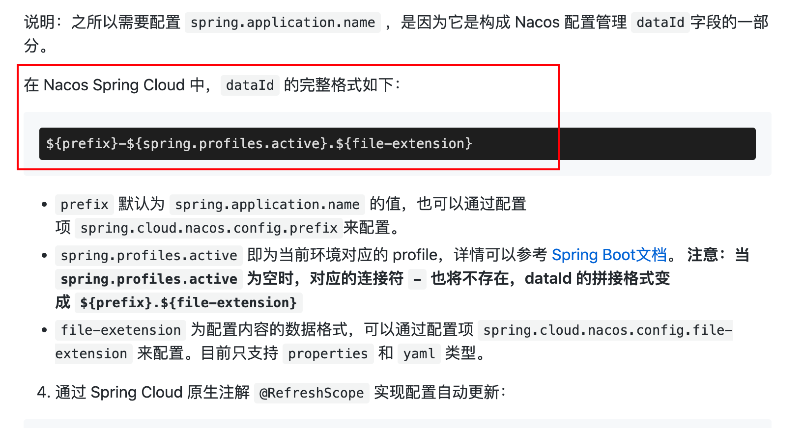

<font color=red>**即dataId公式为**：</font>

```yaml
${spring.application.name}-${spring.profiles.active}.${spring.cloud.nacos.config.file-extension} 
```


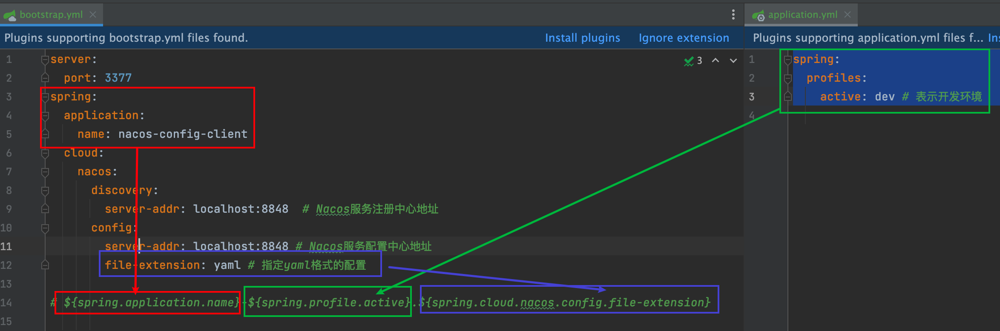


##### 18.4.1.2.1.Nacos中的匹配规则实操

1. nacos新增配置 nacos-config-client-dev.yaml

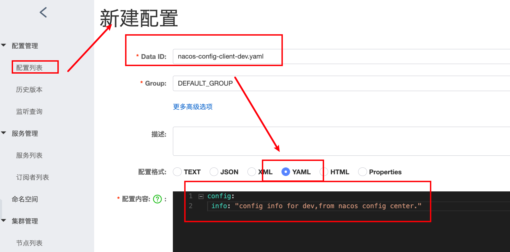


2. nacos 历史版本

Nacos会记录配置文件的历史版本默认保留30天，此外还有一键回滚功能，回滚操作将会触发配置更新

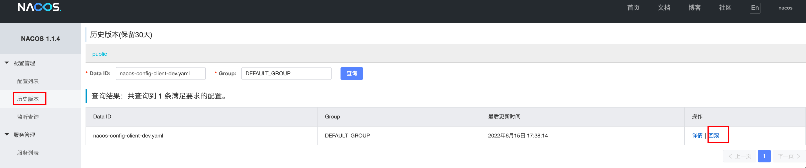


#### 18.4.1.3.测试

1. 启动前需要在nacos客户端-配置管理-配置管理栏目下有对应的yaml配置文件（nacos-config-client-dev.yaml）

2. 运行cloud-config-nacos-client3377的主启动类

3. 调用接口查看配置信息 http://localhost:3377/config/info  成功获得配置信息

4. 修改下Nacos中的yaml配置文件，再次调用查看配置的接口，就会发现配置已经刷新

   ```json
   config:
    info: "config info for dev,from nacos config center. version=3"
   ```


### 18.4.2.**Nacos作为配置中心-分类配置**


#### 18.4.2.1.先来看问题

**问题1：**

实际开发中，通常一个系统会准备

dev开发环境 、test测试环境 、prod生产环境。

如何保证指定环境启动时服务能正确读取到Nacos上相应环境的配置文件呢？


**问题2：**

一个大型分布式微服务系统会有很多微服务子项目，

每个微服务项目又都会有相应的开发环境、测试环境、预发环境、正式环境......

那怎么对这些微服务配置进行管理呢？


即多服务，每个服务多环境怎么管理？


#### 18.4.2.2. 看一下Nacos的图形化管理界面

命名空间

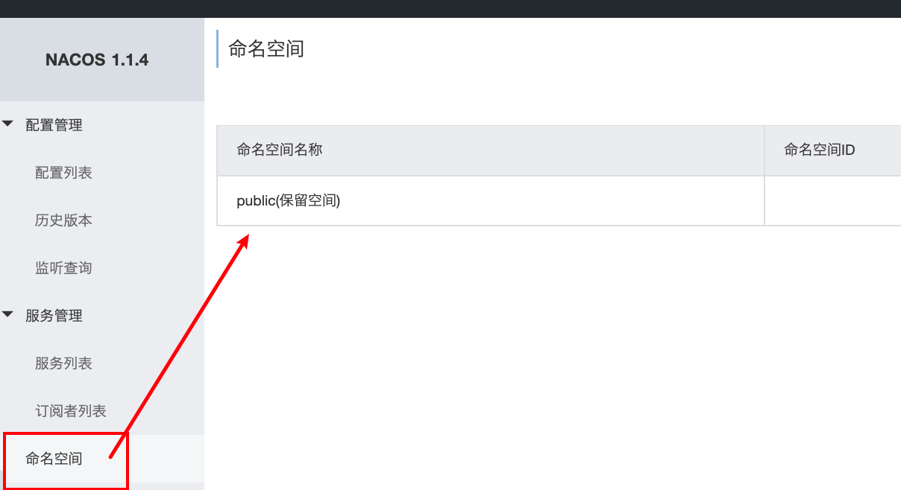


配置管理

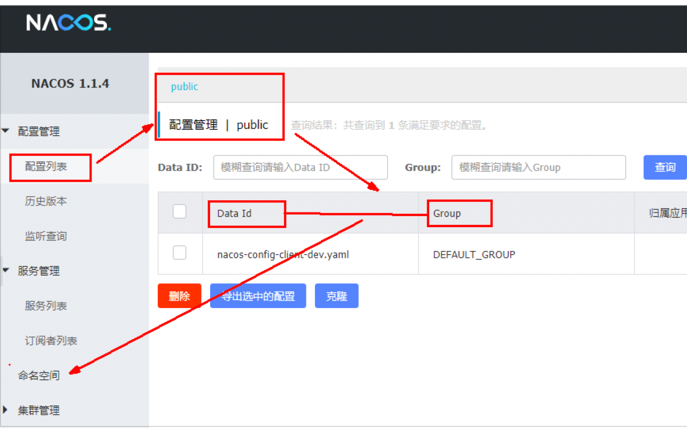


#### 18.4.2.3.Namespace+Group+Data ID三者关系？为什么这么设计？

1. **是什么**

类似Java里面的package名和类名

最外层的namespace是可以用于区分部署环境的，Group和DataID逻辑上区分两个目标对象。


2. **三者情况**

   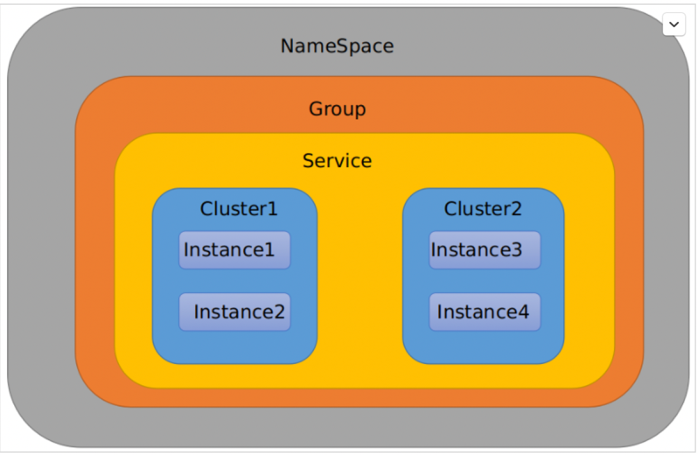


<font color=blue>默认情况： </font>

<font color=blue>Namespace=public，Group=DEFAULT_GROUP, 默认Cluster是DEFAULT </font>


Nacos默认的命名空间是public，Namespace主要用来实现隔离。

比方说我们现在有三个环境：开发、测试、生产环境，我们就可以创建三个Namespace，不同的Namespace之间是隔离的。


Group默认是DEFAULT_GROUP，Group可以把不同的微服务划分到同一个分组里面去


Service就是微服务；一个Service可以包含多个Cluster（集群），Nacos默认Cluster是DEFAULT，Cluster是对指定微服务的一个虚拟划分。

比方说为了容灾，将Service微服务分别部署在了杭州机房和广州机房，

这时就可以给杭州机房的Service微服务起一个集群名称（HZ），

给广州机房的Service微服务起一个集群名称（GZ），还可以尽量让同一个机房的微服务互相调用，以提升性能。


最后是Instance，就是微服务的实例。


### 18.4.3.案例case-DataID方案

**实现目标：指定spring.profile.active和配置文件的DataID来使不同环境下读取不同的配置**

默认空间+默认分组+新建dev和test两个DataID

1. 新建dev配置DataID

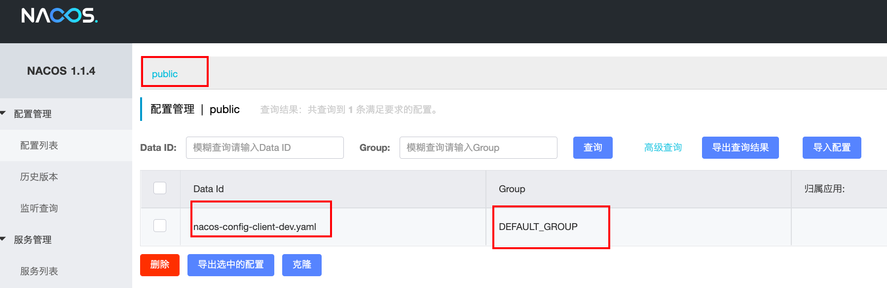


2. 新建test配置DataID

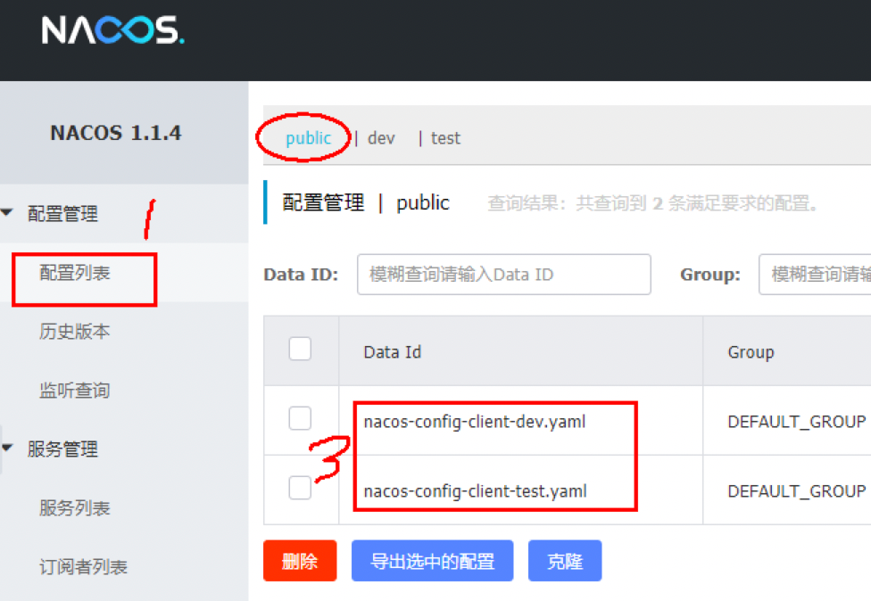


3. 通过spring.profile.active属性就能进行多环境下配置文件的读取

   访问：http://localhost:3377/config/info 配置是什么就加载什么

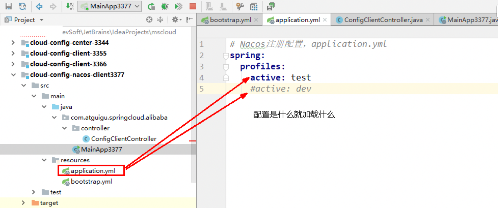


### 18.4.4.案例case-Group方案

实现目标：通过Group实现环境区分


1. 新建group  DEV_GROUP、TEST_GROUP

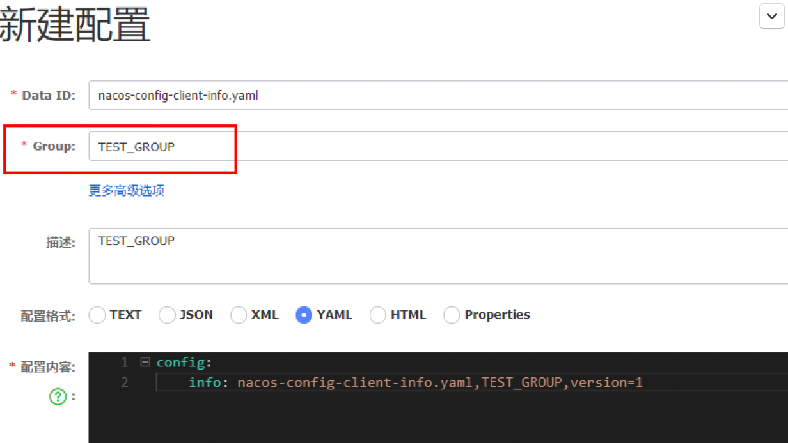


nacos-config-client-info.yaml DEV_GROUP

```yaml
config: 
  info: nacos-config-client-info.yaml, DEV_GROUP
```


nacos-config-client-info.yaml TEST_GROUP

```yaml
config: 
  info: nacos-config-client-info.yaml, TEST_GROUP
```


2.在nacos图形界面控制台上面新建配置文件DataID

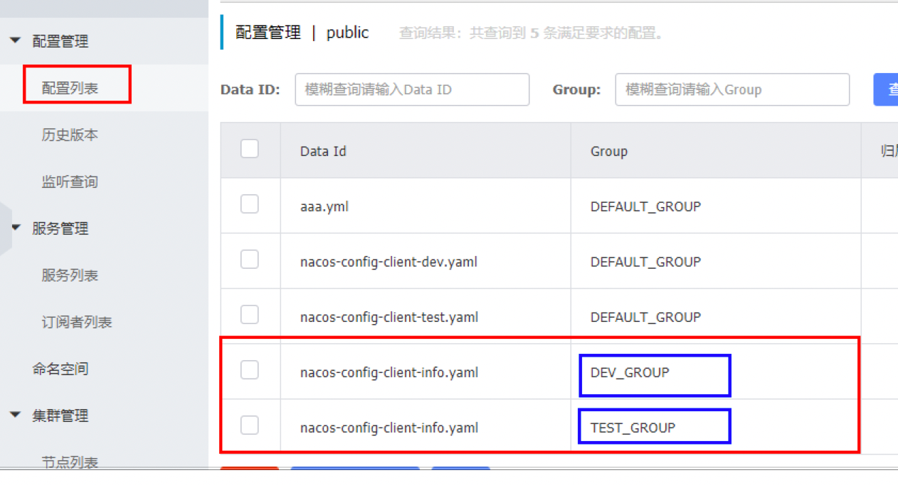


3.调整 bootstrap+application

在config下增加一条group的配置即可，可配置为DEV_GROUP或TEST_GROUP，group指定是什么就读取什么group的配置

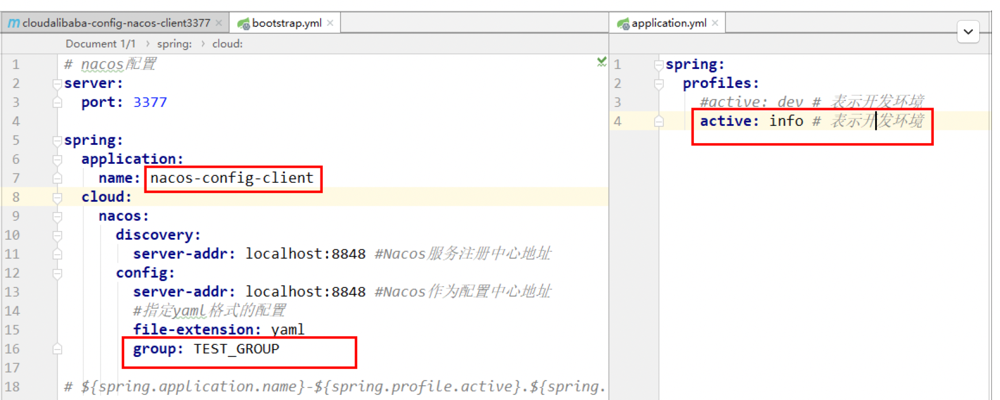


### 18.4.5.案例case-Namespace方案

目前：通过切换命名空间，实现环境切换


1. 新建dev/test命名空间，注意命名空间id

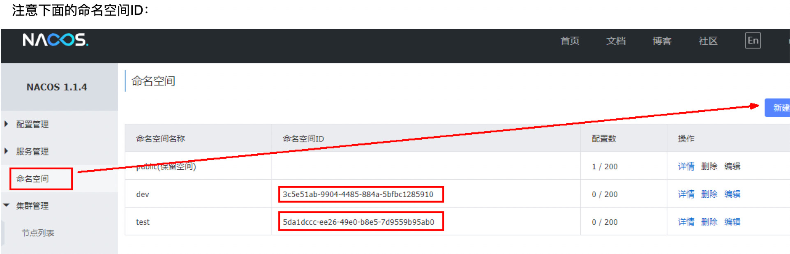

2. 回到服务管理-服务列表查看，多了dev、test命名空间

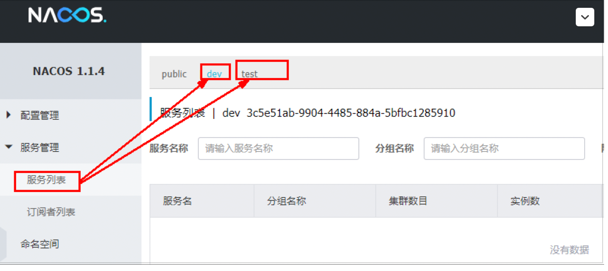

2. 按照命名空间新建各项配置文件

   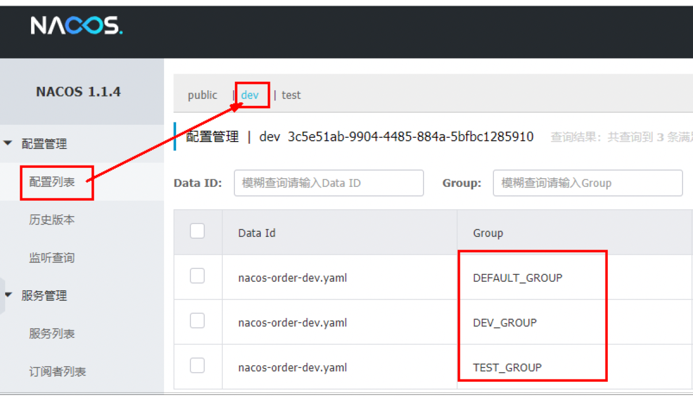

3. yml

   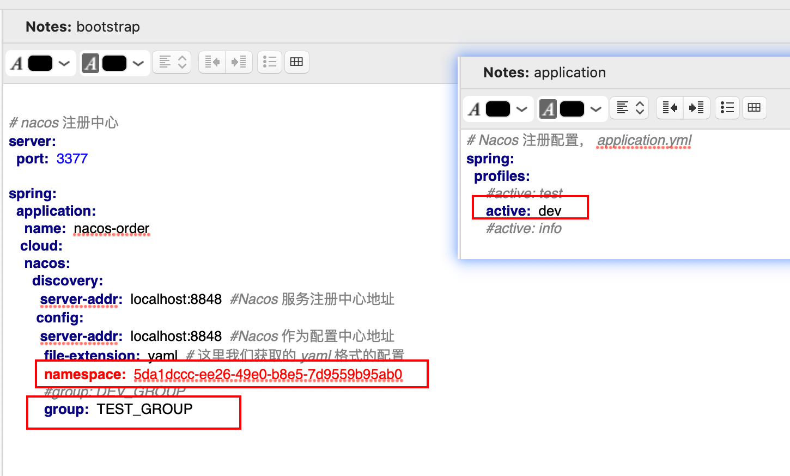


测试：http://localhost:3377/config/info  会读取对应 namespace，group、activite 配置


## 18.5.**Nacos集群和持久化配置（重要）**


### 18.5.1.官网说明

https://nacos.io/zh-cn/docs/cluster-mode-quick-start.html

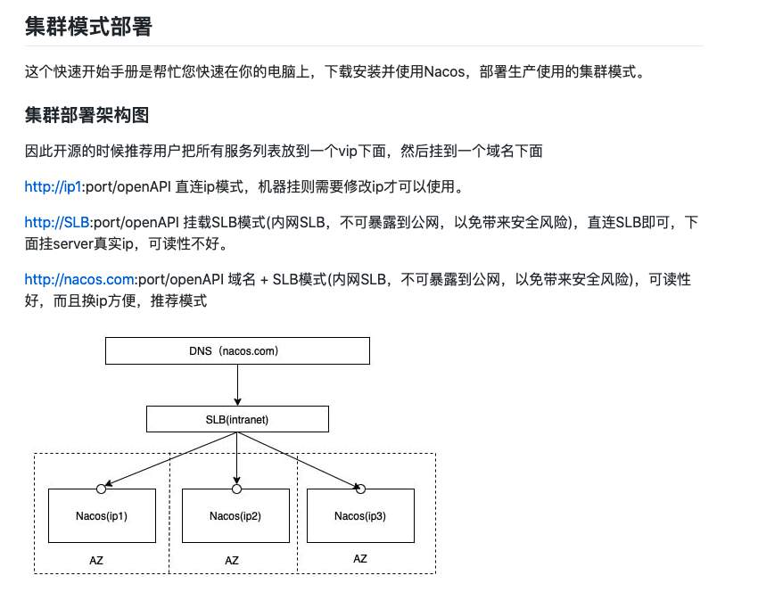


上图翻译过来，说人话

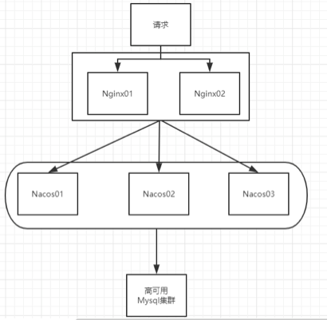


默认Nacos使用嵌入式数据库实现数据的存储。所以，如果启动多个默认配置下的Nacos节点，数据存储是存在一致性问题的。

为了解决这个问题，Nacos采用了<font color=red>集中式存储的方式来支持集群化部署，目前只支持MySQL的存储。</font>


**Nacos支持三种部署模式**

https://nacos.io/zh-cn/docs/deployment.html


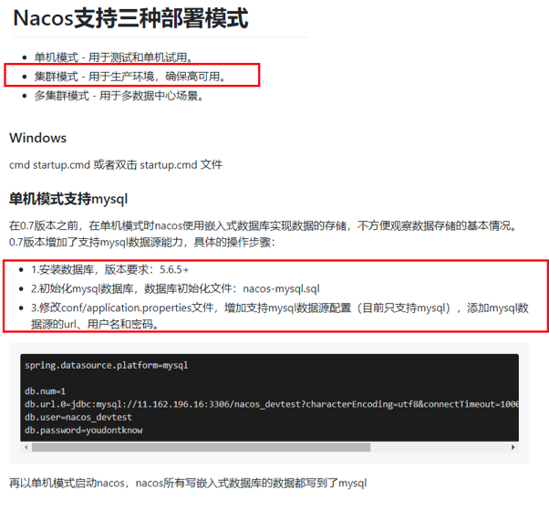


### 18.5.2.Nacos 持久化配置

Nacos默认自带的是嵌入式数据库derby：https://github.com/alibaba/nacos/blob/develop/config/pom.xml

如果nacos需要持久化，必须使用mysql

derby到mysql切换配置步骤，使用Mysql进行持久化

1. nacos-server-1.1.4\nacos\conf目录下找到sql脚本 nacos-mysql.sql 并执行，执行到nacos_config数据库中

2. nacos-server-1.1.4\nacos\conf目录下找到application.properties 添加mysql配置

   参考：https://github.com/alibaba/nacos/blob/master/distribution/conf/application.properties

   ```properties
   spring.datasource.platform=mysql
   
   db.num=1
   db.url.0=jdbc:mysql://127.0.0.1:3306/nacos_config?characterEncoding=utf8&connectTimeout=1000&socketTimeout=3000&autoReconnect=true
   db.user=root
   db.password=root
   ```

3. 启动Nacos，可以看到是个全新的空记录界面，以前是记录进derby


<font color=red>注意：nacos-server-1.1.4 默认不支持mysql8.0 ，可以在nacos下创建plugins/mysql 目录 把mysql-connector-java-8.0.22.jar 驱动包放到这个目录下即可</font>


### 18.5.3.Linux版Nacos+MySQL生产环境配置

搭建：1个Nginx+3个nacos注册中心+1个mysql  nacos集群


1. 下载nacos https://github.com/alibaba/nacos/releases/tag/1.1.4 解压

2. 执行nacos-myql.sql sql语句，创建nacos需要的表

3. 修改nacos的 application.properties，配置mysql

   参考：https://github.com/alibaba/nacos/blob/master/distribution/conf/application.properties

   ```properties
   spring.datasource.platform=mysql
   
   db.num=1
   db.url.0=jdbc:mysql://127.0.0.1:3306/nacos_config?characterEncoding=utf8&connectTimeout=1000&socketTimeout=3000&autoReconnect=true
   db.user=root
   db.password=root
   ```

4. nacos集群配置：cluster.conf.example 复制为 cluster.conf ， 请每行配置成ip:port 并配置3台nacos集器的不同服务端口号

   这个IP不能写127.0.0.1，必须是Linux命令hostname -i能够识别的IP

   ```shell
   [root@centos-linux ~]# hostname -i
   192.168.1.7
   ```


编辑cluster.conf

```shell
#ip:port
192.168.1.7:3333
192.168.1.7:4444
192.168.1.7:5555
```

5. 编辑Nacos的启动脚本startup.sh，使它能够接受不同的启动端口（这一步更快的方式是复制3份nacos，直接修改application.properties 启动端口会更快）

   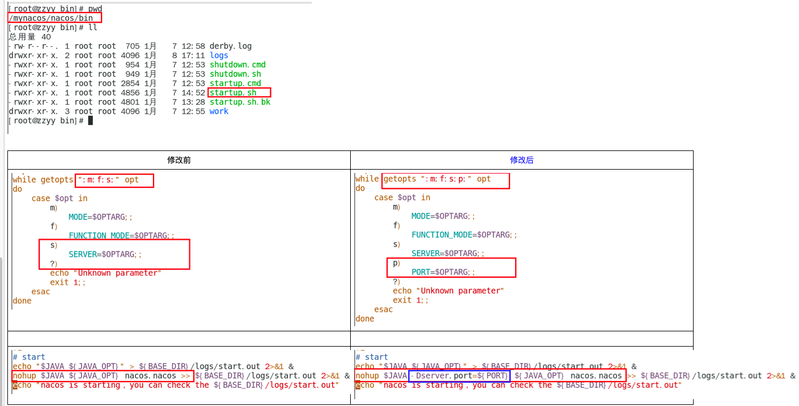

6. 启动3个nacos实例

   ```shell
   ./startup.sh -p 3333
   ./startup.sh -p 4444
   ./startup.sh -p 4444
   
   nacos is starting with cluster
   nacos is starting，you can check the /Users/caojx/Downloads/nacos/logs/start.out
   ```

启动后可以正常访问

http://192.168.1.7:3333/nacos/index.html

http://192.168.1.7:4444/nacos/index.html

http://192.168.1.7:5555/nacos/index.html


6. Nginx的配置，由它作为负载均衡器，nginx.conf

```conf
upstream cluster { # nacos 服务列表
    server 192.168.1.7:3333; 
    server 192.168.1.7:4444; 
    server 192.168.1.7:5555; 
} 

server {
        listen       1111;  # nginx 监听端口
        server_name  localhost; 
        #charset koi8-r; 
        #access_log  logs/host.access.log  main; 
        location / { 
            #root   html; 
            #index  index.html index.htm;
            proxy_pass http://cluster;  # 代理转发
        } 
.......省略 
```

5. 启动nginx `nginx -c /usr/local/etc/nginx/nginx.conf`

6. 截止到此处，1个Nginx+3个nacos注册中心+1个mysql

   测试通过nginx访问nacos：http://192.168.1.7:1111/nacos/#/login

   新建一个配置测试

   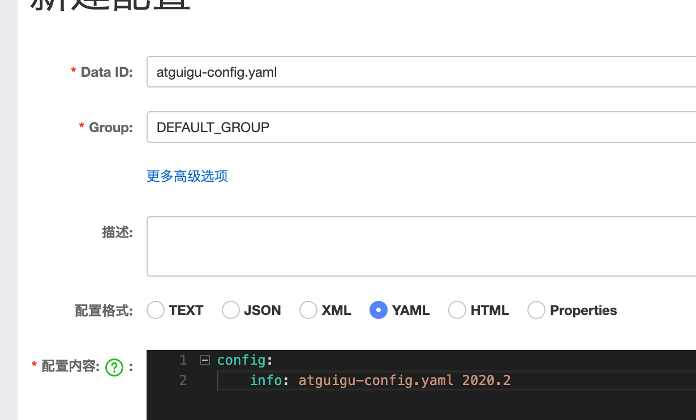


发现linux服务器的mysql插入一条记录

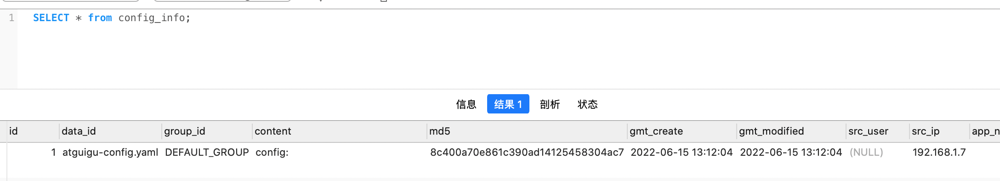


### 18.5.4.微服务cloudalibaba-provider-payment9002启动注册进nacos集群

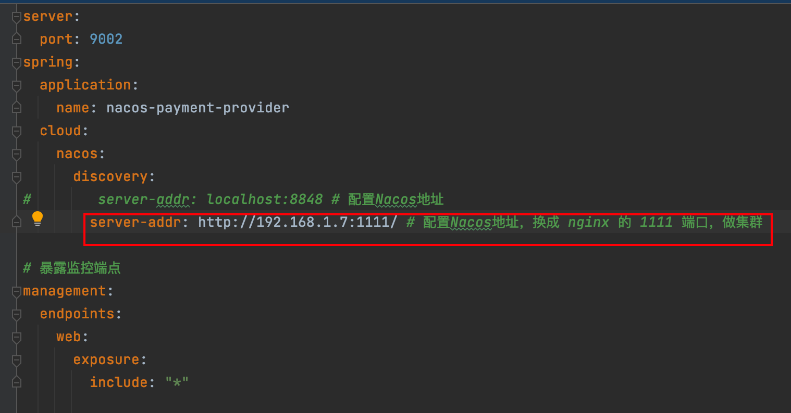


发现服务成功注册到nacos集群

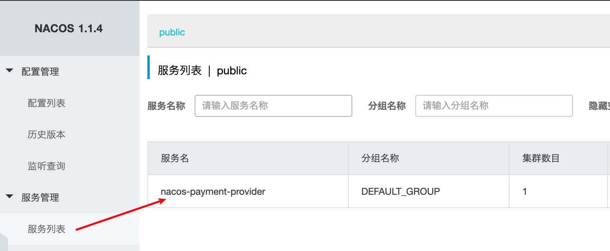


### 18.5.5.总结（我们搭建了一套nacos 集群）

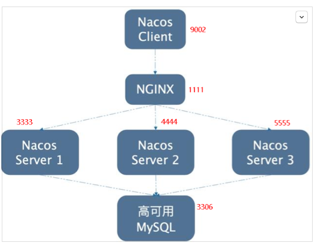

