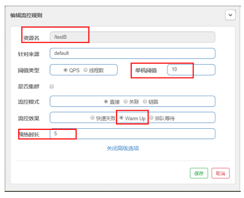
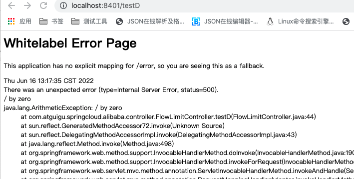
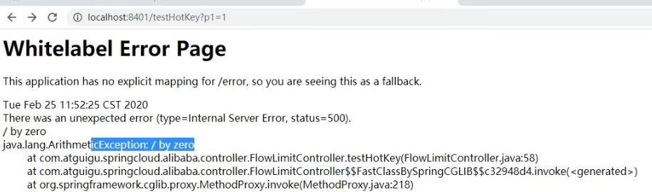
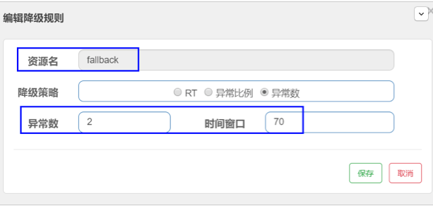

# 19.SpringCloud Alibaba Sentinel实现熔断与限流

官网：https://github.com/alibaba/Sentinel

中文官网：https://github.com/alibaba/Sentinel/wiki/%E4%BB%8B%E7%BB%8D


## 19.1.Sentinel

Sentinel 就是一套阿里版的Hystrix

之前使用Hystrix，需要做如下工作，使用起来比较麻烦

1. 需要我们程序员自己手工搭建监控平台
2. 没有一套wb界面可以给我们进行更加细粒度化得配置流控、速率控制、服务熔断、服务降级。。。。。。


**Sentinel**

1. 不需要我们去搭建，直接提供了一个单独的组件
2. 直接界面化的细粒度统一配置，不需要大规模的把配置写在代码中


**是什么？**


**去哪下载？**

跟教程保持一致，先下载1.7.0版本：https://github.com/alibaba/Sentinel/releases


**能干嘛？**


**怎么玩？**

https://spring-cloud-alibaba-group.github.io/github-pages/greenwich/spring-cloud-alibaba.html#_spring_cloud_alibaba_sentinel

有了sentinel 我们可以处理服务使用中的各种问题

- 服务雪崩
- 服务降级
- 服务熔断
- 服务限流


## 19.2.安装Sentinel控制台

Sentinel 分为两个部分:

- 核心库（Java 客户端）不依赖任何框架/库，能够运行于所有 Java 运行时环境，同时对 Dubbo / Spring Cloud 等框架也有较好的支持。
- 控制台（Dashboard）基于 Spring Boot 开发，打包后可以直接运行，不需要额外的 Tomcat 等应用容器。

Sentinel 社区官方网站：https://sentinelguard.io/


**Sentinel控制台安装步骤：**

1. 下载到sentinel-dashboard-1.7.0.jar到本地 https://github.com/alibaba/Sentinel/releases
2. 启动java -jar sentinel-dashboard-1.7.0.jar
3. 访问sentinel管理界面 http://localhost:8080  登录账号密码均为sentinel


## 19.3.初始化演示工程

前提：

启动好nacos环境 http://localhost:8848/nacos/#/login

启动好sentinel：http://localhost:8080 


### 19.3.1.cloudalibaba-sentinel-service8401模块

#### 19.3.1.1.新建cloudalibaba-sentinel-service8401模块

略

#### 19.3.1.2.pom

```xml
<?xml version="1.0" encoding="UTF-8"?>
<project xmlns="http://maven.apache.org/POM/4.0.0"
         xmlns:xsi="http://www.w3.org/2001/XMLSchema-instance"
         xsi:schemaLocation="http://maven.apache.org/POM/4.0.0 http://maven.apache.org/xsd/maven-4.0.0.xsd">
    <parent>
        <artifactId>cloud2020-learn</artifactId>
        <groupId>com.atguigu.springcloud</groupId>
        <version>1.0-SNAPSHOT</version>
    </parent>
    <modelVersion>4.0.0</modelVersion>

    <artifactId>cloudalibaba-sentinel-service8401</artifactId>

    <properties>
        <maven.compiler.source>8</maven.compiler.source>
        <maven.compiler.target>8</maven.compiler.target>
    </properties>

    <dependencies>

        <!--SpringCloud ailibaba sentinel -->
        <dependency>
            <groupId>com.alibaba.cloud</groupId>
            <artifactId>spring-cloud-starter-alibaba-sentinel</artifactId>
        </dependency>

        <!--SpringCloud ailibaba sentinel-datasource-nacos 后续做持久化用到 -->
        <dependency>
            <groupId>com.alibaba.csp</groupId>
            <artifactId>sentinel-datasource-nacos</artifactId>
        </dependency>

        <!--SpringCloud ailibaba nacos -->
        <dependency>
            <groupId>com.alibaba.cloud</groupId>
            <artifactId>spring-cloud-starter-alibaba-nacos-discovery</artifactId>
        </dependency>

        <dependency>
            <groupId>org.springframework.boot</groupId>
            <artifactId>spring-boot-starter-web</artifactId>
        </dependency>
        <dependency>
            <groupId>org.springframework.boot</groupId>
            <artifactId>spring-boot-starter-actuator</artifactId>
        </dependency>
        <!--devtools-->
        <dependency>
            <groupId>org.springframework.boot</groupId>
            <artifactId>spring-boot-devtools</artifactId>
            <scope>runtime</scope>
            <optional>true</optional>
        </dependency>
        <dependency>
            <groupId>org.projectlombok</groupId>
            <artifactId>lombok</artifactId>
            <optional>true</optional>
        </dependency>
        <dependency>
            <groupId>org.springframework.boot</groupId>
            <artifactId>spring-boot-starter-test</artifactId>
            <scope>test</scope>
        </dependency>
    </dependencies>

</project>

```


#### 19.3.1.3.yml

```yml
server:
  port: 8401

spring:
  application:
    name: cloudalibaba-sentinel-service
  cloud:
    nacos:
      discovery:
        server-addr: localhost:8848 #Nacos 服务注册中心地址
    sentinel:
      transport:
        dashboard: localhost:8080 # 配置 Sentinel dashboard 地址
        port: 8719  # 默认 8719 端口，假如被占用会自动从 8719 开始依次 +1 扫描 , 直至找到未被占用的端口

management:
  endpoints:
    web:
      exposure:
        include: '*'
```


#### 19.3.1.4.主启动类

```java
package com.atguigu.springcloud.alibaba;

import org.springframework.boot.SpringApplication;
import org.springframework.boot.autoconfigure.SpringBootApplication;
import org.springframework.cloud.client.discovery.EnableDiscoveryClient;

/**
 * @author caojx created on 2022/6/15 9:38 PM
 */
@SpringBootApplication
@EnableDiscoveryClient
public class MainApp8401 {

    public static void main(String[] args) {
        SpringApplication.run(MainApp8401.class, args);
    }
}

```


#### 19.3.1.5.业务类

```java
package com.atguigu.springcloud.alibaba.controller;

import org.springframework.web.bind.annotation.GetMapping;
import org.springframework.web.bind.annotation.RestController;

/**
 * @author caojx created on 2022/6/15 9:40 PM
 */
@RestController
public class FlowLimitController {

    @GetMapping("/testA")
    public String testA() {
        return "------testA";
    }

    @GetMapping("/testB")
    public String testB() {
        return "------testB";
    }
}

```


### 19.3.2.测试验证

1. 启动8401微服务后查看sentienl控制台，空空如也，啥都没有


2. Sentinel采用的懒加载说明，执行一次访问即可

   访问 ：http://localhost:8401/testA

   http://localhost:8401/testB

   sentinel8080正在监控微服务8401


## 19.4**流控规则**


### 19.4.1.基本介绍


**解释说明：**

- 资源名：唯一名称，默认请求路径

- 针对来源：Sentinel可以针对调用者进行限流，填写微服务名，默认default(不区分来源)

- 阈值类型/单机阈值：

  -  QPS(每秒钟的请求数量)：当调用该pi的QPS达到阈值的时候，进行限流 

  - 线程数：当调用该api的线程数达到阈值的时候，进行限流


- 是足否集群：不需要集群
- 流控模式：

  - 直接：ap达到限流条件时，直接限流

  - 关联：当关联的资源达到阔值时，就限流自己

  - 链路：只记录指定链路上的流量（指定资源从入口资源进来的流量，如果达到调值，就进行限流）【p级别的针对来源】


- 流控效果：

  - 快速失败：直接失败，抛异常

  - Warm Up：根据codeFactor(冷加载因子，默认3)的值，从阈值/codeFactor，经过预热时长，才达到设置的QPS阔值

  - 排队等待：匀速队，让请求以匀速的速度通过，阔值类型必须设置为QPS，否则无效


### 19.4.2.流控模式


#### 19.4.2.1.直接（默认）的流控模式

直接流控模式效果：直接->快速失败


案例：

1. 设置效果：表示1秒钟内查询（QPS）1次就是OK，若超过次数1，就直接-快速失败，报默认错误 


2. 测试：快速点击访问：http://localhost:8401/testA，提示：Blocked by Sentinel (flow limiting)


**思考：直接调用默认报错信息，技术方面OK，but,是否应该有我们自己的后续处理，比如：类似有个fallback的兜底方法？**


案例：线程数超过1，限流

配置


为了实现线程数超过1，testA每次都暂停一会

```java
    @GetMapping("/testA")
    public String testA() {
        // 暂停毫秒
        try{
            TimeUnit.MILLISECONDS.sleep(800);
        }catch (InterruptedException e){
            e.printStackTrace();
        }
        return "------testA";
    }
```


使用jemter对testA进行压测


浏览器访问：http://localhost:8401/testA  提示：Blocked by Sentinel (flow limiting)


#### 19.4.2.2.关联的流控模式

**什么是关联的流控模式?**

>  当关联的资源达到阈值时，就限流自己，
>
>  当与A关联的资源B达到阀值后，就限流A自己
>
>  B惹事，A挂了


案例：

1. 配置A：当关联资源/testB的qps阀值超过1时，就限流/testA的Rest访问地址，即<font color=red>当关联资源到阈值后限制配置好的资源名 </font>


2. 使用postman对testB进行大规模高并发访问


3. 运行后发现testA挂了，访问：http://localhost:8401/testA  提示：Blocked by Sentinel (flow limiting)


#### 19.4.2.3.链路的流控模式

多个请求调用了同一个微服务，怎么做，自己根据官网文档探索吧


### 19.4.3.流控效果

#### 19.4.3.1.直接

效果：直接->快速失败(默认的流控处理)，直接失败，抛出异常：Blocked by Sentinel (flow limiting)

相关源码：com.alibaba.csp.sentinel.slots.block.flow.controller.DefaultController


#### 19.4.3.2.预热

应用场景：如，秒杀系统在开启的瞬间，会有很多流量上来，很有可能把系统打死，预热方式就是把为了保护系统，可慢慢的把流量放进来，慢慢的把阀值增长到设置的阀值。 


**知识说明:**

说明：公式：阈值除以coldFactor(默认值为3),经过预热时长后才会达到阈值

			默认coldFactor为3，即请求 QPS 从 threshold / 3 开始，经预热时长逐渐升至设定的 QPS 阈值。


官网说明：https://github.com/alibaba/Sentinel/wiki/%E6%B5%81%E9%87%8F%E6%8E%A7%E5%88%B6


限流 冷启动的官方解释：https://github.com/alibaba/Sentinel/wiki/%E9%99%90%E6%B5%81---%E5%86%B7%E5%90%AF%E5%8A%A8


相关源码：com.alibaba.csp.sentinel.slots.block.flow.controller.WarmUpController


**WarmUp配置案例**

默认 coldFactor（冷加载因子） 为 3，即请求QPS从(threshold【阈值】 / 3【冷加载因子】) 开始，经多少预热时长才逐渐升至设定的 QPS 阈值。 

该案例配置说明，阀值为10+预热时长设置5秒。系统初始化的阀值为10 / 3 约等于3，即阀值刚开始为3；然后过了5秒后阀值才慢慢升高恢复到10 




测试效果：快速点击 http://localhost:8401/testB  刚开始会频繁提示（Blocked by Sentinel (flow limiting)），后续慢慢OK


#### 19.4.3.3.排队等待

知识背景：

官网：https://github.com/alibaba/Sentinel/wiki/%E6%B5%81%E9%87%8F%E6%8E%A7%E5%88%B6


源码：com.alibaba.csp.sentinel.slots.block.flow.controller.RateLimiterController


**排队等待案例：**

匀速排队，让请求以均匀的速度通过，阀值类型必须设成QPS，否则无效。 

设置含义：/testA每秒1次请求，超过的话就排队等待，等待的超时时间为20000毫秒（20秒）。 


**测试**

测试：请求1秒通过一个


## 19.5.**降级规则**


### 19.5.1基本介绍

官网：https://github.com/alibaba/Sentinel/wiki/%E7%86%94%E6%96%AD%E9%99%8D%E7%BA%A7


降级策略：

<font color=blue>RT（平均响应时间，秒级） </font>

> 要求：平均响应时间  <font color=blue>超出阈值 </font> <font color=red>且</font>   <font color=blue>在时间窗口内通过的请求>=5</font> ，两个条件同时满足后触发降级 
>
> 窗口期过后关闭断路器 
>
> RT最大4900（更大的需要通过-Dcsp.sentinel.statistic.max.rt=XXXX才能生效） 

 

<font color=blue>异常比列（秒级） </font>

>  要求：QPS >= 5 且异常比例（秒级统计）超过阈值时，触发降级；时间窗口结束后，关闭降级 

 

<font color=blue>异常数（分钟级 ) </font>

>  要求：异常数（分钟统计）超过阈值时，触发降级；时间窗口结束后，关闭降级 


**补充说明：**

>  Sentinel 熔断降级会在调用链路中某个资源出现不稳定状态时（例如调用超时或异常比例升高），对这个资源的调用进行限制， 让请求快速失败，避免影响到其它的资源而导致级联错误。 
>
>  
>
>  当资源被降级后，在接下来的降级时间窗口之内，对该资源的调用都自动熔断（默认行为是抛出 DegradeException）。 


**Sentinel的断路器是没有半开状态的**

> 半开的状态系统自动去检测是否请求有异常，
>
> 没有异常就关闭断路器恢复使用，
>
> 有异常则继续打开断路器不可用。具体可以参考Hystrix


### 19.5.2.降级策略实战

#### 19.5.2.1.RT 

1. **是什么？**


2. 代码

   ```java
       @GetMapping("/testD")
       public String testD() {
           // 暂停几秒钟线程
           try {
               TimeUnit.SECONDS.sleep(1);
           } catch (InterruptedException e) {
               e.printStackTrace();
           }
           log.info("testD 测试 RT");
           return "------testD";
       }
   ```

3. 配置降级策略RT（如果秒级平均响应时间超过200毫秒还没处理完，在未来1秒钟的时间窗口内，断路器打开(保险丝跳闸)微服务不可用）


4. jmeter压测

   每秒10个请求


5.测试结论

 按照上述配置， 

 永远一秒钟打进来10个线程（大于5个了）调用testD，我们希望200毫秒处理完本次任务， 

如果超过200毫秒还没处理完，在未来1秒钟的时间窗口内，断路器打开(保险丝跳闸)微服务不可用，保险丝跳闸断电了  提示：Blocked by Sentinel (flow limiting)

 后续我停止jmeter，没有这么大的访问量了，断路器关闭(保险丝恢复)，微服务恢复OK 


#### 19.5.2.2.异常比例

1. 是什么？

   


2.代码

```java
    @GetMapping("/testD")
    public String testD() {
//        // 暂停几秒钟线程
//        try {
//            TimeUnit.SECONDS.sleep(1);
//        } catch (InterruptedException e) {
//            e.printStackTrace();
//        }
//        log.info("testD 测试 RT");

        log.info("testD 测试 异常比例");
        int age = 10 / 0;

        return "------testD";
    }
```


3.配置（1秒钟内，如果超过20%异常，就降级）


4.jemeter压测


5.结论

 按照上述配置， 

先单独访问一次，必然来一次报错一次(int age = 10/0)，调一次错一次；




后续开启jmeter后，直接高并发发送请求，多次调用达到我们的配置条件了。 

断路器开启(保险丝跳闸)，微服务不可用了，提示：Blocked by Sentinel (flow limiting)，不再报错error而是服务降级了。


#### 19.5.2.3.异常数

1.是什么？

注意：异常数是按照分钟统计的


2.代码

```java
@GetMapping("/testE")
public String testE() {
    log.info("testE 测试异常数 ");
    int age = 10 / 0;
    return "------testE 测试异常数 ";
}
```


3.配置

61秒内，超过5次异常，则进行熔断降级


4.jemter压测


5.结论

 http://localhost:8401/testE，第一次访问绝对报错，因为除数不能为零， 

我们看到error窗口，但是达到5次报错后，进入熔断后降级，提示：Blocked by Sentinel (flow limiting)。 


## 19.6.**热点key限流（热点规则）**

官网：https://github.com/alibaba/Sentinel/wiki/%E7%83%AD%E7%82%B9%E5%8F%82%E6%95%B0%E9%99%90%E6%B5%81


### 19.6.1.基本介绍

#### 19.6.1.1.什么是热点？

官网：https://github.com/alibaba/Sentinel/wiki/%E7%83%AD%E7%82%B9%E5%8F%82%E6%95%B0%E9%99%90%E6%B5%81

何为热点 ：热点即经常访问的数据，很多时候我们希望统计或者限制某个热点数据中访问频次最高的TopN数据，并对其访问进行限流或者其它操作 


#### 19.6.1.1.2.承上启下复习start

<font color=blue>兜底方法 ：分为系统默认和客户自定义，两种 </font>


 之前的case，限流出问题后，都是用sentinel系统默认的提示： Blocked by Sentinel (flow limiting) 

 我们能不能自定？类似hystrix，某个方法出问题了，就找对应的兜底降级方法？ 


**结论 ：从HystrixCommand 到 @SentinelResource**


### 19.6.2.处理热点key案例


1.代码

```java
    /**
     * 处理热点key：
     * 超过指定的热点规则定义的qps 阀值，就调用我们指定以的：dealHandler_testHotKey 方法，返回自定义提示
     * sentinel系统默认的提示： Blocked by Sentinel (flow limiting)
     * @SentinelResource  value指定热点key，blockHandler 指定限流处理兜底方法
     *
     * @param p1
     * @param p2
     * @return
     */
    @GetMapping("/testHotKey")
    @SentinelResource(value = "testHotKey", blockHandler = "dealHandler_testHotKey")
    public String testHotKey(@RequestParam(value = "p1", required = false) String p1,
                             @RequestParam(value = "p2", required = false) String p2) {
        return "------testHotKey";
    }

    /**
     * @param exception
     * @see com.alibaba.csp.sentinel.slots.block.BlockException
     */
    public String dealHandler_testHotKey(String p1, String p2, BlockException exception) {
        return "-----dealHandler_testHotKey"; // sentinel系统默认的提示： Blocked by Sentinel (flow limiting)
    }
```


2.配置热点规则


<font color=blue>限流模式：支持QPS模式，固定写死了。（这才叫热点） </font>

<font color=blue>@SentinelResource注解的方法参数索引，0代表第一个参数，1代表第二个参数，以此类推 </font>

<font color=blue>单机阀值以及统计窗口时长表示在此窗口时间超过阀值就限流。</font> 

<font color=red>下面的抓图就是第一个参数有值的话，超过指定的QPS=1，超过就限流，限流后调用 dealHandler_testHotKey支持方法。 </font>


3.测试

快速点击：http://localhost:8401/testHotKey?p1=abc  返回自定义内容：-----dealHandler_testHotKey

快速点击：http://localhost:8401/testHotKey?p2=abc  非热点key，返回：------testHotKey


### 19.6.3.参数例外项

上述案例演示了第一个参数p1，当QPS超过1，点击后马上被限流，


其实配置还可以有特例情况：

我们期望p1参数当它是某个特殊值时，它的限流值和平时不一样，


比如：

一般情况：超过1秒钟一个后，达到阈值1后马上被限流

特例情况：假如当p1的值等于5时，它的阈值可以达到200


热点规则配置：
注意：热点参数的注意点，参数必须是基本类型或者String


测试：

http://localhost:8401/testHotKey?p1=5  qps 阈值可以达到200
http://localhost:8401/testHotKey?p1=3   qps阈值时1

结论：当p1等于5的时候，阈值变为200，当p1不等于5的时候，阈值就是平常的1


### 19.6.4.其他（我们手动添加异常抛出的情况）

<font color=blue>@SentinelResource</font> ：处理的是Sentinel控制台配置的违规情况，有blockHandler方法配置的兜底处理； 

 

<font color=blue>RuntimeException </font>

int age = 10/0,这个是java运行时报出的运行时异常RunTimeException，@SentinelResource不管 

 


总结 ：<font color=blue>@SentinelResource主管配置出错，运行出错该走异常走异常 </font>


## 19.7.**系统规则**


### 19.7.1.是什么？

官网：https://github.com/alibaba/Sentinel/wiki/%E7%B3%BB%E7%BB%9F%E8%87%AA%E9%80%82%E5%BA%94%E9%99%90%E6%B5%81


Sentinel 系统自适应限流<font color=red>从整体维度对应用入口流量进行控制</font>，结合应用的 Load、CPU 使用率、总体平均 RT、入口 QPS 和并发线程数等几个维度的监控指标，通过自适应的流控策略，让系统的入口流量和系统的负载达到一个平衡，让系统尽可能跑在最大吞吐量的同时保证系统整体的稳定性。


### 19.7.2.各项配置参数说明


如上图所示，入口qps 设置为1，即访问任何接口qps都只能是1，相当于系统总控的功能


## 19.8.**@SentinelResources使用**


### 19.8.1.**按资源名称限流+后续处理**

前提：

启动Nacos成功：http://localhost:8848/nacos/#/login

启动Sentinel成功：java -jar sentinel-dashboard-1.7.0.jar


##### 19.8.1.1.修改cloudalibaba-sentinel-service8401


##### 19.8.1.1.1.pom

新增引入自己定义的api通用包，可以使用Payment支付Entity

```xml
<!-- 引入自己定义的api通用包，可以使用Payment支付Entity -->
<dependency>
    <groupId>com.atguigu.springcloud</groupId>
    <artifactId>cloud-api-commons</artifactId>
    <version>${project.version}</version>
</dependency>
```


##### 19.8.1.1.2.yml（不变）

不变


##### 19.8.1.1.3.主启动（不变）

不变


##### 19.8.1.1.3.新增业务类RateLimitController

```java
package com.atguigu.springcloud.alibaba.controller;

import com.alibaba.csp.sentinel.annotation.SentinelResource;
import com.alibaba.csp.sentinel.slots.block.BlockException;
import com.atguigu.springcloud.entites.CommonResult;
import com.atguigu.springcloud.entites.Payment;
import org.springframework.web.bind.annotation.GetMapping;
import org.springframework.web.bind.annotation.RestController;

/**
 * @author caojx created on 2022/6/16 5:06 PM
 */
@RestController
public class RateLimitController {

    @GetMapping("/byResource")
    @SentinelResource(value = "byResource", blockHandler = "handleException")
    public CommonResult byResource() {
        return new CommonResult(200, "按资源名称限流测试OK", new Payment(2020L, "serial001"));
    }

    public CommonResult handleException(BlockException exception) {
        return new CommonResult(444, exception.getClass().getCanonicalName() + "\t 服务不可用");
    }
}

```


#### 19.8.1.2.配置流控规则


1.配置步骤

表示1秒钟内查询次数大于1，就跑到我们自定义的处流，限流


2.图形配置和代码关系


测试：访问：http://localhost:8401/byResource

1秒钟点击1下，OK

```json
{"code":200,"message":"按资源名称限流测试OK","data":{"id":2020,"serial":"serial001"}}
```


超过上述，疯狂点击，返回了自己定义的限流处理信息，限流发生

```json
{"code":444,"message":"com.alibaba.csp.sentinel.slots.block.flow.FlowException\t 服务不可用","data":null}
```


#### 19.8.1.3.此时关闭问服务8401看看，Sentinel控制台，流控规则消失了

说明Sentinel 规则默认是临时的，后续会讲使用nacos对sentinel 配置进行持久化


### 19.8.2.**按照Url地址限流+后续处理**

结论：通过访问的URL来限流，会返回Sentinel自带默认的限流处理信息


<font color=blue>即：流控规则资源名称可以 使用 @SentinelResource 注解的 value 值@SentinelResource(value = "byUrl")</font>

<font color=blue>也可以直接使用@GetMapping("/rateLimit/byUrl") 中的 URL</font>


#### 19.8.2.1.业务类方法

```java
@GetMapping("/rateLimit/byUrl")
@SentinelResource(value = "byUrl")
public CommonResult byUrl() {
    return new CommonResult(200, "按url限流测试OK", new Payment(2020L, "serial002"));
}

```


#### 19.8.2.2.流控规则配置


#### 19.8.2.3.测试

快速点击访问：http://localhost:8401/rateLimit/byUrl

会返回：会返回Sentinel自带的限流处理结果  Blocked by Sentinel (flow limiting)


### 19.8.3.**上面兜底方案面临的问题**

1. 系统默认的，没有体现我们自己的业务要求。 
2. 依照现有条件，我们自定义的处理方法又和业务代码耦合在一块，不直观。 
3. 每个业务方法都添加一个兜底的，那代码膨胀加剧。 
4. 全局统一的处理方法没有体现。 


### 19.8.4.**客户自定义限流处理逻辑**


#### 19.8.4.1.创建CustomerBlockHandler类用于自定义限流处理逻辑

```java
package com.atguigu.springcloud.alibaba.myhandler;

import com.alibaba.csp.sentinel.slots.block.BlockException;
import com.atguigu.springcloud.entites.CommonResult;

/**
 * 创建CustomerBlockHandler类用于自定义限流处理逻辑
 *
 * @author caojx created on 2022/6/16 6:16 PM
 */
public class CustomerBlockHandler {

    public static CommonResult handleException(BlockException exception) {
        return new CommonResult(2020, "按客戶自定义,global handlerException ---1");
    }

    public static CommonResult handleException2(BlockException exception) {
        return new CommonResult(2020, "按客戶自定义,global handlerException ---2");
    }
}
```


#### 19.8.4.2.RateLimitController使用自定义通用的限流处理逻辑

```java
/**
 * 自定义通用的限流处理逻辑，
 * blockHandlerClass = CustomerBlockHandler.class
 * blockHandler = handleException2
 * <p>
 * 上述配置：找 CustomerBlockHandler 类里的 handleException2 方法进行兜底处理
 * 自定义通用的限流处理逻辑
 */
@GetMapping("/rateLimit/customerBlockHandler")
@SentinelResource(value = "customerBlockHandler", blockHandlerClass = CustomerBlockHandler.class, blockHandler = "handleException2")
public CommonResult customerBlockHandler() {
    return new CommonResult(200, " 按客户自定义限流处理逻辑 ", new Payment(2020L, "serial003"));
}
```


#### 19.8.4.3.Sentinel控制台配置


进一步说明


#### 19.8.4.4.测试

先点击一次：http://localhost:8401/rateLimit/customerBlockHandler  返回正常

```json
{"code":200,"message":" 按客户自定义限流处理逻辑 ","data":{"id":2020,"serial":"serial003"}}
```


快速点击：http://localhost:8401/rateLimit/customerBlockHandler，返回自定义限流处理逻辑

```json
{"code":2020,"message":"按客戶自定义,global handlerException ---2","data":null}
```


这样我们就解耦了业务逻辑，与兜底方法的处理，且可以全局处理


额外说一下：流控规则也可以使用代码的方式配置，但是不推荐

代码配置流控规则参考官网：https://github.com/alibaba/Sentinel/wiki/%E4%BB%8B%E7%BB%8D


### 19.8.5.**更多注解属性说明**


#### 19.8.5.1.@SentinelResource 属性

@SentinelResource 注解：https://sentinelguard.io/zh-cn/docs/annotation-support.html


#### 19.8.5.2.Sentinel主要有三个核心Api

- SphU用于定义资源
- Tracer用户定义统计，比如线程是多少，QPS是多少

- ContextUtil用于定义上下文


文档：https://sentinelguard.io/zh-cn/docs/quick-start.html

注意：所有的代码都要用try-catch--finally方式进行处理


## 19.9.**服务熔断功能**

前面我们学了sentinel的流控，降级，这里我们来学一下sentinel处理熔断


本节我们通过sentinel整合ribbon+openFeign+fallback，实现如下案例：


### 19.9.1.新建cloudalibaba-provider-payment9003/9004服务提供者

这里列举9003的代码，9004的处理逻辑跟9003一样，就改一下端口


#### 19.9.1.1.新建cloudalibaba-provider-payment9003

略

#### 19.9.1.2.pom

```xml
<?xml version="1.0" encoding="UTF-8"?>
<project xmlns="http://maven.apache.org/POM/4.0.0"
         xmlns:xsi="http://www.w3.org/2001/XMLSchema-instance"
         xsi:schemaLocation="http://maven.apache.org/POM/4.0.0 http://maven.apache.org/xsd/maven-4.0.0.xsd">
    <parent>
        <artifactId>cloud2020-learn</artifactId>
        <groupId>com.atguigu.springcloud</groupId>
        <version>1.0-SNAPSHOT</version>
    </parent>
    <modelVersion>4.0.0</modelVersion>

    <artifactId>cloudalibaba-provider-payment9004</artifactId>

    <properties>
        <maven.compiler.source>8</maven.compiler.source>
        <maven.compiler.target>8</maven.compiler.target>
    </properties>

    <dependencies>
        <!--SpringCloud ailibaba nacos -->
        <dependency>
            <groupId>com.alibaba.cloud</groupId>
            <artifactId>spring-cloud-starter-alibaba-nacos-discovery</artifactId>
        </dependency>

        <!-- 引入自己定义的api通用包，可以使用Payment支付Entity -->
        <dependency>
            <groupId>com.atguigu.springcloud</groupId>
            <artifactId>cloud-api-commons</artifactId>
            <version>${project.version}</version>
        </dependency>

        <dependency>
            <groupId>org.springframework.boot</groupId>
            <artifactId>spring-boot-starter-web</artifactId>
        </dependency>
        <dependency>
            <groupId>org.springframework.boot</groupId>
            <artifactId>spring-boot-starter-actuator</artifactId>
        </dependency>
        <!--devtools-->
        <dependency>
            <groupId>org.springframework.boot</groupId>
            <artifactId>spring-boot-devtools</artifactId>
            <scope>runtime</scope>
            <optional>true</optional>
        </dependency>
        <dependency>
            <groupId>org.projectlombok</groupId>
            <artifactId>lombok</artifactId>
            <optional>true</optional>
        </dependency>
        <dependency>
            <groupId>org.springframework.boot</groupId>
            <artifactId>spring-boot-starter-test</artifactId>
            <scope>test</scope>
        </dependency>
    </dependencies>
</project>

```


#### 19.9.1.3.yml

```yaml
server:
  port: 9003

spring:
  application:
    name: nacos-payment-provider
  cloud:
    nacos:
      discovery:
        server-addr: localhost:8848 # nacos 注册中心地址

management:
  endpoints:
    web:
      exposure:
        include: '*'

```


#### 19.9.1.4.主启动

```java
package com.atguigu.springcloud.alibaba;

import org.springframework.boot.SpringApplication;
import org.springframework.boot.autoconfigure.SpringBootApplication;
import org.springframework.cloud.client.discovery.EnableDiscoveryClient;

/**
 * @author caojx created on 2022/6/16 6:54 PM
 */
@SpringBootApplication
@EnableDiscoveryClient
public class PaymentMain9003 {

    public static void main(String[] args) {
        SpringApplication.run(PaymentMain9003.class, args);
    }
}

```


#### 19.9.1.5.业务类


这里自己模拟了数据库数据

```java
package com.atguigu.springcloud.alibaba.controller;

import com.atguigu.springcloud.entites.CommonResult;
import com.atguigu.springcloud.entites.Payment;
import org.springframework.beans.factory.annotation.Value;
import org.springframework.web.bind.annotation.GetMapping;
import org.springframework.web.bind.annotation.PathVariable;
import org.springframework.web.bind.annotation.RestController;

import java.util.HashMap;

/**
 * @author caojx created on 2022/6/16 6:54 PM
 */
@RestController
public class PaymentController {

    @Value("${server.port}")
    private String serverPort;

    public static HashMap<Long, Payment> hashMap = new HashMap<>();

    static {
        hashMap.put(1L, new Payment(1L, "28a8c1e3bc2742d8848569891fb42181"));
        hashMap.put(2L, new Payment(2L, "bba8c1e3bc2742d8848569891ac32182"));
        hashMap.put(3L, new Payment(3L, "6ua8c1e3bc2742d8848569891xt92183"));
    }

    @GetMapping(value = "/paymentSQL/{id}")
    public CommonResult<Payment> paymentSQL(@PathVariable("id") Long id) {
        Payment payment = hashMap.get(id);
        CommonResult<Payment> result = new CommonResult(200, "from mysql,serverPort:  " + serverPort, payment);
        return result;
    }

}
```


### 19.9.2.cloudalibaba-consumer-nacos-order84 模块

#### 19.9.2.1.新建cloudalibaba-consumer-nacos-order84模块

略

#### 19.9.2.2.pom

```xml
<?xml version="1.0" encoding="UTF-8"?>
<project xmlns="http://maven.apache.org/POM/4.0.0"
         xmlns:xsi="http://www.w3.org/2001/XMLSchema-instance"
         xsi:schemaLocation="http://maven.apache.org/POM/4.0.0 http://maven.apache.org/xsd/maven-4.0.0.xsd">
    <parent>
        <artifactId>cloud2020-learn</artifactId>
        <groupId>com.atguigu.springcloud</groupId>
        <version>1.0-SNAPSHOT</version>
    </parent>
    <modelVersion>4.0.0</modelVersion>

    <artifactId>cloudalibaba-consumer-nacos-order84</artifactId>

    <properties>
        <maven.compiler.source>8</maven.compiler.source>
        <maven.compiler.target>8</maven.compiler.target>
    </properties>

    <dependencies>
        <!--SpringCloud ailibaba nacos -->
        <dependency>
            <groupId>com.alibaba.cloud</groupId>
            <artifactId>spring-cloud-starter-alibaba-nacos-discovery</artifactId>
        </dependency>

        <!--SpringCloud ailibaba sentinel -->
        <dependency>
            <groupId>com.alibaba.cloud</groupId>
            <artifactId>spring-cloud-starter-alibaba-sentinel</artifactId>
        </dependency>

        <!-- 引入自己定义的api通用包，可以使用Payment支付Entity -->
        <dependency>
            <groupId>com.atguigu.springcloud</groupId>
            <artifactId>cloud-api-commons</artifactId>
            <version>${project.version}</version>
        </dependency>

        <dependency>
            <groupId>org.springframework.boot</groupId>
            <artifactId>spring-boot-starter-web</artifactId>
        </dependency>
        <dependency>
            <groupId>org.springframework.boot</groupId>
            <artifactId>spring-boot-starter-actuator</artifactId>
        </dependency>
        <!--devtools-->
        <dependency>
            <groupId>org.springframework.boot</groupId>
            <artifactId>spring-boot-devtools</artifactId>
            <scope>runtime</scope>
            <optional>true</optional>
        </dependency>
        <dependency>
            <groupId>org.projectlombok</groupId>
            <artifactId>lombok</artifactId>
            <optional>true</optional>
        </dependency>
        <dependency>
            <groupId>org.springframework.boot</groupId>
            <artifactId>spring-boot-starter-test</artifactId>
            <scope>test</scope>
        </dependency>
    </dependencies>
</project>

```


#### 19.9.2.3.yml

```yaml
server:
  port: 84
spring:
  application:
    name: nacos-order-consumer

  cloud:
    nacos:
      discovery:
        server-addr: localhost:8848

    sentinel:
      transport:
        # 配置 Sentinel dashboard 地址
        dashboard: localhost:8080
        # 默认 8719 端口，假如被占用会自动从 8719 开始依次 +1 扫描 , 直至找到未被占用的端口
        port: 8179

management:
  endpoints:
    web:
      exposure:
        include: '*'

```


#### 19.9.2.4.主启动

```java
package com.atguigu.springcloud.alibaba;

import org.springframework.boot.SpringApplication;
import org.springframework.boot.autoconfigure.SpringBootApplication;
import org.springframework.cloud.client.discovery.EnableDiscoveryClient;

/**
 * @author caojx created on 2022/6/16 7:04 PM
 */
@SpringBootApplication
@EnableDiscoveryClient
public class OrderNacosMain84 {

    public static void main(String[] args) {
        SpringApplication.run(OrderNacosMain84.class, args);
    }
}

```


#### 19.9.2.5.业务类


配置类  ApplicationContextConfig.java

```java
package com.atguigu.springcloud.alibaba.config;

import org.springframework.cloud.client.loadbalancer.LoadBalanced;
import org.springframework.context.annotation.Bean;
import org.springframework.context.annotation.Configuration;
import org.springframework.web.client.RestTemplate;

/**
 * @author caojx created on 2022/6/15 2:30 PM
 */
@Configuration
public class ApplicationContextConfig {

    @Bean
    @LoadBalanced
    public RestTemplate getRestTemplate() {
        return new RestTemplate();
    }
}
```


**CircleBreakerController.java**

```java
package com.atguigu.springcloud.alibaba.controller;

import com.alibaba.csp.sentinel.annotation.SentinelResource;
import com.alibaba.csp.sentinel.slots.block.BlockException;
import com.atguigu.springcloud.entites.CommonResult;
import com.atguigu.springcloud.entites.Payment;
import org.springframework.web.bind.annotation.PathVariable;
import org.springframework.web.bind.annotation.RequestMapping;
import org.springframework.web.bind.annotation.RestController;
import org.springframework.web.client.RestTemplate;

import javax.annotation.Resource;

/**
 * @author caojx created on 2022/6/16 7:05 PM
 */
@RestController
public class CircleBreakerController {

    public static final String SERVICE_URL = "http://nacos-payment-provider";

    @Resource
    private RestTemplate restTemplate;

    @RequestMapping("/consumer/fallback/{id}")
    @SentinelResource(value = "fallback")
    public CommonResult<Payment> fallback(@PathVariable Long id) {
        CommonResult<Payment> result = restTemplate.getForObject(SERVICE_URL + "/paymentSQL/" + id, CommonResult.class, id);
        if (id == 4) {
            throw new IllegalArgumentException("IllegalArgumentException, 非法参数异常 ....");
        } else if (result.getData() == null) {
            throw new NullPointerException("NullPointerException, 该 ID 没有对应记录 , 空指针异常 ");
        }
        return result;
    }

}

```


### 19.9.3.测试

提示：fallback管运行异常，blockHandler管配置违规

关于热部署：热部署对java代码级生效及时，对@SentinelResource注解内属性，有时效果不好


先访问：http://localhost:84/consumer/fallback/1  结果：消费这成功访问到服务提供者，9003、9004 轮询出现

```json
{"code":200,"message":"from mysql,serverPort:  9004","data":{"id":1,"serial":"28a8c1e3bc2742d8848569891fb42181"}}
```


#### 19.9.3.1.没有任何配置

访问：http://localhost:84/consumer/fallback/4 给客户error页面，不友好


#### 19.9.3.2.只配置fallback，sentinel无配置

fallback 负责业务异常，进行服务降级

```java
		@RequestMapping("/consumer/fallback/{id}")	
    @SentinelResource(value = "fallback", fallback = "handlerFallback")  //fallback 负责业务异常
    public CommonResult<Payment> fallback(@PathVariable Long id) {
        CommonResult<Payment> result = restTemplate.getForObject(SERVICE_URL + "/paymentSQL/" + id, CommonResult.class, id);
        if (id == 4) {
            throw new IllegalArgumentException("IllegalArgumentException, 非法参数异常 ....");
        } else if (result.getData() == null) {
            throw new NullPointerException("NullPointerException, 该 ID 没有对应记录 , 空指针异常 ");
        }
        return result;
    }

    public CommonResult handlerFallback(@PathVariable Long id, Throwable e) {
        Payment payment = new Payment(id, "null");
        return new CommonResult<>(444, " 兜底异常 handlerFallback,exception 内容  " + e.getMessage(), payment);
    }
```


访问：http://localhost:84/consumer/fallback/4   fallback 可以处理业务异常，对其进行兜底处理

```json
{"code":444,"message":" 兜底异常 handlerFallback,exception 内容  IllegalArgumentException, 非法参数异常 ....","data":{"id":4,"serial":"null"}}
```


#### 19.9.3.3.只配置blockHandler，有sentinel配置

blockHandler负责在sentinel里面配置的降级限流


```java
    @RequestMapping("/consumer/fallback/{id}")
    @SentinelResource(value = "fallback", blockHandler = "blockHandler")  // blockHandler负责在sentinel里面配置的降级限流
    public CommonResult<Payment> fallback(@PathVariable Long id) {
        CommonResult<Payment> result = restTemplate.getForObject(SERVICE_URL + "/paymentSQL/" + id, CommonResult.class, id);
        if (id == 4) {
            throw new IllegalArgumentException("IllegalArgumentException, 非法参数异常 ....");
        } else if (result.getData() == null) {
            throw new NullPointerException("NullPointerException, 该 ID 没有对应记录 , 空指针异常 ");
        }
        return result;
    }

    public CommonResult blockHandler(@PathVariable Long id, BlockException blockException) {
        Payment payment = new Payment(id, "null");
        return new CommonResult<>(445, "blockHandler-sentinel 限流 , 无此流水 : blockException " + blockException.getMessage(), payment);
    }
```


sentinel配置： 异常超过2次后，断路器打开，断电跳闸，系统被保护 




点击一下：http://localhost:84/consumer/fallback/4


快速点击访问：http://localhost:84/consumer/fallback/4   ，可以看到达到了sentinel控制台配置的降级规则，发生了降级

```json
{"code":445,"message":"blockHandler-sentinel 限流 , 无此流水 : blockException null","data":{"id":4,"serial":"null"}}
```


#### 19.9.3.4.fallback和blockHandler都配置，有sentinel配置


若 blockHandler 和 fallback 都进行了配置，则被限流降级时，即使抛出 BlockException 时只会进入 blockHandler 处理逻辑。 

```java
 		@RequestMapping("/consumer/fallback/{id}")
    @SentinelResource(value = "fallback", fallback = "handlerFallback", blockHandler = "blockHandler")  // fallback和blockHandler都配置，fallback 负责业务异常，blockHandler负责在sentinel里面配置的降级限流
    public CommonResult<Payment> fallback(@PathVariable Long id) {
        CommonResult<Payment> result = restTemplate.getForObject(SERVICE_URL + "/paymentSQL/" + id, CommonResult.class, id);
        if (id == 4) {
            throw new IllegalArgumentException("IllegalArgumentException, 非法参数异常 ....");
        } else if (result.getData() == null) {
            throw new NullPointerException("NullPointerException, 该 ID 没有对应记录 , 空指针异常 ");
        }
        return result;
    }

    public CommonResult handlerFallback(@PathVariable Long id, Throwable e) {
        Payment payment = new Payment(id, "null");
        return new CommonResult<>(444, " 兜底异常 handlerFallback,exception 内容  " + e.getMessage(), payment);
    }

    public CommonResult blockHandler(@PathVariable Long id, BlockException blockException) {
        Payment payment = new Payment(id, "null");
        return new CommonResult<>(445, "blockHandler-sentinel 限流 , 无此流水 : blockException " + blockException.getMessage(), payment);
    }
```


sentinel需配置：qps 超过1，就限流


正常访问：http://localhost:84/consumer/fallback/1  9003、9004 切换出现

快速访问：http://localhost:84/consumer/fallback/1 ，触发了 blockHandler 流控

```json
{"code":445,"message":"blockHandler-sentinel 限流 , 无此流水 : blockException null","data":{"id":1,"serial":"null"}}
```


正常访问：http://localhost:84/consumer/fallback/4，触发了fallback java异常降级

```json
{"code":444,"message":" 兜底异常 handlerFallback,exception 内容  IllegalArgumentException, 非法参数异常 ....","data":{"id":4,"serial":"null"}}
```


快速访问：http://localhost:84/consumer/fallback/4，触发了 blockHandler 流控

```json
{"code":445,"message":"blockHandler-sentinel 限流 , 无此流水 : blockException null","data":{"id":1,"serial":"null"}}
```


若 blockHandler 和 fallback 都进行了配置，则被限流降级时，即使抛出 BlockException 时只会进入 blockHandler 处理逻辑。 


#### 19.9.3.5.忽略属性.......，本例sentinel无配置

```java
		@RequestMapping("/consumer/fallback/{id}")
    @SentinelResource(value = "fallback", fallback = "handlerFallback", blockHandler = "blockHandler", exceptionsToIgnore ={IllegalArgumentException.class} )  // 忽略属性，假如有IllegalArgumentException异常抛出，就不会再有 fallback方法兜底，没有降级效果了。
    public CommonResult<Payment> fallback(@PathVariable Long id) {
        CommonResult<Payment> result = restTemplate.getForObject(SERVICE_URL + "/paymentSQL/" + id, CommonResult.class, id);
        if (id == 4) {
            throw new IllegalArgumentException("IllegalArgumentException, 非法参数异常 ....");
        } else if (result.getData() == null) {
            throw new NullPointerException("NullPointerException, 该 ID 没有对应记录 , 空指针异常 ");
        }
        return result;
    }

    public CommonResult handlerFallback(@PathVariable Long id, Throwable e) {
        Payment payment = new Payment(id, "null");
        return new CommonResult<>(444, " 兜底异常 handlerFallback,exception 内容  " + e.getMessage(), payment);
    }

    public CommonResult blockHandler(@PathVariable Long id, BlockException blockException) {
        Payment payment = new Payment(id, "null");
        return new CommonResult<>(445, "blockHandler-sentinel 限流 , 无此流水 : blockException " + blockException.getMessage(), payment);
    }
```


访问：http://localhost:84/consumer/fallback/4，兜底降级被忽略了


访问：http://localhost:84/consumer/fallback/5，有兜底降级处理

```json
{"code":444,"message":" 兜底异常 handlerFallback,exception 内容  NullPointerException, 该 ID 没有对应记录 , 空指针异常 ","data":{"id":5,"serial":"null"}}
```


### 19.9.4.Sentinel服务熔断OpenFeign

实现使用：84消费者调用提供者9003


#### 19.9.4.1.修改cloudalibaba-consumer-nacos-order84模块

##### 19.9.4.1.1.pom

引入openfeign

```xml
        <!--openfeign-->
        <dependency>
            <groupId>org.springframework.cloud</groupId>
            <artifactId>spring-cloud-starter-openfeign</artifactId>
        </dependency>
```


##### 19.9.4.1.2.激活 *Sentinel* 对 *Feign* 的支持


##### 19.9.4.1.3.业务类

带@FeignClient注解的业务接口 PaymentService

```java
package com.atguigu.springcloud.alibaba.service;

import com.atguigu.springcloud.entites.CommonResult;
import com.atguigu.springcloud.entites.Payment;
import org.springframework.cloud.openfeign.FeignClient;
import org.springframework.web.bind.annotation.GetMapping;
import org.springframework.web.bind.annotation.PathVariable;

/**
 * 使用 fallback 方式是无法获取异常信息的，
 * 如果想要获取异常信息，可以使用 fallbackFactory 参数
 *
 * @author caojx created on 2022/6/16 8:43 PM
 */
@FeignClient(value = "nacos-payment-provider", fallback = PaymentFallbackService.class) // 调用中关闭 9003 服务提供者
public interface PaymentService {

    @GetMapping(value = "/paymentSQL/{id}")
    CommonResult<Payment> paymentSQL(@PathVariable("id") Long id);
}
```


fallback = PaymentFallbackService.class

```java
package com.atguigu.springcloud.alibaba.service;

import com.atguigu.springcloud.entites.CommonResult;
import com.atguigu.springcloud.entites.Payment;
import org.springframework.stereotype.Component;

/**
 * @author caojx created on 2022/6/16 8:43 PM
 */
@Component
public class PaymentFallbackService implements PaymentService{

    @Override
    public CommonResult<Payment> paymentSQL(Long id) {
        return new CommonResult<>(444, " 服务降级返回 , 没有该流水信息 ", new Payment(id, "errorSerial......"));
    }
}
```


CircleBreakerController.java 新增方法

```java
//==================OpenFeign
@Resource
private PaymentService paymentService;

@GetMapping(value = "/consumer/paymentSQL/{id}")
public CommonResult<Payment> paymentSQL(@PathVariable("id") Long id) {
    if (id == 4) {
        throw new RuntimeException(" 没有该 id");
    }
    return paymentService.paymentSQL(id);
}
```


##### 19.9.4.1.4.主启动，添加@EnableFeignClients启动Feign的功能

```java
package com.atguigu.springcloud.alibaba;

import org.springframework.boot.SpringApplication;
import org.springframework.boot.autoconfigure.SpringBootApplication;
import org.springframework.cloud.client.discovery.EnableDiscoveryClient;
import org.springframework.cloud.openfeign.EnableFeignClients;

/**
 * @author caojx created on 2022/6/16 7:04 PM
 */
@SpringBootApplication
@EnableDiscoveryClient
@EnableFeignClients
public class OrderNacosMain84 {

    public static void main(String[] args) {
        SpringApplication.run(OrderNacosMain84.class, args);
    }
}

```


##### 19.9.4.1.5.测试

访问：http://localhost:84/consumer/paymentSQL/1

测试84调用9003，此时故意关闭9003微服务提供者，看84消费侧自动降级，不会被耗死

```json
{"code":444,"message":" 服务降级返回 , 没有该流水信息 ","data":{"id":1,"serial":"errorSerial......"}}
```


### 19.9.5.熔断框架比较


|                | Sentinel                                                 | Hystrix                | resilience4j                     |
| -------------- | -------------------------------------------------------- | ---------------------- | -------------------------------- |
| 隔离策略       | 信号量隔离（井发线程数限流）                             | 线程池隔离/信号量隔离  | 信号量调离                       |
| 熔断降级策路   | 基于响应时间、异常比率、异常数                           | 基于异常比率           | 基于异常比率、响应时间           |
| 实时统计实现   | 滑动窗口(LeapArray)                                      | 滑动险口（基于 RxJava) | Ring Bit Buffer                  |
| 动态规则配置   | 支持多种数据源                                           | 支持多种数据源         | 有限支持                         |
| 扩展性         | 多个扩展点                                               | 插件的形式             | 接口的形式                       |
| 基于注解的支持 | 支持                                                     | 支持                   | 支持                             |
| 限流           | 基于QPS，支持基于调用关系的限流                          | 有限的支持             | Rate Limiter                     |
| 流量整形       | 支持预热模式、匀速器模式、预热排队模式                   | 不支持                 | 流单的Rate Limiter 横式          |
| 系统白适应保护 | 支持                                                     | 不支持                 | 支持                             |
| 控制台         | 提供开箱即用的控制台，可配置规侧、查香秒级监拉机器发现等 | 简单的监拉查看         | 不提供控制台，可河接其它监拉系统 |


## 19.10.**规则持久化**

问题：一旦我们重启应用，sentinel规则将消失，生产环境需要将配置规则进行持久化

怎么处理？（持久化）：

将限流配置规则持久化进Nacos保存，只要刷新8401某个rest地址，sentinel控制台的流控规则就能看到，只要Nacos里面的配置不删除，针对8401上sentinel上的流控规则持续有效


### 19.10.1.cloudalibaba-sentinel-service8401 sentinel配置规则持久化改造


#### 19.10.1.1.pom

```xml
<!--SpringCloud ailibaba sentinel-datasource-nacos 后续做持久化用到 -->
<dependency>
    <groupId>com.alibaba.csp</groupId>
    <artifactId>sentinel-datasource-nacos</artifactId>
</dependency>
```


#### 19.10.1.2.sentinel添加Nacos数据源配置


#### 19.10.1.3.添加Nacos业务规则配置

Data Id= spring.cloud.sentinel.datasource.ds1.nacos.dataId


```json
[
    {
        "resource": "/rateLimit/byUrl",
        "limitApp": "default",
        "grade": 1,
        "count": 1,
        "strategy": 0,
        "controlBehavior": 0,
        "clusterMode": false
    }
]
```


resource：资源名称；

limitApp：来源应用； 

grade：阈值类型，0表示线程数，1表示QPS； 

count：单机阈值； 

strategy：流控模式，0表示直接，1表示关联，2表示链路； 

controlBehavior：流控效果，0表示快速失败，1表示Warm Up，2表示排队等待； 

clusterMode：是否集群。 


### 19.10.2.测试

1.快速访问：http://localhost:8401/rateLimit/byUrl  返回：Blocked by Sentinel (flow limiting)


2.停止8401在看sentinel，停机后，停机后发见控规肌没有了


3.重新启动8401再看sentinel，乍一看还是没有，稍等一会儿

4.多次调用：http://localhost:8401/rateLimit/byUrl，重新配置出现了，持久化验证通过

