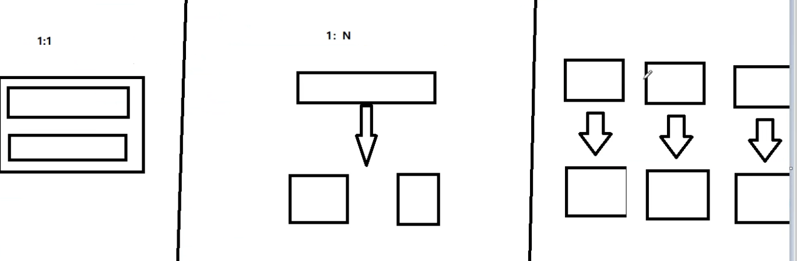

# 20.SpringCloud Alibaba Seata处理分布式事务


先看在线笔记，这里还没有完全整理好：https://note.youdao.com/s/QJjpuUhv
或者 20-Seata分布式事务学习.pdf


## 20.1.**分布式事务问题**

### 20.1.1.分布式问题的由来

下面来看一下Seata处理分布式事物。

由于现在企业开发都是基于分布式的微服务架构，面试基本都会问分布式事务怎么控制，所以我们要看看多数据库，多数据源的情况下，我们是如何处理和面对的分布式事物的问题？


### 20.1.2.分布式事务问题

一次业务操作需要跨多个数据源或需要跨多个系统进行远程调用，就会产生分布式事务问题。


**分布式之前**

我们的业务发展有三个阶段

第一阶段：单服务单库

第二阶段：单服务多个库，即对库进行了拆分

第三阶段：微服务架构，每个服务对应自己的库，多服务多库，这就牵扯到多数据源，多中心的跨库的调用，比如说有订单库、库存库、支付库，这时候这三个库整体物理上他们可能是三个不同的数据库，但是逻辑上是统一的一个事物，牵扯到全局的跨数据库的多数据源的统一调度，这就是分布式事物的前身和雏形，以及我们问题的痛点。

​    

**分布式之后**

单体应用被拆分成微服务应用，原来的三个模块被拆分成三个独立的应用，分别使用三个独立的数据源

业务操作需要调用三个服务来完成。此时每个服务内部的数据一致性由本地事务来保证，但是全局的数据一致性问题没法保证。

 

​    

用户购买商品的业务逻辑分为三个微服务支撑、storage、order、account ，这就牵扯到多个数据库的共享跨库和协调调度。


Seata就是为了解决全局数据一致性问题的一种解决方案。


## 20.2.**Seata简介**

通过上一讲的讲解，我们明白了，我们要解决的痛点就是全局的数据一致性问题。针对于这样跨库的多数据源，多中心的调用，阿里巴巴给我们提供了一个解决方案Seata。


**Seata是什么？**

Seata：是一款开源的分布式事务解决方案，致力于在微服务架构下提供高性能和简单易用的分布式事务服务。

Seata 是一款开源的分布式事务解决方案，致力于提供高性能和简单易用的分布式事务服务。Seata 将为用户提供了 AT、TCC、SAGA 和 XA 事务模式，为用户打造一站式的分布式解决方案。


官网地址：http://seata.io/zh-cn/

官网文档：http://seata.io/zh-cn/docs/overview/what-is-seata.html

下载地址：http://seata.io/zh-cn/blog/download.html


**Seata术语**

Seata分布式事务由：一ID+三组件模型 套件组成


一ID：Trangaction ID XID：全局唯一的事务D


3个组件概念：

- Transaction Coordinator (TC)：事务协调者，维护全局和分支事务的状态，驱动全局事务提交或回滚。

- Transaction Manager(TM)：事务管理器，定义全局事务的范围：开始全局事务、提交或回滚全局事务。

- Resource Manager (RM)： 资源管理器，管理分支事务处理的资源，与TC交谈以注册分支事务和报告分支事务的状态，并驱动分支事务提交或回滚。

  

**Seata分布式事务处理过程**


我们来看一下它的处理过程。

RM最好理解就是我们的数据库，一个微服务可能连一个也可能连更多个的数据库，图中黑色的双向箭头，从上到下是TC的覆盖维度，四个双向箭头，有点像总纲总揽，从头到尾。请看XID（一个XID带着TC、TM、RM），一个XID贯穿始终，说明我们是在同一个全局事务里面。假设这一次全局操作就由三个组成。首先TM开启事务/提交事务/回滚事务（第一个黑色箭头），然后注册分支，分支上面又是提交或者回滚（第二个黑色箭头）。


**Seata分布式事务的运作流程**

1. TM向TC申请开启一个全局事务，全局事务创建成功并生成一个全局唯一的XID；
2. XID在微服务调用链路的上下文中传播：
3. RM向TC注册分支事务，将其纳入XID对应全局事务的管辖：
4. TM向TC发起针对XID的全局提交或回滚决议：
5. TC调度 ⅪD下管辖的全部分支事务完成提交或回滚请求。


这个步骤就是Seata的分布式事务的处理过程，记住一XID、3组件。


## 20.3.**Seata-Server安装**


怎么用？

如果是本地事务使用 Spring 的 @Transactional注解，Seata全局事务使用@GlobalTransactional注解。


我们以一个来解决一个分布式的交易的业务来介绍，Seata分布式事务的使用，我们只需要在需要使用全局事务的地方使用@GlobalTransactional注解，添加在业务方法上就可以了。

安装步骤：

1. 下载地址：http://seata.io/zh-cn/blog/download.html

2. 下载seata-server-0.9.0.zip（这里使用这个版本来学习） 解压到指定目录并修改conf目录下的file.conf配置文件

   ​    

   

   3. 备份file.conf配置文件

   ```shell
   # 进入配置目录
   cd /Users/caojx/code/seata-server-0.9.0/conf
   # 备份配置文件
   cp file.conf file.conf.bak
   ```

   

   **主要修改：自定义事务组名称+事务日志存储模式为db+数据库连接信息**

   service模块：自定义事务组名称

   ```nginx
   service {
     #vgroup->rgroup，自定义事务组名称key=my_test_tx_group, value=fsp_tx_gorup 名字随意，默认叫default
     vgroup_mapping.my_test_tx_group = "fsp_tx_gorup"
     #only support single node
     default.grouplist = "127.0.0.1:8091"
     #degrade current not support
     enableDegrade = false
     #disable
     disable = false
     #unit ms,s,m,h,d represents milliseconds, seconds, minutes, hours, days, default permanent
     max.commit.retry.timeout = "-1"
     max.rollback.retry.timeout = "-1"
   }
   ```

   

   store模块：事务日志存储模式为db+数据库连接信息

   ```nginx
   ## transaction log store
   store {
     ## store mode: file、db，修改存储模式使用db数据库
     mode = "db"
     
     ....
     
     ## 数据库存储
     ## database store
     db {
       ## the implement of javax.sql.DataSource, such as DruidDataSource(druid)/BasicDataSource(dbcp) etc.
       datasource = "dbcp"
       ## mysql/oracle/h2/oceanbase etc.
       db-type = "mysql"
       driver-class-name = "com.mysql.jdbc.Driver"
       # 自己本机的数据库
       url = "jdbc:mysql://127.0.0.1:3306/seata"
       user = "root"
       password = "root"    
       min-conn = 1
       max-conn = 3
       global.table = "global_table"
       branch.table = "branch_table"
       lock-table = "lock_table"
       query-limit = 100
     }
   }
   ```


4. 本地新建mysql的seata库

5. 在seata库中建表，建表语句在安装包的 seata-server-0.9.0/conf/db_store.sql 中

​	分支表、全局表、锁表

​    

6. 修改seata-server-0.9.0\seata\conf目录下的registry.conf配置文件，修改向nacos注册

​		目的是：指明注册中心为nacos，及修改nacos连接信息

     ```nginx
     registry {
       # file 、nacos 、eureka、redis、zk、consul、etcd3、sofa
       type = "nacos" 
     
       nacos {
         serverAddr = "localhost:8848"
         namespace = ""
         cluster = "default"
       }
      ... 
      }
     ```


7. 启动Nacos 端口号8848

8. 启动seata-server  `./seata-server.sh`

   

启动报错，原因是本机的mysql版本8.0.19太高，而seata-server-0.9.0/lib/mysql-connector-java-5.1.30.jar mysql驱动包版本太低了，删除该jar包，换成高版本的mysql-connector-java-8.0.23.jar 即可成功运行

报错内容：

```shell
2022-05-20 09:03:40.219 INFO [main]io.seata.common.loader.EnhancedServiceLoader.loadFile:236 -load DataSourceGenerator[dbcp] extension by class[io.seata.server.store.db.DbcpDataSourceGenerator]
2022-05-20 09:03:40.567 ERROR[main]io.seata.core.store.db.LogStoreDataBaseDAO.queryTableStructure:567 -query transaction_name size fail, Cannot create PoolableConnectionFactory (Could not create connection to database server.)
org.apache.commons.dbcp.SQLNestedException: Cannot create PoolableConnectionFactory (Could not create connection to database server.)
	at org.apache.commons.dbcp.BasicDataSource.createPoolableConnectionFactory(BasicDataSource.java:1549)
```


连接mysql出问题一般就几个方面

- mysql驱动版本太低
- 数据库权限不够，比如root用户可能只能本机连接，改为%，允许任意host访问

>  mysql> use mysql;
>
> mysql> update user set host = ‘%’ where user = ‘root’;
>
> mysql> select host, user from user;
>
> mysql> flush privileges;

- 环境变量问题


## 20.4.**订单/库存/账户业务数据库准备**

前面我们完成了 seata server服务器的安装，你可以把seata理解为就是一个分布式事务的服务器。


我们这里演示Seata官网上的一个分布式交易解决方案，需要准备订单、库存、账户业务数据库。


1. 第一步：都需要先有Nacos，后启动Seata，要保证两个都ok，不然Seata会报错 no available server to connect。
2. 第二步：分布式事务的业务说明：

> 这里我们会创建三个服务，一个订单服务，一个库存服务，一个账户服务。
>
> 
>
> 当用户下单时，会在订单服务中创建一个订单，然后通过远程调用库存服务来扣减下单商品的库存，
>
>  再通过远程调用账户服务来扣减用户账户里面的余额，
>
>  最后在订单服务中修改订单状态为已完成。
>
> 
>
> 该操作跨越三个数据库，有两次远程调用，很明显会有分布式事务问题。
>
> 下订单---->扣库存----> 扣账户（余额）
>
> 很显然该操作跨越三个数据库，有两次远程调用。我们待会儿看看分布式问题发生了之后，看看我们用seata如何来治如何来治理和管控起来。


3. 第三步：创建业务数据库：

1. 1. 创建seata_order订单库、订单业务表t_order

2. 2. 创建seata_strorage库存库、库存业务表t_storage

3. 3. 创建seata_account账户库、账户业务表t_account

```sql
# 订单库、订单表
CREATE DATABASE seata_order;
CREATE TABLE t_order (
	`id` BIGINT ( 11 ) NOT NULL AUTO_INCREMENT PRIMARY KEY,
	`user_id` BIGINT ( 11 ) DEFAULT NULL COMMENT '用户id',
	`product_id` BIGINT ( 11 ) DEFAULT NULL COMMENT '产品id ',
	`count` INT ( 11 ) DEFAULT NULL COMMENT '数量',
	` money` DECIMAL ( 11, 0 ) DEFAULT NULL COMMENT '金额',
	`status` INT ( 1 ) DEFAULT NULL COMMENT '订单状态:0:创建中;1:已完结' 
) ENGINE = INNODB AUTO_INCREMENT = 1 DEFAULT CHARSET = utf8;

# 库存库、库存表
CREATE DATABASE seata_storage;
CREATE TABLE t_storage (
	`id` BIGINT ( 11 ) NOT NULL AUTO_INCREMENT PRIMARY KEY,
	`product_id` BIGINT ( 11 ) DEFAULT NULL COMMENT '产品id ',
	`total` INT ( 11 ) DEFAULT NULL COMMENT '总库存数',
	`used` INT ( 11 ) DEFAULT NULL COMMENT '已用库存',
	`residue` INT ( 11 ) DEFAULT NULL COMMENT '剩余库存' 
) ENGINE = INNODB AUTO_INCREMENT = 1 DEFAULT CHARSET = utf8;

# 初始化库存信息
INSERT INTO seata_storage.t_storage ( id, product_id, total, used, residue ) VALUES ( 1, 1, 100, 0, 100 );

# 账户库、账户表
CREATE DATABASE seata_account;
CREATE TABLE t_account (
	`id` BIGINT ( 11 ) NOT NULL AUTO_INCREMENT PRIMARY KEY,
	`user_id` BIGINT ( 11 ) DEFAULT NULL COMMENT '用户id ',
	`total` INT ( 11 ) DEFAULT NULL COMMENT '总额度',
	`used` INT ( 11 ) DEFAULT NULL COMMENT '已用额度',
	`residue` INT ( 11 ) DEFAULT NULL COMMENT '剩余可用额度' 
) ENGINE = INNODB AUTO_INCREMENT = 1 DEFAULT CHARSET = utf8;

#初始化账户余额
INSERT INTO seata_account.t_account ( id, user_id, total, used, residue ) VALUES ( 1, 1, 1000, 0, 1000 );
```


4. 第四步：按照上述3库分别建对应的回滚日志表，因为他可能有异常的情况，最后我们需要通过这些回滚日志来组织事物。

>  订单-库存-账户3个库下都需要建各自的回滚日志表
>
> 建表SQL：seata--server-0.9.0 seata\conf目录下的db_undo_log.sql

```sql
-- the table to store seata xid data
-- 0.7.0+ add context
-- you must to init this sql for you business databese. the seata server not need it.
-- 此脚本必须初始化在你当前的业务数据库中，用于AT 模式XID记录。与server端无关（注：业务数据库）
-- 注意此处0.3.0+ 增加唯一索引 ux_undo_log
drop table `undo_log`;
CREATE TABLE `undo_log` (
  `id` bigint(20) NOT NULL AUTO_INCREMENT,
  `branch_id` bigint(20) NOT NULL,
  `xid` varchar(100) NOT NULL,
  `context` varchar(128) NOT NULL,
  `rollback_info` longblob NOT NULL,
  `log_status` int(11) NOT NULL,
  `log_created` datetime NOT NULL,
  `log_modified` datetime NOT NULL,
  `ext` varchar(100) DEFAULT NULL,
  PRIMARY KEY (`id`),
  UNIQUE KEY `ux_undo_log` (`xid`,`branch_id`)
) ENGINE=InnoDB AUTO_INCREMENT=1 DEFAULT CHARSET=utf8;
```


最终我们就有了四个库，seata分布式事务库，3个业务库，然后每个业务库上有业务表，每个业务库下都有undo_log回滚日志记录表。


## 20.5.**订单/库存/账户业务微服务准备**

数据库准备好了，我们先来看一下我们的业务需求，然后再说一下我们这三个模块怎么编写。

>  业务需求：下订单---->扣库存----> 扣余额-->改订单状态

 

新建三个业务的module（order-module、storage-module、account-module），由订单作为入口来驱动库存和账户的变更。


新建订单order-module


1. 1新建seata-order-service2001模块
2. pom.xml

```xml
<?xml version="1.0" encoding="UTF-8"?>
<project xmlns="http://maven.apache.org/POM/4.0.0"
         xmlns:xsi="http://www.w3.org/2001/XMLSchema-instance"
         xsi:schemaLocation="http://maven.apache.org/POM/4.0.0 http://maven.apache.org/xsd/maven-4.0.0.xsd">
    <parent>
        <artifactId>cloud2020-learn</artifactId>
        <groupId>com.atguigu.springcloud</groupId>
        <version>1.0-SNAPSHOT</version>
    </parent>
    <modelVersion>4.0.0</modelVersion>

    <artifactId>seata-order-service2001</artifactId>

    <properties>
        <maven.compiler.source>8</maven.compiler.source>
        <maven.compiler.target>8</maven.compiler.target>
    </properties>


    <dependencies>

        <!--nacos-->
        <dependency>
            <groupId>com.alibaba.cloud</groupId>
            <artifactId>spring-cloud-starter-alibaba-nacos-discovery</artifactId>
        </dependency>

        <!--引入seata，跟seata服务版本保持一致-->
        <dependency>
            <groupId>com.alibaba.cloud</groupId>
            <artifactId>spring-cloud-starter-alibaba-seata</artifactId>
            <exclusions>
                <exclusion>
                    <artifactId>seata-all</artifactId>
                    <groupId>io.seata</groupId>
                </exclusion>
            </exclusions>
        </dependency>
        <dependency>
            <groupId>io.seata</groupId>
            <artifactId>seata-all</artifactId>
            <version>0.9.0</version>
        </dependency>

        <!--feign-->
        <dependency>
            <groupId>org.springframework.cloud</groupId>
            <artifactId>spring-cloud-starter-openfeign</artifactId>
        </dependency>

        <!--web-actuator-->
        <dependency>
            <groupId>org.springframework.boot</groupId>
            <artifactId>spring-boot-starter-web</artifactId>
        </dependency>
        <dependency>
            <groupId>org.springframework.boot</groupId>
            <artifactId>spring-boot-starter-actuator</artifactId>
        </dependency>

        <!--mysql-->
        <dependency>
            <groupId>mysql</groupId>
            <artifactId>mysql-connector-java</artifactId>
            <version>${mysql-connector-java.version}</version>
            <scope>runtime</scope>
        </dependency>

        <!--feign，用于服务之间的调用-->
        <dependency>
            <groupId>org.mybatis.spring.boot</groupId>
            <artifactId>mybatis-spring-boot-starter</artifactId>
        </dependency>
    </dependencies>
</project>
```


3. 3 resources/application.yml

注意自定义事务组名称，要与seata-server服务中配置的对应

```yaml
server:
  port: 2001

spring:
  application:
    name: seata-order-service
  cloud:
    alibaba:
      seata:
        # 自定义事务组的名称，要与seata-server服务中配置的对应
        tx-service-group: fsp_tx_group
    nacos:
      discovery:
        server-addr: localhost:8848

  datasource:
    driver-class-name: com.mysql.jdbc.Driver
    url: jdbc:mysql://localhost:3306/seata_order
    username: root
    password: root

logging:
  level:
    io:
      seata: info

mybatis:
  mapperLocations: classpath:mapper/*.xml
```


4. 4 resources/file.conf

就是复制code/seata-server-0.9.0/conf/file.conf 文件过来，但是如下配置不一样

注意：vgroup_mapping.fsp_tx_group = "default"

注意vgroup_mapping. 后边拼接自定义事务组，即vgroup_mapping.fsp_tx_group ，value值随便，这里就用defalut


```nginx
...

service {
  #vgroup->rgroup
  # 注意vgroup_mapping.自定义事务组名称，即 key= vgroup_mapping.fsp_tx_group  value随便
  vgroup_mapping.fsp_tx_group = "default"
  #only support single node
  default.grouplist = "127.0.0.1:8091"
  #degrade current not support
  enableDegrade = false
  #disable
  disable = false
  #unit ms,s,m,h,d represents milliseconds, seconds, minutes, hours, days, default permanent
  max.commit.retry.timeout = "-1"
  max.rollback.retry.timeout = "-1"
}

...

## transaction log store
store {
  ## store mode: file、db
  mode = "db"

  ...
  
  ## database store
  db {
    ## the implement of javax.sql.DataSource, such as DruidDataSource(druid)/BasicDataSource(dbcp) etc.
    datasource = "dbcp"
    ## mysql/oracle/h2/oceanbase etc.
    db-type = "mysql"
    driver-class-name = "com.mysql.jdbc.Driver"
    url = "jdbc:mysql://localhost:3306/seata"
    user = "root"
    password = "root"
    min-conn = 1
    max-conn = 3
    global.table = "global_table"
    branch.table = "branch_table"
    lock-table = "lock_table"
    query-limit = 100
  }
}
...
```


5.  5 resources/registry.conf

就是复制code/seata-server-0.9.0/conf/registry.conf 文件过来

内容基本就是复制 seata，使用nacos注册中心

```nginx
registry {
  # file 、nacos 、eureka、redis、zk、consul、etcd3、sofa
  type = "nacos"

  nacos {
    serverAddr = "localhost:8848"
    namespace = ""
    cluster = "default"
  }
  ...
}

```


6. domain

CommonResult.java

```json
/**
 * 返回结果类
 *
 * @author caojx created on 2022/5/19 11:16 AM
 */
@Data
@AllArgsConstructor
@NoArgsConstructor
public class CommonResult<T> {
    private Integer code;

    private String message;

    private T data;

    public CommonResult(Integer code, String message) {
        this(code, message, null);
    }
}

```


order.java

```java
/**
 * 订单
 *
 * @author caojx
 * @date 2022-05-19 09:43
 */
@Data
@NoArgsConstructor
@AllArgsConstructor
public class Order {

    private Long id;

    /**
     * 用户id
     */
    private Long userId;

    /**
     * 产品id
     */
    private Long productId;

    /**
     * 数量
     */
    private Integer count;

    /**
     * 金额
     */
    private BigDecimal money;

    /**
     * 订单状态:0:创建中;1:已完结
     */
    private Integer status;
}
```


7. mapper

OrderMapper.java

```java
/**
 * 订单Mapper
 *
 * @author caojx
 * @date 2022-05-19 09:43
 */
@Mapper
public interface OrderMapper {

    /**
     * 1.新建订单
     *
     * @param order
     */
    void create(Order order);

    /**
     * 修改订单状态，从0->1
     *
     * @param userId
     * @param status
     */
    void update(@Param("userId") Long userId, @Param("status") Integer status);

}
```


OrderMapper.xml

```xml
<?xml version="1.0" encoding="UTF-8" ?>
<!DOCTYPE mapper PUBLIC "-//mybatis.org//DTD Mapper 3.0//EN" "http://mybatis.org/dtd/mybatis-3-mapper.dtd" >
<mapper namespace="caojx.learn.mapper.OrderMapper">

  <resultMap id="BaseResultMap" type="caojx.learn.domain.Order">
    <id column="id" jdbcType="BIGINT" property="id"/>
    <result column="user_id" jdbcType="BIGINT" property="userId"/>
    <result column="product_id" jdbcType="BIGINT" property="productId"/>
    <result column="count" jdbcType="INTEGER" property="count"/>
    <result column="money" jdbcType="DECIMAL" property="money"/>
    <result column="status" jdbcType="INTEGER" property="status"/>
  </resultMap>
  <sql id="Base_Column_List">
    id, user_id, product_id, count,  money, status
  </sql>

  <insert id="create">
    insert into t_order(user_id, product_id, count, money, status)
    values(#{userId}, #{productId}, #{count}, #{money}, 0)
  </insert>

  <update id="update">
    update t_order set status = 1
    where user_id = #{userId} and status = #{status}
  </update>

</mapper>

```


8.8service

OrderService.java

```java
/**
 * 订单业务接口
 *
 * @author caojx created on 2022/5/19 11:27 AM
 */
public interface OrderService {

    /**
     * 创建订单
     * @param order
     */
    void create(Order order);
}

```


OrderServiceImpl.java

```java
/**
 * 订单业务实现
 *
 * @author caojx created on 2022/5/19 11:28 AM
 */
@Slf4j
@Service
public class OrderServiceImpl implements OrderService {

    @Resource
    private OrderMapper orderMapper;
    @Resource
    private StorageFeignClient storageService;
    @Resource
    private AccountFeignClient accountFeignClient;

    /**
     * 创建订单->调用库存服务加减库存>调用账户服务扣减账户余额>修改订单状态
     * 简单说：
     * 下定单->减库存>减余额->改状态
     *
     * @param order
     */
    @Override
    public void create(Order order) {
        // 1.新建订单
        log.info("--->开始新建订单");
        orderMapper.create(order);

        // 2.扣减库存
        log.info("--->订单微服务开始调用库存，扣减库存");
        storageService.decrease(order.getProductId(), order.getCount());
        log.info("--->订单微服务开始调用库存，扣减库存end");

        // 3.扣减Money
        log.info("--->订单微服务开始调用账户，扣减Money");
        accountFeignClient.decrease(order.getUserId(), order.getMoney());
        log.info("--->订单微服务开始调用账户，扣减Money end");

        // 4.  修改订单状态，从0到1，1代表已经完成
        log.info("--->修改订单状态开始");
        orderMapper.update(order.getUserId(), 0);
        log.info("--->修改订单状态结束");

        log.info("--->下订单结束了，o(n_n)o哈哈~");
    }
}
```


StorageFeignClient.java

```java
/**
 * 库存FeignClient
 *
 * @author caojx created on 2022/5/19 11:28 AM
 */
@FeignClient(value = "seata-storage-service")
public interface StorageFeignClient {

    /**
     * 扣减库存
     *
     * @param productId 产品id
     * @param count     扣减数量
     * @return
     */
    @PostMapping("/storage/decrease")
    CommonResult decrease(@RequestParam("productId") Long productId, @RequestParam("count") Integer count);
}

```


AccountFeignClient.java

```java
/**
 * 账户 FeignClient
 *
 * @author caojx created on 2022/5/19 11:28 AM
 */
@FeignClient(value = "seata-account-service")
public interface AccountFeignClient {

    /**
     * 扣减余额
     *
     * @param userId 用户id
     * @param money  金额
     * @return
     */
    @PostMapping("/account/decrease")
    CommonResult decrease(@RequestParam("userId") Long userId, @RequestParam("money") BigDecimal money);
}

```


9. 9.controller

OrderController.java

```java
/**
 * 订单controller
 *
 * @author caojx created on 2022/5/19 11:41 AM
 */
@RestController
public class OrderController {

    @Resource
    private OrderService orderService;

    /**
     * 用户下单
     * @param order
     * @return
     */
    @GetMapping("/order/create")
    public CommonResult create(Order order){
        orderService.create(order);
        return new CommonResult(200, "订单创建成功");
    }
}

```


10. 10config配置

    MyBatisConfig.java

    ```java
    package caojx.learn.config;
    
    import org.mybatis.spring.annotation.MapperScan;
    import org.springframework.context.annotation.Configuration;
    
    /**
     * mybatis 相关配置
     *
     * @author caojx created on 2022/5/19 11:43 AM
     */
    @Configuration
    @MapperScan({"caojx.learn.mapper"})
    public class MyBatisConfig {
    }
    ```

    

    DataSourceProxyConfig.java

    ```java
    package caojx.learn.config;
    
    import com.alibaba.druid.pool.DruidDataSource;
    import io.seata.rm.datasource.DataSourceProxy;
    import org.apache.ibatis.session.SqlSessionFactory;
    import org.mybatis.spring.SqlSessionFactoryBean;
    import org.mybatis.spring.transaction.SpringManagedTransactionFactory;
    import org.springframework.beans.factory.annotation.Value;
    import org.springframework.boot.context.properties.ConfigurationProperties;
    import org.springframework.context.annotation.Bean;
    import org.springframework.context.annotation.Configuration;
    import org.springframework.core.io.support.PathMatchingResourcePatternResolver;
    
    import javax.sql.DataSource;
    
    /**
     * 使用seata数据源进行代理
     *
     * @author caojx created on 2022/5/19 11:44 AM
     */
    @Configuration
    public class DataSourceProxyConfig {
    
        @Value("${mybatis.mapperLocations}")
        private String mapperLocations;
    
        @Bean
        @ConfigurationProperties(prefix = "spring.datasource")
        public DataSource druidDataSource() {
            return new DruidDataSource();
        }
    
        @Bean
        public DataSourceProxy dataSourceProxy(DataSource dataSource) {
            return new DataSourceProxy(dataSource);
        }
    
        @Bean
        public SqlSessionFactory sqlSessionFactoryBean(DataSourceProxy dataSourceProxy) throws Exception {
            SqlSessionFactoryBean sqlSessionFactoryBean = new SqlSessionFactoryBean();
            sqlSessionFactoryBean.setDataSource(dataSourceProxy);
            sqlSessionFactoryBean.setMapperLocations(new PathMatchingResourcePatternResolver().getResources(mapperLocations));
            sqlSessionFactoryBean.setTransactionFactory(new SpringManagedTransactionFactory());
            return sqlSessionFactoryBean.getObject();
        }
    }
    ```

    

11 主启动类

SeataOrderService2001Application.java

```java
package caojx.learn;

import org.springframework.boot.SpringApplication;
import org.springframework.boot.autoconfigure.SpringBootApplication;
import org.springframework.boot.autoconfigure.jdbc.DataSourceAutoConfiguration;
import org.springframework.cloud.client.discovery.EnableDiscoveryClient;
import org.springframework.cloud.openfeign.EnableFeignClients;

@EnableDiscoveryClient
@EnableFeignClients
@SpringBootApplication(exclude = DataSourceAutoConfiguration.class) // 取消数据源的自动创建
public class SeataOrderService2001Application {

    public static void main(String[] args) {
        SpringApplication.run(SeataOrderService2001Application.class, args);
    }
}
```


## 20.6.**Test**
