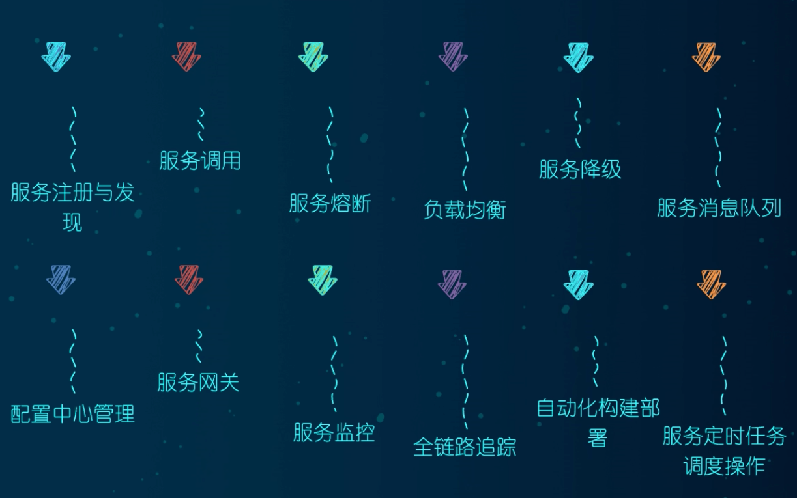
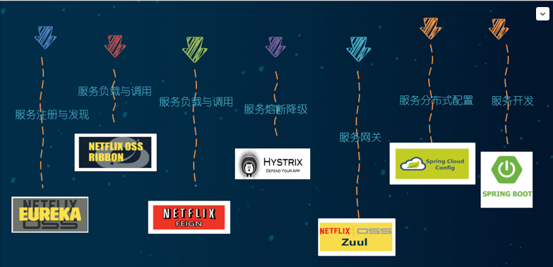
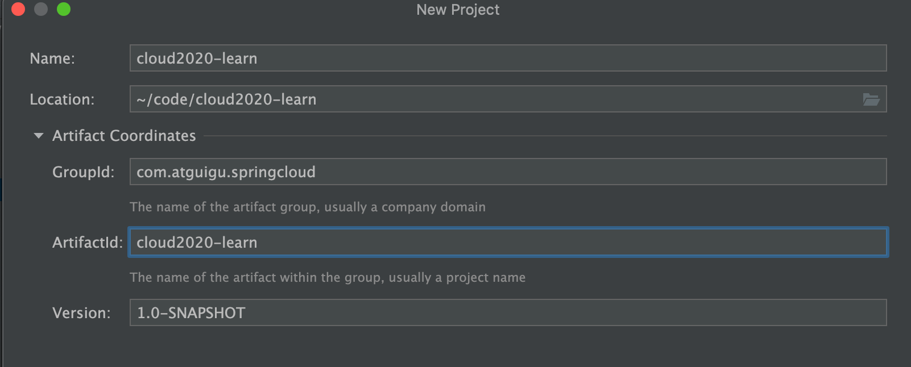
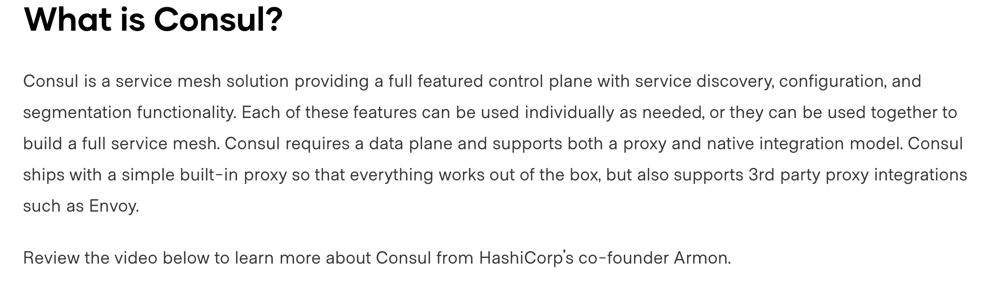
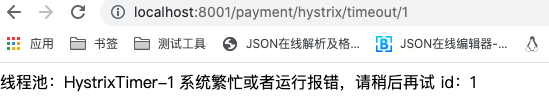
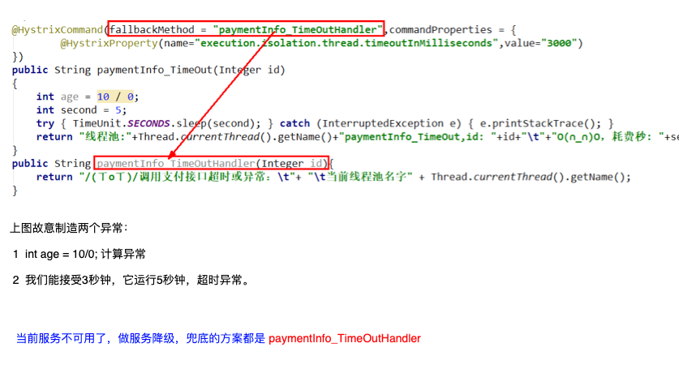

[TOC]

#  SpringCloudAlibaba(H版本&alibaba)微服务分布式架构学习


视频教程：[尚硅谷SpringCloud框架开发教程(SpringCloudAlibaba微服务分布式架构丨Spring Cloud)
](https://www.bilibili.com/video/BV18E411x7eT?spm_id_from=333.999.0.0)

相关参考笔记：

https://gitee.com/lixiaogou/cloud2020/blob/master/%E7%AC%94%E8%AE%B0-%E5%B0%9A%E7%A1%85%E8%B0%B7SpringCloud(H%E7%89%88&alibaba)/%E7%AC%94%E8%AE%B0-%E5%B0%9A%E7%A1%85%E8%B0%B7SpringCloud(H%E7%89%88&alibaba).md


建议使用：Typora markdown 编辑器阅读


# 1.微服务架构理论入门


## 1.1.什么是微服务？

微服务架构是一种架构模式，它提倡将单一应用程序划分成一组小的服务，服务之间互相协调、互相配合，为用户提供最终价值。每个服务运行在其独立的进程中，服务与服务间采用轻量级的通信机制互相协作（通常是基于HTTP协议的RESTful API)。 每个服务都围绕着具有本业务进行构建，并且能够被独立的部署到生产环境、类生产环境等。另外，应当尽量避免统一的、集中式的服务管理机制， 对具体的一个服务而言，应根据业务上下文，选择合适的语言、工具对其进行构建。


## 1.2.SpringCloud 简介


**SpringCloud是什么？**

SpringCloud=<font color=red>分布式微服务架构的一站式解决方案，是多种微服务架构落地技术的集合体</font>，俗称微服务全家桶


**支撑SpringCloud的技术维度**




**SpringCloud技术栈介绍**

  


## 1.3.国内大厂微服务架构举例

SpringCloud俨然己成为微服务开发的主流技术栈，在国内开发者社区非常火爆。


京东促销


阿里


# 2.环境选择从2.2.x和H版开始


## 2.1 Boot和Cloud版本选型

SpringCloud和SpringBoot有个适配的版本对应关系，并不是全都是最新的就好


SpringCloud 官网：https://spring.io/projects/spring-cloud

SpringBoot官网：https://spring.io/projects/spring-boot#learn


SpringCloud官网文档：https://cloud.spring.io/spring-cloud-static/Hoxton.SR1/reference/htmlsingle/

Spring Cloud中文文档：https://www.bookstack.cn/read/spring-cloud-docs/docs-index.md

SpringBoot 官网文档：https://docs.spring.io/spring-boot/docs/2.2.2.RELEASE/reference/htmlsingle/


SpringCloud 官方推荐的版本关系


更详细的版本对应查看方法 https://start.spring.io/actuator/info


## 2.2.相关环境与版本

由SpringCloud版本来决定SpringBoot版本，为了减少不必要的环境问题，请使用如下版本

| 名称          | 版本          |
| ------------- | ------------- |
| SpirngCloud   | Hoxton.SR1    |
| SpringBoot    | 2.2.2.RELEASE |
| Cloud Alibaba | 2.1.0.RELEASE |
| Java          | Java8         |
| Maven         | 3.5及以上     |
| Mysql         | 5.7及以上     |


## 2.3.常用组件的pom.xml



```xml
<!--spring boot 2.2.2-->
<dependency>
    <groupId>org.springframework.boot</groupId>
    <artifactId>spring-boot-dependencies</artifactId>
    <version>2.2.2.RELEASE</version>
    <type>pom</type>
    <scope>import</scope>
</dependency>
<!--spring cloud Hoxton.SR1-->
<dependency>
    <groupId>org.springframework.cloud</groupId>
    <artifactId>spring-cloud-dependencies</artifactId>
    <version>Hoxton.SR1</version>
    <type>pom</type>
    <scope>import</scope>
</dependency>
<!--spring cloud alibaba 2.1.0.RELEASE-->
<dependency>
    <groupId>com.alibaba.cloud</groupId>
    <artifactId>spring-cloud-alibaba-dependencies</artifactId>
    <version>2.1.0.RELEASE</version>
    <type>pom</type>
    <scope>import</scope>
</dependency>
```


# 3.关于Cloud各种组件的停更/升级/替换

 

以前




现在，基本上每种技术维度都有新的替代方案


> 服务配置比较主流的是，阿里巴巴的Nacos（推荐） 和 携程Apollo


# 4.微服务架构编码构建

我们将订单-支付模块微服务来逐步融合进这些知识


## 4.1.微服务cloud整体聚合父工程Project

### 4.1.1.新建微服务cloud整体聚合父工程





### 4.1.2.父工程pom.xml

```xml
<?xml version="1.0" encoding="UTF-8"?>

<project xmlns="http://maven.apache.org/POM/4.0.0" xmlns:xsi="http://www.w3.org/2001/XMLSchema-instance"
         xsi:schemaLocation="http://maven.apache.org/POM/4.0.0 http://maven.apache.org/xsd/maven-4.0.0.xsd">
    <modelVersion>4.0.0</modelVersion>

    <groupId>com.atguigu.springcloud</groupId>
    <artifactId>cloud2020-learn</artifactId>
    <version>1.0-SNAPSHOT</version>
    <packaging>pom</packaging>

    <!-- 统一管理jar包版本 -->
    <properties>
        <project.build.sourceEncoding>UTF-8</project.build.sourceEncoding>
        <maven.compiler.source>1.8</maven.compiler.source>
        <maven.compiler.target>1.8</maven.compiler.target>
        <junit.version>4.12</junit.version>
        <log4j.version>1.2.17</log4j.version>
        <lombok.version>1.16.18</lombok.version>
        <mysql.version>5.1.47</mysql.version>
        <druid.version>1.1.16</druid.version>
        <mybatis.spring.boot.version>1.3.0</mybatis.spring.boot.version>
    </properties>


    <!--子模块继承之后，提供作用：锁定版本 + 子 module 不用写 groupId和version-->
    <!-- 1、只是声明依赖，并不实际引入，子项目按需声明使用的依赖 -->
    <!-- 2、子项目可以继承父项目的 version 和 scope -->
    <!-- 3、子项目若指定了 version 和 scope，以子项目为准 -->
    <dependencyManagement>
        <dependencies>
            <!--spring boot 2.2.2-->
            <dependency>
                <groupId>org.springframework.boot</groupId>
                <artifactId>spring-boot-dependencies</artifactId>
                <version>2.2.2.RELEASE</version>
                <type>pom</type>
                <scope>import</scope>
            </dependency>
            <!--spring cloud Hoxton.SR1-->
            <dependency>
                <groupId>org.springframework.cloud</groupId>
                <artifactId>spring-cloud-dependencies</artifactId>
                <version>Hoxton.SR1</version>
                <type>pom</type>
                <scope>import</scope>
            </dependency>
            <!--spring cloud alibaba 2.1.0.RELEASE-->
            <dependency>
                <groupId>com.alibaba.cloud</groupId>
                <artifactId>spring-cloud-alibaba-dependencies</artifactId>
                <version>2.1.0.RELEASE</version>
                <type>pom</type>
                <scope>import</scope>
            </dependency>

            <dependency>
                <groupId>mysql</groupId>
                <artifactId>mysql-connector-java</artifactId>
                <version>${mysql.version}</version>
            </dependency>
            <dependency>
                <groupId>com.alibaba</groupId>
                <artifactId>druid</artifactId>
                <version>${druid.version}</version>
            </dependency>
            <dependency>
                <groupId>org.mybatis.spring.boot</groupId>
                <artifactId>mybatis-spring-boot-starter</artifactId>
                <version>${mybatis.spring.boot.version}</version>
            </dependency>
            <dependency>
                <groupId>junit</groupId>
                <artifactId>junit</artifactId>
                <version>${junit.version}</version>
            </dependency>
            <dependency>
                <groupId>log4j</groupId>
                <artifactId>log4j</artifactId>
                <version>${log4j.version}</version>
            </dependency>
            <dependency>
                <groupId>org.projectlombok</groupId>
                <artifactId>lombok</artifactId>
                <version>${lombok.version}</version>
                <optional>true</optional>
            </dependency>
        </dependencies>
    </dependencyManagement>

    <build>
        <plugins>
            <plugin>
                <groupId>org.springframework.boot</groupId>
                <artifactId>spring-boot-maven-plugin</artifactId>
                <configuration>
                    <fork>true</fork>
                    <addResources>true</addResources>
                </configuration>
            </plugin>
        </plugins>
    </build>

</project>
```


## 4.2.cloud-provider-payment8001微服务提供者支付模块

创建微服务步骤：建module->改pom->写yml->主启动类->业务类


本节，我们将一步一步的写出来，后续将省略一些步骤

### 4.2.1.建module：cloud-provider-payment8001 支付微服务提供者


### **4.2.2.改pom.xml**

```xml
<?xml version="1.0" encoding="UTF-8"?>
<project xmlns="http://maven.apache.org/POM/4.0.0"
         xmlns:xsi="http://www.w3.org/2001/XMLSchema-instance"
         xsi:schemaLocation="http://maven.apache.org/POM/4.0.0 http://maven.apache.org/xsd/maven-4.0.0.xsd">
    <parent>
        <artifactId>cloud2020-learn</artifactId>
        <groupId>com.atguigu.springcloud</groupId>
        <version>1.0-SNAPSHOT</version>
    </parent>
    <modelVersion>4.0.0</modelVersion>

    <artifactId>cloud-provider-payment8001</artifactId>

    <properties>
        <maven.compiler.source>8</maven.compiler.source>
        <maven.compiler.target>8</maven.compiler.target>
    </properties>

    <dependencies>
        <dependency>
            <groupId>org.springframework.boot</groupId>
            <artifactId>spring-boot-starter-web</artifactId>
        </dependency>
        <dependency>
            <groupId>org.springframework.boot</groupId>
            <artifactId>spring-boot-starter-actuator</artifactId>
        </dependency>
        <dependency>
            <groupId>org.mybatis.spring.boot</groupId>
            <artifactId>mybatis-spring-boot-starter</artifactId>
        </dependency>
        <dependency>
            <groupId>com.alibaba</groupId>
            <artifactId>druid-spring-boot-starter</artifactId>
            <version>1.1.10</version>
        </dependency>
        <!--mysql-connector-java-->
        <dependency>
            <groupId>mysql</groupId>
            <artifactId>mysql-connector-java</artifactId>
        </dependency>
        <!--jdbc-->
        <dependency>
            <groupId>org.springframework.boot</groupId>
            <artifactId>spring-boot-starter-jdbc</artifactId>
        </dependency>
        <dependency>
            <groupId>org.springframework.boot</groupId>
            <artifactId>spring-boot-devtools</artifactId>
            <scope>runtime</scope>
            <optional>true</optional>
        </dependency>
        <dependency>
            <groupId>org.projectlombok</groupId>
            <artifactId>lombok</artifactId>
            <optional>true</optional>
        </dependency>
        <dependency>
            <groupId>org.springframework.boot</groupId>
            <artifactId>spring-boot-starter-test</artifactId>
            <scope>test</scope>
        </dependency>
    </dependencies>
</project>

```


### 4.2.3.写yml

application.yml

```yaml
server:
  port: 8001

spring:
  application:
    name: cloud-payment-service
  datasource:
    type: com.alibaba.druid.pool.DruidDataSource    # 当前数据源操作类型
    driver-class-name: org.gjt.mm.mysql.Driver      # mysql 驱动包 com.mysql.jdbc.Driver
    url: jdbc:mysql://localhost:3306/db2019?useUnicode=true&characterEncoding=utf-8&useSSL=false
    username: root
    password: root

mybatis:
  mapper-locations: classpath:mapper/*xml
  type-aliases-package: com.atguigu.springcloud.entities # 所有 Entity 别名类所在包
```


### 4.2.4.主启动类

```java
package com.atguigui.springcloud;

import org.springframework.boot.SpringApplication;
import org.springframework.boot.autoconfigure.SpringBootApplication;

/**
 * 支付微服务主启动
 *
 * @author caojx created on 2022/6/4 6:34 PM
 */
@SpringBootApplication
public class PaymentMain8001 {

    public static void main(String[] args) {
        SpringApplication.run(PaymentMain8001.class, args);
    }
}
```


### 4.2.5.业务类


#### 4.2.5.1.建库建表

新建数据库db2019，这些不是我们的重点，这里就建一张简单的表

```sql
CREATE TABLE `payment`(
    `id`     BIGINT ( 20 ) NOT NULL AUTO_INCREMENT COMMENT 'ID',
    `serial` VARCHAR(200) DEFAULT '',
    PRIMARY KEY (`id`)
) ENGINE = INNODB AUTO_INCREMENT = 1 DEFAULT CHARSET = utf8;
```


#### 4.2.5.2.新建实体&公共返回类


**Payment.java实体类**

```java
package com.atguigu.springcloud.entites;

import lombok.AllArgsConstructor;
import lombok.Data;
import lombok.NoArgsConstructor;

import java.io.Serializable;

/**
 * @author caojx created on 2022/6/4 8:42 PM
 */
@Data
@NoArgsConstructor
@AllArgsConstructor
public class Payment implements Serializable {
    private Long id;
    private String serial;
}
```


**CommonResult.java 通用返回对象**

```java
package com.atguigu.springcloud.entites;

import lombok.AllArgsConstructor;
import lombok.Data;
import lombok.NoArgsConstructor;

/**
 * 通用的返回对象
 *
 * @author caojx created on 2022/6/4 8:42 PM
 */
@Data
@NoArgsConstructor
@AllArgsConstructor
public class CommonResult<T> {

    private Integer code;
    private String message;
    private T data;

    public CommonResult(Integer code, String message) {
        this(code, message, null);
    }
}
```


#### 4.2.5.3.Dao&Mapper.xml

**PaymentDao.java**

```java
package com.atguigu.springcloud.dao;

import com.atguigu.springcloud.entites.Payment;
import org.apache.ibatis.annotations.Mapper;
import org.apache.ibatis.annotations.Param;

/**
 * PaymentDao
 *
 * @author caojx created on 2022/6/4 8:48 PM
 */
@Mapper
public interface PaymentDao {

    int create(Payment payment);

    Payment getPaymentById(@Param("id") Long id);
}
```


**PaymentMapper.xml**

```xml
<?xml version="1.0" encoding="UTF-8"?>
<!DOCTYPE mapper PUBLIC "-//mybatis.org//DTD Mapper 3.0//EN" "http://mybatis.org/dtd/mybatis-3-mapper.dtd">

<mapper namespace="com.atguigu.springcloud.dao.PaymentDao">

    <resultMap id="BaseResultMap" type="com.atguigu.springcloud.entites.Payment">
        <result property="id" column="id" jdbcType="BIGINT"/>
        <result property="serial" column="serial" jdbcType="VARCHAR"/>
    </resultMap>

    <insert id="create" parameterType="Payment" useGeneratedKeys="true" keyProperty="id">
        insert into payment(serial)
        values (#{serial})
    </insert>

    <select id="getPaymentById" parameterType="Long" resultMap="BaseResultMap">
        select *
        from payment
        where id = #{id}
    </select>
</mapper>
```


#### 4.2.5.4.Service


**PaymentService.java**

```java
package com.atguigu.springcloud.service;

import com.atguigu.springcloud.entites.Payment;

/**
 * @author caojx created on 2022/6/4 8:58 PM
 */
public interface PaymentService {

    int create(Payment payment);

    Payment getPaymentById(Long id);
}
```


**PaymentServiceImpl.java**

```java
package com.atguigu.springcloud.service.impl;

import com.atguigu.springcloud.dao.PaymentDao;
import com.atguigu.springcloud.entites.Payment;
import com.atguigu.springcloud.service.PaymentService;
import org.springframework.stereotype.Service;

import javax.annotation.Resource;

/**
 * @author caojx created on 2022/6/4 8:58 PM
 */
@Service
public class PaymentServiceImpl implements PaymentService {

    @Resource
    private PaymentDao paymentDao;

    @Override
    public int create(Payment payment) {
        return paymentDao.create(payment);
    }

    @Override
    public Payment getPaymentById(Long id) {
        return paymentDao.getPaymentById(id);
    }
}
```


#### 4.2.5.5.controller

PaymentController.java

```java
package com.atguigu.springcloud.controller;

import com.atguigu.springcloud.entites.CommonResult;
import com.atguigu.springcloud.entites.Payment;
import com.atguigu.springcloud.service.PaymentService;
import lombok.extern.slf4j.Slf4j;
import org.springframework.web.bind.annotation.*;

import javax.annotation.Resource;

/**
 * @author caojx created on 2022/6/4 9:00 PM
 */
@Slf4j
@RestController
public class PaymentController {

    @Resource
    private PaymentService paymentService;

    @PostMapping("/payment/create")
    public CommonResult create(@RequestBody Payment payment) {
        int result = paymentService.create(payment);
        log.info("插入结果：{}", result);
        if (result > 0) {
            return new CommonResult(200, "插入数据库成功", result);
        }
        return new CommonResult(444, "插入数据库失败");
    }

    @GetMapping("/payment/get/{id}")
    public CommonResult getPaymentById(@PathVariable("id") Long id) {
        Payment payment = paymentService.getPaymentById(id);
        log.info("查询结果：{}", payment);
        if (payment != null) {
            return new CommonResult(200, "查询成功", payment);
        }
        return new CommonResult(444, "没有对应记录，查询id：" + id);
    }
}
```


#### 4.2.1.6.测试

插入数据

```shell
~# curl --location --request POST 'http://localhost:8001/payment/create' \
--header 'Content-Type: application/json' \
--data-raw '{
    "serial":"尚硅谷001"
}'
{"code":200,"message":"插入数据库成功","data":1}%
```


查询数据

http://localhost:8001/payment/get/1

```json
{"code":200,"message":"查询成功","data":{"id":1,"serial":"尚硅谷001"}}
```


## 4.3.热部署Devtools

实现代码改动后，自动重启生效，不需要手动的关闭重启


### 4.3.1.添加devtools依赖到工程

```xml
<dependency>
    <groupId>org.springframework.boot</groupId>
    <artifactId>spring-boot-devtools</artifactId>
    <scope>runtime</scope>
    <optional>true</optional>
</dependency>
```


### 4.3.2.添加plugin到pom.xml

下段配置我们粘贴进聚合父类总工程的pom.xml里 

```xml
    <build>
      <finalName>你自己的工程名字</finalName>
        <plugins>
            <plugin>
                <groupId>org.springframework.boot</groupId>
                <artifactId>spring-boot-maven-plugin</artifactId>
                <configuration>
                    <fork>true</fork>
                    <addResources>true</addResources>
                </configuration>
            </plugin>
        </plugins>
    </build>
```


### 4.3.3.开启自动编译选项


 1、设置自动构建项目，步骤是： File --- Settings --- Build,Execution, --- Compiler ---勾选如下四个


2、设置自动启动，步骤：File --- Settings --- Advanced Settings --- 勾选 “Allow auto-make to start... ”


### 4.3.4.开启热注册

IDEA 2021.3.2中没有看到这个配置，应该不需要改


windows：ctrl+shift+alt+/

macos：command+shft+option+/


重启IDEA后即可生效


## 4.4.cloud-consumer-order80微服务消费者订单模块

> 创建微服务步骤：建module->改pom->写yml->主启动类->业务类


### 4.4.1.构建cloud-consumer-order80订单微服务消费者

图略


### 4.4.2.改pom.xml

```xml
<?xml version="1.0" encoding="UTF-8"?>
<project xmlns="http://maven.apache.org/POM/4.0.0"
         xmlns:xsi="http://www.w3.org/2001/XMLSchema-instance"
         xsi:schemaLocation="http://maven.apache.org/POM/4.0.0 http://maven.apache.org/xsd/maven-4.0.0.xsd">
    <parent>
        <artifactId>cloud2020-learn</artifactId>
        <groupId>com.atguigu.springcloud</groupId>
        <version>1.0-SNAPSHOT</version>
    </parent>
    <modelVersion>4.0.0</modelVersion>

    <artifactId>cloud-consumer-order80</artifactId>

    <properties>
        <maven.compiler.source>8</maven.compiler.source>
        <maven.compiler.target>8</maven.compiler.target>
    </properties>

    <dependencies>
        <dependency>
            <groupId>org.springframework.boot</groupId>
            <artifactId>spring-boot-starter-web</artifactId>
        </dependency>
        <dependency>
            <groupId>org.springframework.boot</groupId>
            <artifactId>spring-boot-starter-actuator</artifactId>
        </dependency>
        <!--devtools-->
        <dependency>
            <groupId>org.springframework.boot</groupId>
            <artifactId>spring-boot-devtools</artifactId>
            <scope>runtime</scope>
            <optional>true</optional>
        </dependency>
        <dependency>
            <groupId>org.projectlombok</groupId>
            <artifactId>lombok</artifactId>
            <optional>true</optional>
        </dependency>
        <dependency>
            <groupId>org.springframework.boot</groupId>
            <artifactId>spring-boot-starter-test</artifactId>
            <scope>test</scope>
        </dependency>
    </dependencies>
</project>
```


### 4.4.3.写yml

```yaml
server:
  port: 80

```


### 4.4.4.主启动

```java
package com.atguigu.springcloud;

import org.springframework.boot.SpringApplication;
import org.springframework.boot.autoconfigure.SpringBootApplication;

/**
 * 订单消费者微服务主启动
 *
 * @author caojx created on 2022/6/9 6:14 PM
 */
@SpringBootApplication
public class OrderMain80 {
    public static void main(String[] args) {
        SpringApplication.run(OrderMain80.class, args);
    }
}
```


### 4.4.5.业务类

#### 4.4.5.1.实体&公共返回类

Payment.java 、CommonResult.java 略，参考前面的


#### 4.4.5.2.首说RestTemplate

后续将使用restTemplate完成订单向支付微服务的调用


**是什么？**

RestTemplate提供了多种便捷访问远程Http服务的方法， 是一种简单便捷的访问restful服务模板类，是Spring提供的用于访问Rest服务的客户端模板工具集 。


**官网以及使用**

官网地址 ：https://docs.spring.io/spring-framework/docs/5.2.2.RELEASE/javadoc-api/org/springframework/web/client/RestTemplate.html 


 使用 ：使用restTemplate访问restful接口非常的简单粗暴无脑。 (url, requestMap, ResponseBean.class)这三个参数分别代表 REST请求地址、请求参数、HTTP响应转换被转换成的对象类型。 


#### 4.4.5.3.配置类定义RestTemplate  Bean


ApplicationContextConfig.java

```java
package com.atguigu.springcloud.config;

import org.springframework.context.annotation.Bean;
import org.springframework.context.annotation.Configuration;
import org.springframework.web.client.RestTemplate;

/**
 * 配置类，相当于之前我们再配置文件中配置 applicationcontext.xml <bean id=""class="">
 * @author caojx created on 2022/6/9 6:31 PM
 */
@Configuration
public class ApplicationContextConfig {

    @Bean
    public RestTemplate getRestTemplate() {
        return new RestTemplate();
    }
}
```


#### 4.4.5.4.controller


使用RestTemplate  OrderController.java 调用支付微服务相关接口

```java
package com.atguigu.springcloud.controller;

import com.atguigu.springcloud.entites.CommonResult;
import com.atguigu.springcloud.entites.Payment;
import lombok.extern.slf4j.Slf4j;
import org.springframework.web.bind.annotation.*;
import org.springframework.web.client.RestTemplate;

import javax.annotation.Resource;

/**
 * 使用RestTemplate 调用支付微服务相关接口
 *
 * @author caojx created on 2022/6/9 6:17 PM
 */
@Slf4j
@RestController
public class OrderController {

    private static final String PAYMENT_URL = "http://localhost:8001";

    @Resource
    private RestTemplate restTemplate;

    @PostMapping("/consumer/payment/create")
    public CommonResult<Payment> create(@RequestBody Payment payment) {
        return restTemplate.postForObject(PAYMENT_URL + "/payment/create", payment, CommonResult.class);
    }

    @GetMapping("/consumer/payment/get/{id}")
    public CommonResult<Payment> getPayment(@PathVariable("id") Long id) {
        return restTemplate.getForObject(PAYMENT_URL + "/payment/get/" + id, CommonResult.class);
    }
}
```


### 4.4.6.测试

http://localhost/consumer/payment/get/1

```java
{"code":200,"message":"查询成功","data":{"id":1,"serial":"尚硅谷001"}}
```


http://localhost/consumer/payment/create

```json
curl --location --request POST 'http://localhost/consumer/payment/create' \
--header 'Content-Type: application/json' \
--data-raw '{
    "serial":"尚硅谷001"
}'
```


## 4.5.IDEA Run DashBoard

一般运行多个springboot项目时，IDEA 会使用run dashboard 显示服务列表


如果没有显示，可以通过修改idea的workspace.xml的方式来快速打开Run Dashboard窗口

你自己路径：D:\devSoft\JetBrains\IdeaProjects\自己project名\.idea 

```xml
<option name="configurationTypes">
   <set> 
       <option value="SpringBootApplicationConfigurationType" /> 
   </set> 
</option> 
```


部分同学可能由于idea版本不同，需要关闭重启


## 4.6.工程重构


系统中有重复部分，我们可以把相似的部分entites提取到一个统一的模块中cloud-api-commons


### 4.6.1.新建cloud-api-commons 模块

图略


### 4.6.2.改pom.xml

```xml
<?xml version="1.0" encoding="UTF-8"?>
<project xmlns="http://maven.apache.org/POM/4.0.0"
         xmlns:xsi="http://www.w3.org/2001/XMLSchema-instance"
         xsi:schemaLocation="http://maven.apache.org/POM/4.0.0 http://maven.apache.org/xsd/maven-4.0.0.xsd">
    <parent>
        <artifactId>cloud2020-learn</artifactId>
        <groupId>com.atguigu.springcloud</groupId>
        <version>1.0-SNAPSHOT</version>
    </parent>
    <modelVersion>4.0.0</modelVersion>

    <artifactId>cloud-api-commons</artifactId>

    <properties>
        <maven.compiler.source>8</maven.compiler.source>
        <maven.compiler.target>8</maven.compiler.target>
    </properties>

    <dependencies>
        <dependency>
            <groupId>org.springframework.boot</groupId>
            <artifactId>spring-boot-devtools</artifactId>
            <scope>runtime</scope>
            <optional>true</optional>
        </dependency>
        <dependency>
            <groupId>org.projectlombok</groupId>
            <artifactId>lombok</artifactId>
            <optional>true</optional>
        </dependency>
        <dependency>
            <groupId>cn.hutool</groupId>
            <artifactId>hutool-all</artifactId>
            <version>5.1.0</version>
        </dependency>
    </dependencies>

</project>

```


### 4.6.3.将entites包移动到cloud-api-commons模块


将entites包移动到cloud-api-commons模块中


cloud-api-commons 执行clean install


### 4.6.4.订单80和支付8001分别改造

删除cloud-consumer-order80、cloud-provider-payment8001 中的enties包，并引入cloud-api-commons依赖

```xml
<!-- 引入自己定义的api通用包 -->
 <dependency>
     <groupId>com.atguigu.springcloud</groupId>
     <artifactId>cloud-api-commons</artifactId>
     <version>${project.version}</version>
 </dependency>
```


工程样图


## 4.7.说明

到这里我们的零基础入门已经学习完毕，后续我们将逐步整合如下技术


# 5.Eureka服务注册与发现

前面我们没有服务注册中心，也可以服务间调用，为什么还要服务注册?

当服务很多时，单靠代码手动管理是很麻烦的，需要一个公共组件，统一管理多服务，包括服务是否正常运行等


## 5.1.Eureka基础知识


**什么是服务治理**？

​		Spring Cloud 封装了 Netflix 公司开发的 Eureka 模块来 <font color=blue>实现服务治理 </font>

​		在传统的rpc远程调用框架中，管理每个服务与服务之间依赖关系比较复杂，管理比较复杂，所以需要使用服务治理，管理服务于服务之间依赖关系，可以实现服务调用、负载均衡、容错等，实现服务发现与注册。 


**什么是服务注册与发现**？

​		Eureka采用了CS的设计架构，Eureka Server 作为服务注册功能的服务器，它是服务注册中心。而系统中的其他微服务，使用 Eureka的客户端连接到 Eureka Server并<font color=red>维持心跳连接</font>。这样系统的维护人员就可以通过 Eureka Server 来监控系统中各个微服务是否正常运行。 

​		在服务注册与发现中，有一个注册中心。当服务器启动的时候，会把当前自己服务器的信息，比如服务地址通讯地址等以别名方式注册到注册中心上。另一方（消费者|服务提供者），以该别名的方式去注册中心上获取到实际的服务通讯地址，然后再实现本地RPC调用RPC远程调用框架核心设计思想：在于注册中心，因为使用注册中心管理每个服务与服务之间的一个依赖关系(服务治理概念)。在任何rpc远程框架中，都会有一个注册中心(存放服务地址相关信息(接口地址)) 


**Eureka两组件Eureka Server和Eureka Client **

Eureka包含两个组件：Eureka Server和Eureka Client 

 

<font color=red>EurekaServer</font> 提供服务注册服务：

各个微服务节点通过配置启动后，会在EurekaServer中进行注册，这样EurekaServer中的服务注册表中将会存储所有可用服务节点的信息，服务节点的信息可以在界面中直观看到。 

 

<font color=red>EurekaClient </font>通过注册中心进行访问： 

是一个Java客户端，用于简化EurekaServer的交互，客户端同时也具备一个内置的、使用轮询(round-robin)负载算法的负载均衡器。在应用启动后，将会向Eureka Server发送心跳(默认周期为30秒)。如果Eureka Server在多个心跳周期内没有接收到某个节点的心跳，EurekaServer将会从服务注册表中把这个服务节点移除（默认90秒） 


## 5.2.单机Eureka构建步骤

### 5.2.1.创建EurekaServer端服务注册中心cloud-eureka-server7001

创建微服务步骤：建module->改pom->写yml->主启动类->业务类


### 5.2.2.改写pom.xml

```xml
<?xml version="1.0" encoding="UTF-8"?>
<project xmlns="http://maven.apache.org/POM/4.0.0"
         xmlns:xsi="http://www.w3.org/2001/XMLSchema-instance"
         xsi:schemaLocation="http://maven.apache.org/POM/4.0.0 http://maven.apache.org/xsd/maven-4.0.0.xsd">
    <parent>
        <artifactId>cloud2020-learn</artifactId>
        <groupId>com.atguigu.springcloud</groupId>
        <version>1.0-SNAPSHOT</version>
    </parent>
    <modelVersion>4.0.0</modelVersion>

    <artifactId>cloud-eureka-server7001</artifactId>

    <properties>
        <maven.compiler.source>8</maven.compiler.source>
        <maven.compiler.target>8</maven.compiler.target>
    </properties>

    <dependencies>
        <!-- 服务注册中心的服务端 eureka-server -->
        <dependency>
            <groupId>org.springframework.cloud</groupId>
            <artifactId>spring-cloud-starter-netflix-eureka-server</artifactId>
        </dependency>

        <dependency>
            <groupId>org.springframework.boot</groupId>
            <artifactId>spring-boot-starter-web</artifactId>
        </dependency>
        <dependency>
            <groupId>org.springframework.boot</groupId>
            <artifactId>spring-boot-starter-actuator</artifactId>
        </dependency>
        <!--devtools-->
        <dependency>
            <groupId>org.springframework.boot</groupId>
            <artifactId>spring-boot-devtools</artifactId>
            <scope>runtime</scope>
            <optional>true</optional>
        </dependency>
        <dependency>
            <groupId>org.springframework.boot</groupId>
            <artifactId>spring-boot-starter-test</artifactId>
            <scope>test</scope>
        </dependency>
        <dependency>
            <groupId>junit</groupId>
            <artifactId>junit</artifactId>
        </dependency>
    </dependencies>

</project>
```


现在新版本（当前使用2020.2） 区分客户端和服务端

```xml
<dependency> 
     <groupId>org.springframework.cloud</groupId> 
     <artifactId>spring-cloud-starter-netflix-eureka-server</artifactId> 
 </dependency> 
```


以前的老版本（当前使用2018） 不区分客户端和服务端

```xml
<dependency> 
     <groupId>org.springframework.cloud</groupId> 
     <artifactId>spring-cloud-starter-eureka</artifactId> 
 </dependency> 
```


### 5.2.3.改写yml


application.yml

```yaml
server:
  port: 7001

# 单机版
eureka:
  instance:
    hostname: localhost  # eureka服务端的实例名字
  client:
    register-with-eureka: false    # 表示不向注册中心注册自己
    fetch-registry: false   # false表示自己端就是注册中心，我的职责就是维护服务实例，并不需要去检抓取索服务
    service-url:
      defaultZone: http://${eureka.instance.hostname}:${server.port}/eureka/ # 设置与Eureka Server交互的地址查询服务和注册服务都需要依赖这个地址
```


### 5.2.4.主启动

```java
package com.atguigu.springcloud;

import org.springframework.boot.SpringApplication;
import org.springframework.boot.autoconfigure.SpringBootApplication;
import org.springframework.cloud.netflix.eureka.server.EnableEurekaServer;

/**
 * @author caojx created on 2022/6/10 8:49 PM
 */
@EnableEurekaServer
@SpringBootApplication
public class EurekaMain7001 {

    public static void main(String[] args) {
        SpringApplication.run(EurekaMain7001.class, args);
    }
}
```


### 5.2.5.测试

http://localhost:7001/


No application available 没有服务被发现，因为没有注册服务进来当然不可能有服务被发现


### 5.2.6. EurekaClient端cloud-provider-payment8001将注册进EurekaServer成为服务提供者provider，类似尚硅谷学校对外提供授课服务


#### 5.2.6.1.改写pom.xml

新版本（推荐）

```xml
<!-- 服务注册中心的客户端 eureka-client -->
<dependency>
    <groupId>org.springframework.cloud</groupId>
    <artifactId>spring-cloud-starter-netflix-eureka-client</artifactId>
</dependency>
```


以前的老版本（当前使用2018） 不区分客户端和服务端

```xml
<dependency> 
     <groupId>org.springframework.cloud</groupId> 
     <artifactId>spring-cloud-starter-eureka</artifactId> 
 </dependency> 
```


#### 5.2.6.2.写yml

```yaml
spring:
  application:
    name: cloud-payment-service
  datasource:
    type: com.alibaba.druid.pool.DruidDataSource    # 当前数据源操作类型
    driver-class-name: org.gjt.mm.mysql.Driver      # mysql 驱动包 com.mysql.jdbc.Driver
    url: jdbc:mysql://localhost:3306/db2019?useUnicode=true&characterEncoding=utf-8&useSSL=false
    username: root
    password: root

eureka:
  client:
    # 表示是否将自己注册进 EurekaServer 默认为 true
    register-with-eureka: true
    # 是否从 EurekaServer 抓取已有的注册信息，默认为 true 单节点无所谓，集群必须设置为 true 才能配合 ribbon 使用负载均衡
    fetch-registry: true
    service-url:
    # EurekaServer 地址
      defaultZone: http://localhost:7001/eureka

mybatis:
  mapper-locations: classpath:mapper/*xml
  type-aliases-package: com.atguigu.springcloud.entites # 所有 Entity 别名类所在包
```


#### 5.2.6.3.主启动

添加@EnableEurekaClient注解

```java
package com.atguigu.springcloud;

import org.springframework.boot.SpringApplication;
import org.springframework.boot.autoconfigure.SpringBootApplication;
import org.springframework.cloud.netflix.eureka.EnableEurekaClient;

/**
 * 支付微服务主启动
 *
 * @author caojx created on 2022/6/4 6:34 PM
 */
@EnableEurekaClient
@SpringBootApplication
public class PaymentMain8001 {
    public static void main(String[] args) {
        SpringApplication.run(PaymentMain8001.class, args);
    }
}
```


#### 5.2.6.4.测试

先要启动EurekaServer，然后启动cloud-provider-payment8001，访问http://localhost:7001/


微服务注册名配置说明：如下图所示注册中心的服务别名与spring.applicaiotn.name保持一致


#### 5.2.6.5.eureka自我保护机制


### 5.2.7.EurekaClient端cloud-consumer-order80将注册进EurekaServer成为服务消费者consumer，类似来尚硅谷上课消费的各位同学


#### 5.2.7.1.改写pom.xml

引入eureka-client

```xml
 <!-- 服务注册中心的客户端 eureka-client -->
 <dependency>
     <groupId>org.springframework.cloud</groupId>
     <artifactId>spring-cloud-starter-netflix-eureka-client</artifactId>
 </dependency>
```


#### 5.2.7.2.改写yml


application.yml

```yaml
server:
  port: 80

spring:
  application:
    name: cloud-order-service

eureka:
  client:
    # 表示是否将自己注册进 EurekaServer 默认为 true
    register-with-eureka: true
    # 是否从 EurekaServer 抓取已有的注册信息，默认为 true 单节点无所谓，集群必须设置为 true 才能配合 ribbon 使用负载均衡
    fetch-registry: true
    service-url:
      defaultZone: http://localhost:7001/eureka

```


#### 5.2.7.3.主启动

添加@EnableEurekaClient注解


#### 5.2.7.4.测试

先要启动EurekaServer，7001服务

再要启动服务提供者provider，8001服务


http://localhost:7001/


http://localhost/consumer/payment/get/31

```json
{"code":444,"message":"没有对应记录，查询id：31","data":null}
```


## 5.2.集群Eureka Server构建

为了保证Eureka Server的高可用，我们一般会集群部署多台Eureka Server


### 5.2.1.Eureka集群原理说明


问题：微服务RPC远程服务调用最核心的是什么  ?

​	高可用，试想你的注册中心只有一个only one， 它出故障了那就呵呵(￣▽￣)"了，会导致整个为服务环境不可用，所以 

　解决办法：搭建Eureka注册中心集群 ，实现负载均衡+故障容错 


集群原理简单归纳就是：互相注册、相互守望，每个eureka server 都要有集群中其他兄弟的全部相关信息，即互相注册，相互守望，对外暴露出一个整体。


### 5.2.2.EurekaServer集群环境构建步骤

#### 5.2.2.1.新建cloud-eureka-server7002 

参考：cloud-eureka-server7002


#### 5.2.2.2.改pom.xml

参考：cloud-eureka-server7002


#### 5.2.2.3.修改host配置文件

windows：C:\Windows\System32\drivers\etc路径下的hosts文件

mac：/etc/hosts

修改映射配置添加进hosts文件

```shell
127.0.0.1 eureka7001.com
127.0.0.1 eureka7002.com
```


#### 5.2.2.4.写yml

**单机版（以前）**

```yaml
server:
  port: 7001

# 单机版
eureka:
  instance:
    hostname: localhost  # eureka服务端的实例名字
  client:
    register-with-eureka: false    # 表示不向注册中心注册自己
    fetch-registry: false   # false表示自己端就是注册中心，我的职责就是维护服务实例，并不需要去检索抓取服务
    service-url:
      defaultZone: http://${eureka.instance.hostname}:${server.port}/eureka/ # 设置与Eureka Server交互的地址查询服务和注册服务都需要依赖这个地址

```


**集群版本（7001）**

7001注册进7002，实现相互注册，相互守望

```yaml
server:
  port: 7001

# 单机版
#eureka:
#  instance:
#    hostname: localhost  # eureka服务端的实例名字
#  client:
#    register-with-eureka: false    # 表示不向注册中心注册自己
#    fetch-registry: false   # false表示自己端就是注册中心，我的职责就是维护服务实例，并不需要去检索抓取服务
#    service-url:
#      defaultZone: http://${eureka.instance.hostname}:${server.port}/eureka/ # 设置与Eureka Server交互的地址查询服务和注册服务都需要依赖这个地址

#集群版，7001注册进7002，实现相互注册，相互守望
eureka:
  instance:
    hostname: eureka7001.com    # eureka服务端的实例名字
  client:
    register-with-eureka: false # 表示不向注册中心注册自己
    fetch-registry: false       # 表示自己就是注册中心，职责是维护服务实例，并不需要去检索服务
    service-url:
      defaultZone: http://eureka7002.com:7002/eureka/  # 7001注册进7002，实现相互注册，相互守望
```


**集群版本（7001）**

7002注册进7001，实现相互注册，相互守望

```yaml
server:
  port: 7002

# #集群版，7002注册进7001，实现相互注册，相互守望
eureka:
  instance:
    hostname: eureka7002.com  # eureka服务端的实例名字
  client:
    register-with-eureka: false # 表示不向注册中心注册自己
    fetch-registry: false       # 表示自己就是注册中心，职责是维护服务实例，并不需要去检索服务
    service-url:
      defaultZone: http://eureka7001.com:7001/eureka/ # 7002注册进7001，实现相互注册，相互守望
```


#### 5.2.2.5.主启动

```java
package com.atguigu.springcloud;

import org.springframework.boot.SpringApplication;
import org.springframework.boot.autoconfigure.SpringBootApplication;
import org.springframework.cloud.netflix.eureka.server.EnableEurekaServer;

/**
 * @author caojx created on 2022/6/11 7:50 PM
 */
@EnableEurekaServer
@SpringBootApplication
public class EurekaMain7002 {

    public static void main(String[] args) {
        SpringApplication.run(EurekaMain7002.class, args);
    }
}
```


#### 5.2.2.6.eureka服务启动测试

可以看到7001指向7002，7002指向7001

http://eureka7001.com:7001/


http://eureka7002.com:7002/


#### 5.2.2.7.将支付服务8001微服务发布到上面2台Eureka集群配置中

```yaml
server:
  port: 8001

spring:
  application:
    name: cloud-payment-service
  datasource:
    type: com.alibaba.druid.pool.DruidDataSource    # 当前数据源操作类型
    driver-class-name: org.gjt.mm.mysql.Driver      # mysql 驱动包 com.mysql.jdbc.Driver
    url: jdbc:mysql://localhost:3306/db2019?useUnicode=true&characterEncoding=utf-8&useSSL=false
    username: root
    password: root

eureka:
  client:
    # 表示是否将自己注册进 EurekaServer 默认为 true
    register-with-eureka: true
    # 是否从 EurekaServer 抓取已有的注册信息，默认为 true 单节点无所谓，集群必须设置为 true 才能配合 ribbon 使用负载均衡
    fetch-registry: true
    service-url:
      # defaultZone: http://localhost:7001/eureka
      defaultZone: http://eureka7001.com:7001/eureka,http://eureka7002.com:7002/eureka # 集群版

mybatis:
  mapper-locations: classpath:mapper/*xml
  type-aliases-package: com.atguigu.springcloud.entites # 所有 Entity 别名类所在包
```


#### 5.2.2.8.将订单服务80微服务发布到上面2台Eureka集群配置中

```yaml
server:
  port: 80

spring:
  application:
    name: cloud-order-service

eureka:
  client:
    # 表示是否将自己注册进 EurekaServer 默认为 true
    register-with-eureka: true
    # 是否从 EurekaServer 抓取已有的注册信息，默认为 true 单节点无所谓，集群必须设置为 true 才能配合 ribbon 使用负载均衡
    fetch-registry: true
    service-url:
      # defaultZone: http://localhost:7001/eureka
      defaultZone: http://eureka7001.com:7001/eureka,http://eureka7002.com:7002/eureka # 集群版
```


#### 5.2.2.9.测试注册情况

先要启动EurekaServer，7001/7002服务

再要启动服务提供者provider，8001

再要启动消费者，80

http://localhost/consumer/payment/get/1 测试ok


http://eureka7001.com:7001/


http://eureka7002.com:7002/


### 5.2.3.支付服务提供者8001集群环境构建


#### 5.2.3.1.参考cloud-provider-payment8001，新建cloud-provider-payment8002


#### 5.2.3.2.写pom.xml，复制8001的


#### 5.2.3.3.写yml

```yaml
server:
  port: 8002

spring:
  application:
    name: cloud-payment-service
  datasource:
    type: com.alibaba.druid.pool.DruidDataSource    # 当前数据源操作类型
    driver-class-name: org.gjt.mm.mysql.Driver      # mysql 驱动包 com.mysql.jdbc.Driver
    url: jdbc:mysql://localhost:3306/db2019?useUnicode=true&characterEncoding=utf-8&useSSL=false
    username: root
    password: root

eureka:
  client:
    # 表示是否将自己注册进 EurekaServer 默认为 true
    register-with-eureka: true
    # 是否从 EurekaServer 抓取已有的注册信息，默认为 true 单节点无所谓，集群必须设置为 true 才能配合 ribbon 使用负载均衡
    fetch-registry: true
    service-url:
      # defaultZone: http://localhost:7001/eureka # 单机版
      defaultZone: http://eureka7001.com:7001/eureka,http://eureka7002.com:7002/eureka # 集群版

mybatis:
  mapper-locations: classpath:mapper/*xml
  type-aliases-package: com.atguigu.springcloud.entites # 所有 Entity 别名类所在包
```


#### 5.2.3.4.主启动

```java
package com.atguigu.springcloud;

import org.springframework.boot.SpringApplication;
import org.springframework.boot.autoconfigure.SpringBootApplication;
import org.springframework.cloud.netflix.eureka.EnableEurekaClient;

/**
 * 支付微服务主启动
 *
 * @author caojx created on 2022/6/4 6:34 PM
 */
@EnableEurekaClient
@SpringBootApplication
public class PaymentMain8002 {
    public static void main(String[] args) {
        SpringApplication.run(PaymentMain8002.class, args);
    }
}
```


#### 5.2.3.4.业务类直接服务8001的


#### 5.2.3.5.修改8001、8002的controller 


8001和8002的PaymentController.java如下， 增加端口，方便查看到底是调用了8001，还是8002

```java
package com.atguigu.springcloud.controller;

import com.atguigu.springcloud.entites.CommonResult;
import com.atguigu.springcloud.entites.Payment;
import com.atguigu.springcloud.service.PaymentService;
import lombok.extern.slf4j.Slf4j;
import org.springframework.beans.factory.annotation.Value;
import org.springframework.web.bind.annotation.*;

import javax.annotation.Resource;

/**
 * @author caojx created on 2022/6/4 9:00 PM
 */
@Slf4j
@RestController
public class PaymentController {

    @Value("${server.port}")
    private String serverPort;

    @Resource
    private PaymentService paymentService;

    @PostMapping("/payment/create")
    public CommonResult create(@RequestBody Payment payment) {
        int result = paymentService.create(payment);
        log.info("插入结果：{}", result);
        if (result > 0) {
            return new CommonResult(200, "插入数据库成功，serverPort：" + serverPort, result);
        }
        return new CommonResult(444, "插入数据库失败，serverPort：" + serverPort);
    }

    @GetMapping("/payment/get/{id}")
    public CommonResult getPaymentById(@PathVariable("id") Long id) {
        Payment payment = paymentService.getPaymentById(id);
        log.info("查询结果：{}", payment);
        if (payment != null) {
            return new CommonResult(200, "查询成功，serverPort：" + serverPort, payment);
        }
        return new CommonResult(444, "没有对应记录，serverPort：" + serverPort + "，查询id：" + id);
    }
}
```


#### 5.2.3.6.服务注册情况


### 5.2.4.负载均衡


#### 5.2.4.1.cloud-consumer-order80 订单服务访问地址不能写死

现在通过eureka暴露服务名称调用目标支付服务

```java
package com.atguigu.springcloud.controller;

import com.atguigu.springcloud.entites.CommonResult;
import com.atguigu.springcloud.entites.Payment;
import lombok.extern.slf4j.Slf4j;
import org.springframework.web.bind.annotation.*;
import org.springframework.web.client.RestTemplate;

import javax.annotation.Resource;

/**
 * 使用RestTemplate 调用支付微服务相关接口
 *
 * @author caojx created on 2022/6/9 6:17 PM
 */
@Slf4j
@RestController
public class OrderController {

//    private static final String PAYMENT_URL = "http://localhost:8001";

    // Ribbon和Eureka整合后Consumer可以直接调用服务而不用再关心地址和端口号，且该服务还有负载功能了
    private static final String PAYMENT_URL = "http://CLOUD-PAYMENT-SERVICE";

    @Resource
    private RestTemplate restTemplate;

    @PostMapping("/consumer/payment/create")
    public CommonResult<Payment> create(@RequestBody Payment payment) {
        return restTemplate.postForObject(PAYMENT_URL + "/payment/create", payment, CommonResult.class);
    }

    @GetMapping("/consumer/payment/get/{id}")
    public CommonResult<Payment> getPayment(@PathVariable("id") Long id) {
        return restTemplate.getForObject(PAYMENT_URL + "/payment/get/" + id, CommonResult.class);
    }
}
```


#### 5.2.4.2.使用@LoadBalanced注解赋予RestTemplate负载均衡的能力

因为我们启动了多个支付微服务，现在我们使用eureka暴露的服务名（CLOUD-PAYMENT-SERVICE）来调用支付微服务，访问测试：http://localhost/consumer/payment/get/1

发现报错，是因为我们没有使用@LoadBalanced注解赋予RestTemplate负载均衡的能力


**使用@LoadBalanced注解赋予RestTemplate负载均衡的能力**

ApplicationContextConfig.java

```java
package com.atguigu.springcloud.config;

import org.springframework.cloud.client.loadbalancer.LoadBalanced;
import org.springframework.context.annotation.Bean;
import org.springframework.context.annotation.Configuration;
import org.springframework.web.client.RestTemplate;

/**
 * 配置类，相当于之前我们再配置文件中配置 applicationcontext.xml <bean id=""class="">
 * @author caojx created on 2022/6/9 6:31 PM
 */
@Configuration
public class ApplicationContextConfig {

    @Bean
    @LoadBalanced // 使用@LoadBalanced注解赋予RestTemplate负载均衡的能力
    public RestTemplate getRestTemplate() {
        return new RestTemplate();
    }
}
```


#### 5.2.4.3.测试验证

http://localhost/consumer/payment/get/1

发现8001、8002交替出现

```
{"code":200,"message":"查询成功，serverPort：8001","data":{"id":1,"serial":"尚硅谷001"}}
```


```
{"code":200,"message":"查询成功，serverPort：8002","data":{"id":1,"serial":"尚硅谷001"}}
```


## 5.3.actuator微服务信息完善

前面我们完成了5个微服务的构建，并注册到eureka


### 5.3.1.主机名称:服务名称修改

#### 5.3.1.1.当前问题：包含主机名称

如下包含主机名称，我们可以改为没有主机名称的显示


#### 5.3.1.2.修改cloud-provider-payment8001、8002

8001添加eureka.instance.instance-id: payment8001

8002添加eureka.instance.instance-id: payment8001

```yaml
eureka:
  client:
    # 表示是否将自己注册进 EurekaServer 默认为 true
    register-with-eureka: true
    # 是否从 EurekaServer 抓取已有的注册信息，默认为 true 单节点无所谓，集群必须设置为 true 才能配合 ribbon 使用负载均衡
    fetch-registry: true
    service-url:
      # defaultZone: http://localhost:7001/eureka # 单机版
      defaultZone: http://eureka7001.com:7001/eureka,http://eureka7002.com:7002/eureka # 集群版
  instance:
    instance-id: payment8001  # 主机名实例id
```


#### 5.3.1.3.修改之后


### 5.3.2.访问信息有IP信息提示


#### 5.3.2.1.当前问题：没有IP提示


#### 5.3.2.2.修改cloud-provider-payment8001、8002

 8001和8002都添加配置eureka.instance.prefer-ip-address: true 

```yaml
eureka:
  client:
    # 表示是否将自己注册进 EurekaServer 默认为 true
    register-with-eureka: true
    # 是否从 EurekaServer 抓取已有的注册信息，默认为 true 单节点无所谓，集群必须设置为 true 才能配合 ribbon 使用负载均衡
    fetch-registry: true
    service-url:
      # defaultZone: http://localhost:7001/eureka  # 单机版
      defaultZone: http://eureka7001.com:7001/eureka,http://eureka7002.com:7002/eureka # 集群版
  instance:
    instance-id: payment8002  # 主机名实例id
    prefer-ip-address: true   # 访问路径可以显示 IP 地址
```


### 5.3.1.4.修改之后

注意，该能力依赖

```xml
<dependency>
    <groupId>org.springframework.boot</groupId>
    <artifactId>spring-boot-starter-actuator</artifactId>
</dependency>
```


可以看到显示服务ip和端口了


## 5.4.**服务发现Discovery**

### 5.4.1.获取注册进eureka里边的微服务信息

对于注册进eureka里面的微服务，可以通过服务发现来获得该服务的信息


### 5.4.2.修改cloud-provider-payment8001的Controller

通过Discoveryclient获取注册进eureka里边的微服务信息

```java
package com.atguigu.springcloud.controller;

import com.atguigu.springcloud.entites.CommonResult;
import com.atguigu.springcloud.entites.Payment;
import com.atguigu.springcloud.service.PaymentService;
import lombok.extern.slf4j.Slf4j;
import org.springframework.beans.factory.annotation.Value;
import org.springframework.cloud.client.ServiceInstance;
import org.springframework.cloud.client.discovery.DiscoveryClient;
import org.springframework.web.bind.annotation.*;

import javax.annotation.Resource;
import java.util.List;

/**
 * @author caojx created on 2022/6/4 9:00 PM
 */
@Slf4j
@RestController
public class PaymentController {

		// 省略...

    // 服务发现，通过Discoveryclient获取注册进eureka里边的微服务信息
    @Resource
    private DiscoveryClient discoveryClient;

    // 省略...

    @GetMapping("/payment/discovery")
    public Object discovery() {
        List<String> services = discoveryClient.getServices();
        for (String service : services) {
            log.info("*** element:{}", service);
        }

        // 获取对应微服务的实例列表
        List<ServiceInstance> instances = discoveryClient.getInstances("CLOUD-PAYMENT-SERVICE");
        instances.forEach(instance -> {
            // 获取实例的服务id、host、port、uri
            log.info(instance.getServiceId() + "\t" + instance.getHost() + "\t" + instance.getPort() + "\t" + instance.getUri());
        });

        return this.discoveryClient;
    }
```


### 5.4.3.8001主启动类添加@EnableDiscoveryClient

```java
package com.atguigu.springcloud;

import org.springframework.boot.SpringApplication;
import org.springframework.boot.autoconfigure.SpringBootApplication;
import org.springframework.cloud.client.discovery.EnableDiscoveryClient;
import org.springframework.cloud.netflix.eureka.EnableEurekaClient;

/**
 * 支付微服务主启动
 *
 * @author caojx created on 2022/6/4 6:34 PM
 */
@EnableEurekaClient
@SpringBootApplication
@EnableDiscoveryClient
public class PaymentMain8001 {
    public static void main(String[] args) {
        SpringApplication.run(PaymentMain8001.class, args);
    }
}
```


### 5.4.4.测试

访问：http://localhost:8001/payment/discovery 可以看到能通过DiscoveryClient获取注册到eureka的信息


```tex
2022-06-11 21:39:53.275  INFO 3468 --- [nio-8001-exec-1] c.a.s.controller.PaymentController       : *** element:cloud-payment-service
2022-06-11 21:39:53.275  INFO 3468 --- [nio-8001-exec-1] c.a.s.controller.PaymentController       : *** element:cloud-order-service
2022-06-11 21:39:53.277  INFO 3468 --- [nio-8001-exec-1] c.a.s.controller.PaymentController       : CLOUD-PAYMENT-SERVICE	192.168.1.7	8001	http://192.168.1.7:8001
2022-06-11 21:39:53.277  INFO 3468 --- [nio-8001-exec-1] c.a.s.controller.PaymentController       : CLOUD-PAYMENT-SERVICE	192.168.1.7	8002	http://192.168.1.7:8002
```


## 5.5.Eureka自我保护

参考：[Eureka自我保护机制](https://blog.csdn.net/weixin_54707282/article/details/123362629)

**Eureka服务端会检查最近15分钟内所有Eureka 实例正常心跳占比，如果低于85%就会触发自我保护机制**。触发了保护机制，Eureka将暂时把这些失效的服务保护起来，不让其过期，**但这些服务也并不是永远不会过期。Eureka在启动完成后，默认每隔60秒会检查一次服务健康状态，如果这些被保护起来失效的服务过一段时间后（默认90秒）还是没有恢复，就会把这些服务剔除**。如果在此期间服务恢复了并且实例心跳占比高于85%时，就会自动关闭自我保护机制。


### 5.5.1.eureka自我保护理论知识

#### 5.5.1.1.故障现象

**概述 ：**

保护模式主要用于一组客户端和Eureka Server之间存在网络分区场景下的保护。一旦进入保护模式， 

<font color=red>Eureka Server将会尝试保护其服务注册表中的信息，不再删除服务注册表中的数据，也就是不会注销任何微服务。 </font>

 

如果在Eureka Server的首页看到以下这段提示，则说明Eureka进入了保护模式： 

EMERGENCY! EUREKA MAY BE INCORRECTLY CLAIMING INSTANCES ARE UP WHEN THEY'RE NOT. 

RENEWALS ARE LESSER THAN THRESHOLD AND HENCE THE INSTANCES ARE NOT BEING EXPIRED JUST TO BE SAFE 


#### 5.5.1.2.导致原因

一句话：某时刻某一个微服务不可用了，Eureka不会立刻清理，依旧会对该微服务的信息进行保存，这属于CAP里面的AP分支


<font color=blue>为什么会产生*Eureka*自我保护机制？ </font>

​	为了防止可以正常运行EurekaClient，但是与 EurekaServer网络不通情况下，EurekaServer 不会立刻将EurekaClient服务剔除 

​	Eureka服务端为了防止Eureka客户端本身是可以正常访问的，但是由于网路通信故障等原因，造成Eureka服务端失去于客户端的连接，从而形成的不可用。

​	因为网络通信是可能恢复的，但是Eureka客户端只会在启动时才去服务端注册。如果因为网络的原因而剔除了客户端，将造成客户端无法再注册到服务端。


<font color=blue>什么是自我保护模式？ </font>

​	默认情况下，如果EurekaServer在一定时间内没有接收到某个微服务实例的心跳，EurekaServer将会注销该实例**<font color=red>（默认90秒）</font>**。但是当网络分区故障发生(延时、卡顿、拥挤)时，微服务与EurekaServer之间无法正常通信，以上行为可能变得非常危险了——因为微服务本身其实是健康的， <font color=red>此时本不应该注销这个微服务</font> 。Eureka通过“自我保护模式”来解决这个问题——当EurekaServer节点在短时间内丢失过多客户端时（可能发生了网络分区故障），**<font color=red>Eureka服务端节点会检查最近15分钟内所有Eureka 实例正常心跳占比，如果低于85%就会触发自我保护机制</font>** 。


<font color=red>在自我保护模式中，Eureka Server会保护服务注册表中的信息，不再注销任何服务实例。 </font>

它的设计哲学就是宁可保留错误的服务注册信息，也不盲目注销任何可能健康的服务实例 。<font color=red>一句话讲解：好死不如赖活着 </font>

 

**综上，自我保护模式是一种应对网络异常的安全保护措施。它的架构哲学是宁可同时保留所有微服务（健康的微服务和不健康的微服务都会保留）也不盲目注销任何健康的微服务。使用自我保护模式，可以让Eureka集群更加的健壮、稳定。** 


### 5.5.2.怎么禁止自我保护

Eureka服务端默认情况下是会开启自我保护机制的。但我们在不同环境应该选择是否开启保护机制。

一般情况下，我们会选择在 开发环境下关闭自我保护机制，而在生产环境下启动自我保护机制。

开发环境下，我们我们启动的服务数量较少而且会经常修改重启。如果开启自我保护机制，很容易触发Eureka客户端心跳占比低于85%的情况。使得Eureka不会剔除我们的服务，从而在我们访问的时候，会访问到可能已经失效的服务，导致请求失败，影响我们的开发。

在生产环境下，我们启动的服务多且不会反复启动修改。环境也相对稳定，影响服务正常运行的人为情况较少。适合开启自我保护机制，让Eureka进行管理。


#### 5.5.2.1.注册中心eureakeServer端7001

出厂默认，自我保护机制是开启的 eureka.server.enable-self-preservation=true，使用eureka.server.enable-self-preservation = false 可以禁用自我保护模式


**application.yml**

增加配置

<font color=red>eureka.server.enable-self-preservation: false # 关闭自我保护机制，保证不可用服务被及时踢除，默认是开启的true，true的情况下要15分钟内所有Eureka 实例正常心跳占比，低于85%才会触发自我保护机</font>

<font color=red>eureka.server.eviction-interval-timer-in-ms: 2000 # 扫描失效服务的间隔时间（单位毫秒，默认是60*1000）即60秒，这里调整为2秒</font>

```yaml
server:
  port: 7001

#集群版，7001注册进7002，实现相互注册，相互守望
eureka:
  instance:
    hostname: eureka7001.com    # eureka服务端的实例名字
  client:
    register-with-eureka: false # 表示不向注册中心注册自己
    fetch-registry: false       # 表示自己就是注册中心，职责是维护服务实例，并不需要去检索服务
    service-url:
      defaultZone: http://eureka7001.com:7001/eureka/  # 单机版
#      defaultZone: http://eureka7002.com:7002/eureka/  # 7001注册进7002，实现相互注册，相互守望
  server:
    enable-self-preservation: false # 关闭自我保护机制，保证不可用服务被及时踢除，默认是开启的true，true的情况下要15分钟内所有Eureka 实例正常心跳占比，低于85%才会触发自我保护机
    eviction-interval-timer-in-ms: 2000 # 扫描失效服务的间隔时间（单位毫秒，默认是60*1000）即60秒，这里调整为2秒
```


**关闭效果**


#### 5.5.2.3.生产者客户端eureakeClient端8001


application.yml

增加配置

<font color=red>eureka.instance.lease-renewal-interval-in-seconds=30 Eureka 客户端向服务端发送心跳的时间间隔，单位为秒 ( 默认是 30 秒 )    </font>

<font color=red> eureka.instance.lease-expiration-duration-in-seconds=90  Eureka 服务端在收到最后一次心跳后等待时间上限，单位为秒 ( 默认是 90 秒 ) ，超时将剔除服务</font>

```yaml
server:
  port: 8001

# ... 省略其他的一些

eureka:
  client:
    # 表示是否将自己注册进 EurekaServer 默认为 true
    register-with-eureka: true
    # 是否从 EurekaServer 抓取已有的注册信息，默认为 true 单节点无所谓，集群必须设置为 true 才能配合 ribbon 使用负载均衡
    fetch-registry: true
    service-url:
      # defaultZone: http://localhost:7001/eureka # 单机版
      defaultZone: http://eureka7001.com:7001/eureka,http://eureka7002.com:7002/eureka # 集群版
  instance:
    instance-id: payment8001  # 主机名实例id
    prefer-ip-address: true   # 访问路径可以显示 IP 地址
    # 心跳检测与续约时时间
    # 开发时设置小些，保证服务关闭后注册中心能即使剔除服务
    lease-renewal-interval-in-seconds: 1 # Eureka 客户端向服务端发送心跳的时间间隔，单位为秒 ( 默认是 30 秒 )
    lease-expiration-duration-in-seconds: 2 # Eureka 服务端在收到最后一次心跳后等待时间上限，单位为秒 ( 默认是 90 秒 ) ，超时将剔除服务
    
# ... 省略其他的一些    
```


#### 5.5.2.4.测试

7001和8001都配置完成，先启动7001再启动8001


先关闭8001，发现马上被剔除了

红色文字意思：自我保护模式被关闭。在网络/其他问题的情况下，这可能无法保护实例过期。


# 6.Zookeeper服务注册与发现

## 6.1.Eureka停更说明

 https://github.com/Netflix/eureka/wiki


关于eureka 2.0的现有开源工作已经停止。作为2.0上现有工作存储库的一部分发布的代码库和工件。2.x branch的使用风险由您自行承担。

eureka 1.x是Netflix服务发现系统的核心部分，目前仍是一个活跃的项目。


Eureka2.0已经停止更新了，1.0版本依然是活跃的可用项目，推荐使用1.0


## 6.2.SpringCloud整合Zookeeper代替Eureka


### 6.2.1.注册中心Zookeeper安装

zookeeper是一个分布式协调工具，可以实现注册中心功能，假如在linux安装zookeper服务器后，关闭Linux服务器防火墙后启动zookeeper服务器，我这里在本机安装启动zookeeper，zookeeper服务器取代Eureka服务器，zk作为服务注册中心

下载地址：https://zookeeper.apache.org/releases.html

这里我们下载安装3.4.9版本 https://archive.apache.org/dist/zookeeper/zookeeper-3.4.9/


**安装启动步骤：**

1. 解压安装包，进入zookeeper-3.4.9/conf目录，复制zoo_sample.cfg为zoo.cfg

2. 启动zookeeper：./zkServer.sh start

3. 使用./zkCli.sh 进行简单连接测试

   ```shell
   ~:./zkCli.sh 
   ...
   WatchedEvent state:SyncConnected type:None path:null
   [zk: localhost:2181(CONNECTED) 0] ls / #查看根节点信息，目前只有一个zookepper节点
   [zookeeper]
   [zk: localhost:2181(CONNECTED) 1] get /zookeeper # 查看zookeeper节点信息
   
   cZxid = 0x0
   ctime = Thu Jan 01 08:00:00 CST 1970
   mZxid = 0x0
   mtime = Thu Jan 01 08:00:00 CST 1970
   pZxid = 0x0
   cversion = -2
   dataVersion = 0
   aclVersion = 0
   ephemeralOwner = 0x0
   dataLength = 0
   numChildren = 2
   [zk: localhost:2181(CONNECTED) 3] ls /zookeeper # 查看zookeeper节点下的节点信息，只有原始的quota节点信息
   [quota]
   ```

   


### 6.2.2.新建cloud-providerzk-payment8004服务提供者


#### 6.2.2.1.新建cloud-providerzk-payment8004

略

#### 6.2.2.2.改pom.xml

```xml
<?xml version="1.0" encoding="UTF-8"?>
<project xmlns="http://maven.apache.org/POM/4.0.0"
         xmlns:xsi="http://www.w3.org/2001/XMLSchema-instance"
         xsi:schemaLocation="http://maven.apache.org/POM/4.0.0 http://maven.apache.org/xsd/maven-4.0.0.xsd">
    <parent>
        <artifactId>cloud2020-learn</artifactId>
        <groupId>com.atguigu.springcloud</groupId>
        <version>1.0-SNAPSHOT</version>
    </parent>
    <modelVersion>4.0.0</modelVersion>

    <artifactId>cloud-providerzk-payment8004</artifactId>

    <properties>
        <maven.compiler.source>8</maven.compiler.source>
        <maven.compiler.target>8</maven.compiler.target>
    </properties>

    <dependencies>
        <!-- SpringBoot整合Web组件 -->
        <dependency>
            <groupId>org.springframework.boot</groupId>
            <artifactId>spring-boot-starter-web</artifactId>
        </dependency>
        <!-- 引入自己定义的api通用包，可以使用Payment支付Entity -->
        <dependency>
            <groupId>com.atguigu.springcloud</groupId>
            <artifactId>cloud-api-commons</artifactId>
            <version>${project.version}</version>
        </dependency>
        <!-- SpringBoot整合zookeeper客户端 -->
        <dependency>
            <groupId>org.springframework.cloud</groupId>
            <artifactId>spring-cloud-starter-zookeeper-discovery</artifactId>
        </dependency>
        <dependency>
            <groupId>org.springframework.boot</groupId>
            <artifactId>spring-boot-devtools</artifactId>
            <scope>runtime</scope>
            <optional>true</optional>
        </dependency>
        <dependency>
            <groupId>org.projectlombok</groupId>
            <artifactId>lombok</artifactId>
            <optional>true</optional>
        </dependency>
        <dependency>
            <groupId>org.springframework.boot</groupId>
            <artifactId>spring-boot-starter-test</artifactId>
            <scope>test</scope>
        </dependency>
    </dependencies>

</project>

```


#### 6.2.2.3.写yml

application.yml

```yaml
#8004 表示注册到 zookeeper 服务器的支付服务提供者端口号
server:
  port: 8004

# 服务别名 ---- 注册 zookeeper 到注册中心名称
spring:
  application:
    name: cloud-provider-payment
  cloud:
    zookeeper:
      # 连接zookeeper注册中心地址
      connect-string: localhost:2181 # 如果zookeeper是集群环境，逗号,隔开即可
```


#### 6.2.2.4.主启动类

```java
package com.atguigu.springcloud;

import org.springframework.boot.SpringApplication;
import org.springframework.boot.autoconfigure.SpringBootApplication;
import org.springframework.cloud.client.discovery.EnableDiscoveryClient;

/**
 * @author caojx created on 2022/6/12 11:20 AM
 */
@SpringBootApplication
@EnableDiscoveryClient // 该注解用于向使用consul或者zookeeper作注册中心时注册服务
public class PaymentZKMain8004 {

    public static void main(String[] args) {
        SpringApplication.run(PaymentMain8004.class, args);
    }
}
```


#### 6.2.2.5.controller

```java
package com.atguigu.springcloud.controller;

import org.springframework.beans.factory.annotation.Value;
import org.springframework.web.bind.annotation.RequestMapping;
import org.springframework.web.bind.annotation.RestController;

import java.util.UUID;

/**
 * @author caojx created on 2022/6/12 11:23 AM
 */
@RestController
public class PaymentController {

    @Value("${server.port}")
    private String serverPort;

    @RequestMapping("/payment/zk")
    public String paymentZk() {
        return "springcloud with zookeeper: " + serverPort + " \t " + UUID.randomUUID();
    }
}
```


#### 6.2.2.6.启动8004注册进zookeeper


**1.启动后问题**

发现启动失败了，提示zookeeper-3.5.3，我们自己本地安装的是3.4.9


**2.原因？**

出现了jar冲突，spring-cloud-starter-zookeeper-discovery 内部引入了3.5.3 版本的zookeeper


**3.排除zk jar冲突，使用3.4.9的zk**

```xml
<!-- SpringBoot整合zookeeper客户端 -->
<dependency>
    <groupId>org.springframework.cloud</groupId>
    <artifactId>spring-cloud-starter-zookeeper-discovery</artifactId>
    <!--先排除自带的zookeeper3.5.3-->
    <exclusions>
        <exclusion>
            <groupId>org.apache.zookeeper</groupId>
            <artifactId>zookeeper</artifactId>
        </exclusion>
    </exclusions>
</dependency>
<!--添加zookeeper3.4.9版本-->
<dependency>
    <groupId>org.apache.zookeeper</groupId>
    <artifactId>zookeeper</artifactId>
    <version>3.4.9</version>
</dependency>
```


#### 6.2.2.7.测试验证


进入zookeeper客户端看看

```she
[zk: localhost:2181(CONNECTED) 5] ls /
[services, zookeeper]
[zk: localhost:2181(CONNECTED) 7] ls /services
[cloud-provider-payment]
```

微服务名称与zookeeper中的一致


访问测试：

http://localhost:8004/payment/zk

springcloud with zookeeper: 8004 9456fc87-c2bd-465e-9fd8-60b5fe38166e


查看8004微服务注册到zookeeper的基本信息

```shell
[zk: localhost:2181(CONNECTED) 10] ls /services/cloud-provider-payment
[828d391f-ec3c-484c-b682-7a48a04869b4]
[zk: localhost:2181(CONNECTED) 11] ls /services/cloud-provider-payment/828d391f-ec3c-484c-b682-7a48a04869b4
[]
[zk: localhost:2181(CONNECTED) 12] get /services/cloud-provider-payment/828d391f-ec3c-484c-b682-7a48a04869b4
{"name":"cloud-provider-payment","id":"828d391f-ec3c-484c-b682-7a48a04869b4","address":"192.168.1.7","port":8004,"sslPort":null,"payload":{"@class":"org.springframework.cloud.zookeeper.discovery.ZookeeperInstance","id":"application-1","name":"cloud-provider-payment","metadata":{}},"registrationTimeUTC":1655005757754,"serviceType":"DYNAMIC","uriSpec":{"parts":[{"value":"scheme","variable":true},{"value":"://","variable":false},{"value":"address","variable":true},{"value":":","variable":false},{"value":"port","variable":true}]}}
cZxid = 0x13
ctime = Sun Jun 12 11:49:18 CST 2022
mZxid = 0x13
mtime = Sun Jun 12 11:49:18 CST 2022
pZxid = 0x13
cversion = 0
dataVersion = 0
aclVersion = 0
ephemeralOwner = 0x18155f707e90003
dataLength = 532
numChildren = 0
[zk: localhost:2181(CONNECTED) 13]
```


json格式

```json
{
    "name": "cloud-provider-payment",
    "id": "828d391f-ec3c-484c-b682-7a48a04869b4",
    "address": "192.168.1.7",
    "port": 8004,
    "sslPort": null,
    "payload": {
        "@class": "org.springframework.cloud.zookeeper.discovery.ZookeeperInstance",
        "id": "application-1",
        "name": "cloud-provider-payment",
        "metadata": {}
    },
    "registrationTimeUTC": 1655005757754,
    "serviceType": "DYNAMIC",
    "uriSpec": {
        "parts": [
            {
                "value": "scheme",
                "variable": true
            },
            {
                "value": "://",
                "variable": false
            },
            {
                "value": "address",
                "variable": true
            },
            {
                "value": ":",
                "variable": false
            },
            {
                "value": "port",
                "variable": true
            }
        ]
    }
}
```


#### 6.2.2.8.服务节点是临时节点

zookeeper节点是临时节点，服务停掉，直接踢出服务节点，比eureka更加干脆


### 6.2.3.新建cloud-consumerzk-order80服务消费者

#### 6.2.3.1.新建cloud-consumerzk-order80模块

略

#### 6.2.3.2.改pom.xml

```xml
<?xml version="1.0" encoding="UTF-8"?>
<project xmlns="http://maven.apache.org/POM/4.0.0"
         xmlns:xsi="http://www.w3.org/2001/XMLSchema-instance"
         xsi:schemaLocation="http://maven.apache.org/POM/4.0.0 http://maven.apache.org/xsd/maven-4.0.0.xsd">
    <parent>
        <artifactId>cloud2020-learn</artifactId>
        <groupId>com.atguigu.springcloud</groupId>
        <version>1.0-SNAPSHOT</version>
    </parent>
    <modelVersion>4.0.0</modelVersion>

    <artifactId>cloud-consumerzk-order80</artifactId>

    <properties>
        <maven.compiler.source>8</maven.compiler.source>
        <maven.compiler.target>8</maven.compiler.target>
    </properties>

    <dependencies>
        <!-- SpringBoot整合Web组件 -->
        <dependency>
            <groupId>org.springframework.boot</groupId>
            <artifactId>spring-boot-starter-web</artifactId>
        </dependency>
        <!-- 引入自己定义的api通用包，可以使用Payment支付Entity -->
        <dependency>
            <groupId>com.atguigu.springcloud</groupId>
            <artifactId>cloud-api-commons</artifactId>
            <version>${project.version}</version>
        </dependency>
        <!-- SpringBoot整合zookeeper客户端 -->
        <dependency>
            <groupId>org.springframework.cloud</groupId>
            <artifactId>spring-cloud-starter-zookeeper-discovery</artifactId>
            <!--先排除自带的zookeeper3.5.3-->
            <exclusions>
                <exclusion>
                    <groupId>org.apache.zookeeper</groupId>
                    <artifactId>zookeeper</artifactId>
                </exclusion>
            </exclusions>
        </dependency>
        <!--添加zookeeper3.4.9版本-->
        <dependency>
            <groupId>org.apache.zookeeper</groupId>
            <artifactId>zookeeper</artifactId>
            <version>3.4.9</version>
        </dependency>
        <dependency>
            <groupId>org.springframework.boot</groupId>
            <artifactId>spring-boot-devtools</artifactId>
            <scope>runtime</scope>
            <optional>true</optional>
        </dependency>
        <dependency>
            <groupId>org.projectlombok</groupId>
            <artifactId>lombok</artifactId>
            <optional>true</optional>
        </dependency>
        <dependency>
            <groupId>org.springframework.boot</groupId>
            <artifactId>spring-boot-starter-test</artifactId>
            <scope>test</scope>
        </dependency>
    </dependencies>
</project>

```


#### 6.2.3.3.写yml

```yaml
server:
  port: 80
spring:
  application:
    name: cloud-consumer-order
  cloud:
    # 注册到 zookeeper 地址
    zookeeper:
      connect-string: localhost:2181  # 如果zookeeper是集群环境，逗号,隔开即可

```


#### 6.2.3.4.主启动

```java
package com.atguigu.springcloud;

import org.springframework.boot.SpringApplication;
import org.springframework.boot.autoconfigure.SpringBootApplication;

/**
 * @author caojx created on 2022/6/12 12:04 PM
 */
@SpringBootApplication
public class OrderZk80 {

    public static void main(String[] args) {
        SpringApplication.run(OrderZk80.class, args);
    }
}

```


#### 6.2.3.5.业务类

**配置bean ApplicationContextConfig.java**

```java
package com.atguigu.springcloud.config;

import org.springframework.cloud.client.loadbalancer.LoadBalanced;
import org.springframework.context.annotation.Bean;
import org.springframework.context.annotation.Configuration;
import org.springframework.web.client.RestTemplate;

/**
 * 配置类，相当于之前我们再配置文件中配置 applicationcontext.xml <bean id=""class="">
 * @author caojx created on 2022/6/9 6:31 PM
 */
@Configuration
public class ApplicationContextConfig {

    @Bean
    @LoadBalanced // 使用@LoadBalanced注解赋予RestTemplate负载均衡的能力
    public RestTemplate getRestTemplate() {
        return new RestTemplate();
    }
}
```


**OrderZKController.java**

```java
package com.atguigu.springcloud.controller;

import lombok.extern.slf4j.Slf4j;
import org.springframework.web.bind.annotation.RequestMapping;
import org.springframework.web.bind.annotation.RestController;
import org.springframework.web.client.RestTemplate;

import javax.annotation.Resource;

/**
 * @author caojx created on 2022/6/12 12:05 PM
 */
@Slf4j
@RestController
public class OrderZKController {

    public static final String INVOKE_URL = "http://cloud-provider-payment";

    @Resource
    private RestTemplate restTemplate;

    @RequestMapping("/consumer/payment/zk")
    public String paymentInfo() {
        String result = restTemplate.getForObject(INVOKE_URL + "/payment/zk", String.class);
        log.info("消费者调用支付服务 (zookeeper)--->result:{}", result);
        return result;
    }
}
```


#### 6.2.3.6.测试验证

进入zkCli.sh，可以看到两个服务都注册到zk

```shell
[zk: localhost:2181(CONNECTED) 17] ls /services
[cloud-provider-payment, cloud-consumer-order]
```

 

访问：可以看到正常调用

http://localhost:8004/payment/zk

http://localhost/consumer/payment/zk


# 7.Consul服务注册与发现

## 7.1.Consul简介

**是什么？**

https://www.consul.io/docs/intro




Consul 是一套开源的分布式服务发现和配置管理系统，由 HashiCorp 公司 <font color=red>用 Go 语言开发 。 </font>

 提供了微服务系统中的服务治理、配置中心、控制总线等功能。这些功能中的每一个都可以根据需要单独使用，也可以一起使用以构建全方位的服务网格，总之Consul提供了一种完整的服务网格解决方案。 

 它具有很多优点。包括： 基于 raft 协议，比较简洁； 支持健康检查, 同时支持 HTTP 和 DNS 协议 支持跨数据中心的 WAN 集群 提供图形界面 跨平台，支持 Linux、Mac、Windows 


**能干嘛？**

Spring Cloud Consul 具有如下特性： 


- 服务发现：提供HTTP和DNS两种发现方式。

- 健康监测：支持多种方式，HTTP、TCP、Docker、Shell脚本定制化监控

- KV存储：Key、Value的存储方式

- 多数据中心：Consul支持多数据中心

- 可视化Web界面


**去哪下载？**

这里保持跟教程一致下载1.6.1版本 https://www.consul.io/downloads  


**怎么玩？**

Consule中文教程：https://www.springcloud.cc/spring-cloud-consul.html


## 7.2.安装运行Consul

官网按安装说明：https://learn.hashicorp.com/tutorials/consul/get-started-install


下载完成后只有一个consul 可执行文件，硬盘路径下双击运行，查看版本号信息


```shell
 ✘ caojx@caojxdeMacBook-Pro-435  ~/Downloads  ./consul --version
Consul v1.6.1
Protocol 2 spoken by default, understands 2 to 3 (agent will automatically use protocol >2 when speaking to compatible agents)
```


使用开发模式启动 `consul agent -dev`

通过以下地址可以访问Consul的首页：http://localhost:8500


## 7.3.服务提供者cloud-providerconsul-payment8006

### 7.3.1.新建cloud-providerconsul-payment8006模块

略

### 7.3.2.改pom.xml

```xml
<?xml version="1.0" encoding="UTF-8"?>
<project xmlns="http://maven.apache.org/POM/4.0.0"
         xmlns:xsi="http://www.w3.org/2001/XMLSchema-instance"
         xsi:schemaLocation="http://maven.apache.org/POM/4.0.0 http://maven.apache.org/xsd/maven-4.0.0.xsd">
    <parent>
        <artifactId>cloud2020-learn</artifactId>
        <groupId>com.atguigu.springcloud</groupId>
        <version>1.0-SNAPSHOT</version>
    </parent>
    <modelVersion>4.0.0</modelVersion>

    <artifactId>cloud-providerconsul-payment8006</artifactId>

    <properties>
        <maven.compiler.source>8</maven.compiler.source>
        <maven.compiler.target>8</maven.compiler.target>
    </properties>

    <dependencies>
        <!--SpringCloud consul-server -->
        <dependency>
            <groupId>org.springframework.cloud</groupId>
            <artifactId>spring-cloud-starter-consul-discovery</artifactId>
        </dependency>

        <!-- SpringBoot整合Web组件 -->
        <dependency>
            <groupId>org.springframework.boot</groupId>
            <artifactId>spring-boot-starter-web</artifactId>
        </dependency>
        <dependency>
            <groupId>org.springframework.boot</groupId>
            <artifactId>spring-boot-starter-actuator</artifactId>
        </dependency>

        <!-- 引入自己定义的api通用包，可以使用Payment支付Entity -->
        <dependency>
            <groupId>com.atguigu.springcloud</groupId>
            <artifactId>cloud-api-commons</artifactId>
            <version>${project.version}</version>
        </dependency>
        <dependency>
            <groupId>org.springframework.boot</groupId>
            <artifactId>spring-boot-devtools</artifactId>
            <scope>runtime</scope>
            <optional>true</optional>
        </dependency>
        <dependency>
            <groupId>org.projectlombok</groupId>
            <artifactId>lombok</artifactId>
            <optional>true</optional>
        </dependency>
        <dependency>
            <groupId>org.springframework.boot</groupId>
            <artifactId>spring-boot-starter-test</artifactId>
            <scope>test</scope>
        </dependency>
    </dependencies>

</project>

```


### 7.3.3.写yml

```yaml
server:
  port: 8006

spring:
  application:
    name: consul-provider-payment
  # consul 注册中心地址
  cloud:
    consul:
      host: localhost
      port: 8500
      discovery:
        hostname: 127.0.0.1
        service-name: ${spring.application.name}
```


### 7.3.4.主启动类

```java
package com.atguigu.springcloud;

import org.springframework.boot.SpringApplication;
import org.springframework.boot.autoconfigure.SpringBootApplication;
import org.springframework.cloud.client.discovery.EnableDiscoveryClient;

/**
 * @author caojx created on 2022/6/12 5:17 PM
 */
@SpringBootApplication
@EnableDiscoveryClient //该注解用于向使用consul或者zookeeper作为注册中心时注册服务
public class PaymentConsulMain8006 {

    public static void main(String[] args) {
        SpringApplication.run(PaymentMainConsul8006.class, args);
    }
}
```


### 7.3.5.业务类controller

```java
package com.atguigu.springcloud.controller;

import org.springframework.beans.factory.annotation.Value;
import org.springframework.web.bind.annotation.GetMapping;
import org.springframework.web.bind.annotation.RestController;

import java.util.UUID;

/**
 * @author caojx created on 2022/6/12 5:18 PM
 */
@RestController
public class PaymentController {

    @Value("${server.port}")
    private String serverPort;

    @GetMapping("/payment/consul")
    public String getPaymentInfo() {
        return "springcloud with consul: " + serverPort + " \t\t " + UUID.randomUUID();
    }
}
```


### 7.3.6.测试验证

http://localhost:8006/payment/consul

```tex
springcloud with consul: 8006 7ebac7bd-1526-448b-b16a-09713b8b3646
```


http://localhost:8500/ui/dc1/services


## 7.4.服务消费者cloud-consumerconsul-order80

### 7.3.1.新建cloud-consumerconsul-order80模块

略

### 7.3.2.改pom.xml

```xml
<?xml version="1.0" encoding="UTF-8"?>
<project xmlns="http://maven.apache.org/POM/4.0.0"
         xmlns:xsi="http://www.w3.org/2001/XMLSchema-instance"
         xsi:schemaLocation="http://maven.apache.org/POM/4.0.0 http://maven.apache.org/xsd/maven-4.0.0.xsd">
    <parent>
        <artifactId>cloud2020-learn</artifactId>
        <groupId>com.atguigu.springcloud</groupId>
        <version>1.0-SNAPSHOT</version>
    </parent>
    <modelVersion>4.0.0</modelVersion>

    <artifactId>cloud-consumerconsul-order80</artifactId>

    <properties>
        <maven.compiler.source>8</maven.compiler.source>
        <maven.compiler.target>8</maven.compiler.target>
    </properties>


    <dependencies>
        <!--SpringCloud consul-server -->
        <dependency>
            <groupId>org.springframework.cloud</groupId>
            <artifactId>spring-cloud-starter-consul-discovery</artifactId>
        </dependency>

        <!-- SpringBoot整合Web组件 -->
        <dependency>
            <groupId>org.springframework.boot</groupId>
            <artifactId>spring-boot-starter-web</artifactId>
        </dependency>

        <dependency>
            <groupId>org.springframework.boot</groupId>
            <artifactId>spring-boot-starter-actuator</artifactId>
        </dependency>

        <!-- 引入自己定义的api通用包，可以使用Payment支付Entity -->
        <dependency>
            <groupId>com.atguigu.springcloud</groupId>
            <artifactId>cloud-api-commons</artifactId>
            <version>${project.version}</version>
        </dependency>
        <dependency>
            <groupId>org.springframework.boot</groupId>
            <artifactId>spring-boot-devtools</artifactId>
            <scope>runtime</scope>
            <optional>true</optional>
        </dependency>
        <dependency>
            <groupId>org.projectlombok</groupId>
            <artifactId>lombok</artifactId>
            <optional>true</optional>
        </dependency>
        <dependency>
            <groupId>org.springframework.boot</groupId>
            <artifactId>spring-boot-starter-test</artifactId>
            <scope>test</scope>
        </dependency>
    </dependencies>

</project>

```


### 7.3.3.写yml

```yaml
server:
  port: 80

spring:
  application:
    name: cloud-consumer-order
  #consul 注册中心地址
  cloud:
    consul:
      host: localhost
      port: 8500
      discovery:
        #hostname: 127.0.0.1
        service-name: ${spring.application.name}
```


### 7.3.4.主启动类


```java
package com.atguigu.springcloud;

import org.springframework.boot.SpringApplication;
import org.springframework.boot.autoconfigure.SpringBootApplication;
import org.springframework.cloud.client.discovery.EnableDiscoveryClient;

/**
 * @author caojx created on 2022/6/12 5:21 PM
 */
@SpringBootApplication
@EnableDiscoveryClient //该注解用于向使用consul或者zookeeper作为注册中心时注册服务
public class OrderConsulMain80 {

    public static void main(String[] args) {
        SpringApplication.run(OrderConsulMain80.class, args);
    }
}
```


### 7.3.5.配置bean

```java
package com.atguigu.springcloud.config;

import org.springframework.cloud.client.loadbalancer.LoadBalanced;
import org.springframework.context.annotation.Bean;
import org.springframework.context.annotation.Configuration;
import org.springframework.web.client.RestTemplate;

/**
 * 配置类，相当于之前我们再配置文件中配置 applicationcontext.xml <bean id=""class="">
 * @author caojx created on 2022/6/9 6:31 PM
 */
@Configuration
public class ApplicationContextConfig {

    @Bean
    @LoadBalanced // 使用@LoadBalanced注解赋予RestTemplate负载均衡的能力
    public RestTemplate getRestTemplate() {
        return new RestTemplate();
    }
}
```


### 7.3.5.controller

```java
package com.atguigu.springcloud.controller;

import lombok.extern.slf4j.Slf4j;
import org.springframework.web.bind.annotation.GetMapping;
import org.springframework.web.bind.annotation.RestController;
import org.springframework.web.client.RestTemplate;

import javax.annotation.Resource;

/**
 * @author caojx created on 2022/6/12 5:23 PM
 */
@Slf4j
@RestController
public class OrderConsulController {

    private static final String INVOKE_URL = "http://consul-provider-payment";

    @Resource
    private RestTemplate restTemplate;

    @GetMapping("/consumer/payment/consul")
    public String getPaymentInfo() {
        String result = restTemplate.getForObject(INVOKE_URL + "/payment/consul", String.class);
        log.info("消费者调用支付服务（consul）-->result：{}", result);
        return result;
    }
}

```


### 7.3.6.测试验证

http://localhost:8500/ui/dc1/services


http://localhost/consumer/payment/consul

```tex
springcloud with consul: 8006 911cfdb5-b41c-4cdf-9764-462c4532e0d7
```


## 7.5.三个注册中心异同点

| 组件名    | 语言 | CAP  | 服务监控检查 | 对外暴露接口 | Spring Cloud集成 |
| --------- | ---- | ---- | ------------ | ------------ | ---------------- |
| Eureka    | Java | AP   | 可配置支持   | HTTP         | 已集成           |
| Consul    | Go   | CP   | 支持         | HTTP/DNS     | 已集成           |
| Zookeeper | Java | CP   | 支持         | 客户端       | 已集成           |


CAP:

- C:Consistency（强一致性）

- A:Availability（可用性）

- P:Partition tolerance（分区容错性）

CAP理论关注粒度是数据，而不是整体系统设计的策略


**经典CAP图**

<font color=red>最多只能同时较好的满足两个。 </font>

 CAP理论的核心是： <font color=red>一个分布式系统不可能同时很好的满足一致性，可用性和分区容错性这三个需求， </font>

因此，根据 CAP 原理将 NoSQL 数据库分成了满足 CA 原则、满足 CP 原则和满足 AP 原则三 大类： 

CA - 单点集群，满足一致性，可用性的系统，通常在可扩展性上不太强大。 

CP - 满足一致性，分区容忍必的系统，通常性能不是特别高。 

AP - 满足可用性，分区容忍性的系统，通常可能对一致性要求低一些。 


**AP(Eureka)：** 即使服务宕机了，不会立即清除服务，好死不如赖活着

AP架构 

当网络分区出现后，为了保证可用性，系统B <font color=red>可以返回旧值</font> ，保证系统的可用性。 

<font color=red>结论：违背了一致性C的要求，只满足可用性和分区容错，即AP </font>


**CP(Zookeeper/Consul)**：服务端单机下线，直接清除

CP架构 

当网络分区出现后，为了保证一致性，就必须拒接请求，否则无法保证一致性 

<font color=red>结论：违背了可用性A的要求，只满足一致性和分区容错，即CP</font> 


# 8.Ribbon负载均衡服务调用


前提：我们先恢复7001、7002为相互注册、相互守望集群模式，并启动8001、8002、order80


## 8.1.概述


**是什么？**

> Spring Cloud Ribbon是基于Netflix Ribbon实现的一套<font color=red>客户端    负载均衡的工具 。 </font>


> 简单的说，Ribbon是Netflix发布的开源项目，主要功能是提供<font color=red>客户端的软件负载均衡算法和服务调用</font>。 Ribbon客户端组件提供一系列完善的配置项如连接超时，重试等。简单的说，就是在配置文件中列出Load Balancer（简称LB）后面所有的机器，Ribbon会自动的帮助你基于某种规则（如简单轮询，随机连接等）去连接这些机器。我们很容易使用Ribbon实现自定义的负载均衡算法。 


**官网资料**

https://github.com/Netflix/ribbon/wiki/Getting-Started
https://github.com/Netflix/ribbon

Ribbon目前也进入维护模式


但是ribbon 目前负载均衡、eureka 在生产环境大规模部署使用，一时半会还替代不掉，即目前主流的还是使用 ribbon


未来，Spring Cloud想使用Spring Cloud LoadBalancer替代Ribbon


**能干嘛？**

**LB（负载均衡）:**


<font color=blue>LB负载均衡(Load Balance)是什么 </font>

>  简单的说就是将用户的请求平摊的分配到多个服务上，从而达到系统的HA（高可用）。 常见的负载均衡有软件Nginx，LVS，硬件 F5等。 

 

<font color=blue>Ribbon本地负载均衡客户端 VS Nginx服务端负载均衡区别 </font>

> Nginx是服务器负载均衡，客户端所有请求都会交给nginx，然后由nginx实现转发请求。即负载均衡是由服务端实现的。
>
> Ribbon本地负载均衡，在调用微服务接口时候，会在注册中心上获取注册信息服务列表之后缓存到JVM本地，从而在本地实现RPC远程服务调用技术。 


**负载均衡分类**

1. 集中式LB 

>  即在服务的消费方和提供方之间使用独立的LB设施(可以是硬件，如F5, 也可以是软件，如nginx), 由该设施负责把访问请求通过某种策略转发至服务的提供方； 

2. 进程内LB

>  <font color=red>将LB逻辑集成到消费方</font>，消费方从服务注册中心获知有哪些地址可用，然后自己再从这些地址中选择出一个合适的服务器。 
>
> <font color=red>Ribbon就属于进程内LB </font>，它只是一个类库，<font color=red> 集成于消费方进程</font> ，消费方通过它来获取到服务提供方的地址。  


http://localhost/consumer/payment/get/1

前面我们讲解过了80通过轮询负载访问8001/8002，可以用与句话简单归纳：ribbon=负载均衡+RestTemplate调用


## 8.2.Ribbon负载均衡演示


### 8.2.1.架构说明

总结：Ribbon其实就是一个软负载均衡的客户端组件，他可以和其他所需请求的客户端结合使用，和eureka结合只是其中的一个实例。


消费者自己就集成了ribbon负载均衡

Ribbon在工作时分成两步 

- 第一步先选择 EurekaServer，它优先选择在同一个区域内负载较少的server. 

- 第二步再根据用户指定的策略，在从server取到的服务注册列表中选择一个地址。 

其中Ribbon提供了多种策略：比如轮询、随机和根据响应时间加权。 


### 8.2.2.pom.xml

之前写样例时候没有引入spring-cloud-starter-ribbon也可以使用ribbon, 负载均衡

```xml
<dependency>
	<groupId>org.springframework.cloud</groupId> 
	<artifactId>spring-cloud-starter-netflix-ribbon</artifactId> 
</dependency> 
```

猜测spring-cloud-starter-netflix-eureka-client自带了spring-cloud-starter-ribbon引用，

证明如下：  <font color=red>可以看到spring-cloud-starter-netflix-eureka-client 确实引入了Ribbon </font>


### 8.2.3.二说RestTemplate的使用

官网：https://docs.spring.io/spring-framework/docs/5.2.2.RELEASE/javadoc-api/org/springframework/web/client/RestTemplate.html


**getForObject方法/getForEntity方法**

getForObject：返回对象为响应体中数据转化成的对象，基本上可以理解为Json 


getForEntity：返回对象为ResponseEntity对象，包含了响应中的一些重要信息，比如响应头、响应状态码、响应体等 


**postForObject/postForEntity**


**GET请求方法**

```java
<T> T getForObject(String url, Class<T> responseType, Object... uriVariables); 

<T> T getForObject(String url, Class<T> responseType, Map<String, ?> uriVariables); 

<T> T getForObject(URI url, Class<T> responseType); 

<T> ResponseEntity<T> getForEntity(String url, Class<T> responseType, Object... uriVariables); 

<T> ResponseEntity<T> getForEntity(String url, Class<T> responseType, Map<String, ?> uriVariables); 

<T> ResponseEntity<T> getForEntity(URI var1, Class<T> responseType); 
```


**POST请求方法**

```java
<T> T postForObject(String url, @Nullable Object request, Class<T> responseType, Object... uriVariables); 

<T> T postForObject(String url, @Nullable Object request, Class<T> responseType, Map<String, ?> uriVariables); 

<T> T postForObject(URI url, @Nullable Object request, Class<T> responseType); 

<T> ResponseEntity<T> postForEntity(String url, @Nullable Object request, Class<T> responseType, Object... uriVariables); 

<T> ResponseEntity<T> postForEntity(String url, @Nullable Object request, Class<T> responseType, Map<String, ?> uriVariables); 

<T> ResponseEntity<T> postForEntity(URI url, @Nullable Object request, Class<T> responseType); 
```


## 8.3.Ribbon核心组件IRule

### 8.3.1.IRule：根据特定算法中从服务列表中选取一个要访问的服务


```java
/*
*
* Copyright 2013 Netflix, Inc.
*
* Licensed under the Apache License, Version 2.0 (the "License");
* you may not use this file except in compliance with the License.
* You may obtain a copy of the License at
*
* http://www.apache.org/licenses/LICENSE-2.0
*
* Unless required by applicable law or agreed to in writing, software
* distributed under the License is distributed on an "AS IS" BASIS,
* WITHOUT WARRANTIES OR CONDITIONS OF ANY KIND, either express or implied.
* See the License for the specific language governing permissions and
* limitations under the License.
*
*/
package com.netflix.loadbalancer;

/**
 * Interface that defines a "Rule" for a LoadBalancer. A Rule can be thought of
 * as a Strategy for loadbalacing. Well known loadbalancing strategies include
 * Round Robin, Response Time based etc.
 * 
 * @author stonse
 * 
 */
public interface IRule{
    /*
     * choose one alive server from lb.allServers or
     * lb.upServers according to key
     * 
     * @return choosen Server object. NULL is returned if none
     *  server is available 
     */

    public Server choose(Object key);
    
    public void setLoadBalancer(ILoadBalancer lb);
    
    public ILoadBalancer getLoadBalancer();    
}
```


**Ribbon默认自带的负载均衡规则（7种）**

- com.netflix.loadbalancer.RoundRobinRule：轮询
- com.netflix.loadbalancer.RandomRule：随机
- com.netflix.loadbalancer.RetryRule：先按照RoundRobinRule的策略获取服务，如果获取服务失败则在指定时间内会进行重试，获取可用的服务
- WeightedResponseTimeRule：对RoundRobinRule的扩展，响应速度越快的实例选择权重越大，越容易被选择
- BestAvailableRule：会先过滤掉由于多次访问故障而处于断路器跳闸状态的服务，然后选择一个并发量最小的服务
- AvailabilityFilteringRule：先过滤掉故障实例，再选择并发较小的实例
- ZoneAvoidanceRule：默认规则，合判断server所在区域的性能和server的可用性选择服务器


### 8.3.2.如何替换负载均衡规则


#### 8.3.2.1.注意细节

修改cloud-consumer-order80，注意配置细节，官方文档明确给出了警告： 

<font color=blue>这个自定义配置类不能放在@ComponentScan所扫描的当前包下以及子包下， 否则我们自定义的这个配置类就会被所有的Ribbon客户端所共享，达不到特殊化定制的目的了。 </font>


#### 8.3.2.2.新建com.atguigu.myrule

该package不能被@ComponentScan所扫描到


@SpringBootApplication注解中有@ComponenetScan 会自动扫描主启动类包以及子包下的配置类，myrule不能定义在@ComponenetScan可以扫描的包中 


#### 8.3.2.3.上面包下新建MySelfRule规则类

```java
package com.atguigu.myrule;

import com.netflix.loadbalancer.IRule;
import com.netflix.loadbalancer.RandomRule;
import org.springframework.context.annotation.Bean;
import org.springframework.context.annotation.Configuration;

/**
 * 自定义Ribbon 规则配置类
 * @author caojx created on 2022/6/12 9:12 PM
 */
@Configuration
public class MySelfRule {

    @Bean
    public IRule myRule() {
        // 定义为随机
        return new RandomRule();
    }
}

```


#### 8.3.2.4.主启动类添加@RibbonClient

```java
package com.atguigu.springcloud;

import com.atguigu.myrule.MySelfRule;
import org.springframework.boot.SpringApplication;
import org.springframework.boot.autoconfigure.SpringBootApplication;
import org.springframework.cloud.netflix.eureka.EnableEurekaClient;
import org.springframework.cloud.netflix.ribbon.RibbonClient;

/**
 * 订单消费者微服务主启动
 *
 * @author caojx created on 2022/6/9 6:14 PM
 */
@EnableEurekaClient
@SpringBootApplication
// 在启动该微服务的时候就能去加载我们的自定义 Ribbon 配置类，从而使配置生效，形如：
// 对于访问：CLOUD-PAYMENT-SERVICE服务，使用自定义负载规则
@RibbonClient(name = "CLOUD-PAYMENT-SERVICE", configuration = MySelfRule.class)
public class OrderMain80 {
    public static void main(String[] args) {
        SpringApplication.run(OrderMain80.class, args);
    }
}

```


#### 8.3.2.5.测试

http://localhost/consumer/payment/get/1


8001、8002随机出现


## 8.4.Ribbon负载均衡算法

### 8.4.1.原理


负载均衡算法：rest接口第几次请求数 % 服务器集群总数量 = 实际调用服务器位置下标 ，每次服务重启动后rest接口计数从1开始。 

<font color=blue>List\<ServiceInstance\> instances = discoveryClient.getInstances("CLOUD-PAYMENT-SERVICE"); </font>


如：  List [0] <font color=blue>instances</font> = 127.0.0.1:8002 

　　  List [1] <font color=blue>instances</font> = 127.0.0.1:8001 

 

8001+ 8002 组合成为集群，它们共计2台机器，集群总数为2， 按照轮询算法原理： 

 

当总请求数为1时： 1 % 2 =1 对应下标位置为1 ，则获得服务地址为127.0.0.1:8001 

当总请求数位2时： 2 % 2 =0 对应下标位置为0 ，则获得服务地址为127.0.0.1:8002 

当总请求数位3时： 3 % 2 =1 对应下标位置为1 ，则获得服务地址为127.0.0.1:8001 

当总请求数位4时： 4 % 2 =0 对应下标位置为0 ，则获得服务地址为127.0.0.1:8002 

如此类推...... 


### 8.4.2.RoundRobinRule源码


com.netflix.loadbalancer.RoundRobinRule#choose(com.netflix.loadbalancer.ILoadBalancer, java.lang.Object)

```java
public Server choose(ILoadBalancer lb, Object key) {
        if (lb == null) {
            log.warn("no load balancer");
            return null;
        }

        Server server = null;
        int count = 0;
        while (server == null && count++ < 10) {
            List<Server> reachableServers = lb.getReachableServers();
            List<Server> allServers = lb.getAllServers();
            int upCount = reachableServers.size();
            int serverCount = allServers.size();

            if ((upCount == 0) || (serverCount == 0)) {
                log.warn("No up servers available from load balancer: " + lb);
                return null;
            }

          	// 获取服务下标，rest接口第几次请求数 % 服务器集群总数量 = 实际调用服务器位置下标 ，
            int nextServerIndex = incrementAndGetModulo(serverCount);
            server = allServers.get(nextServerIndex);

            if (server == null) {
                /* Transient. */
                Thread.yield();
                continue;
            }

            if (server.isAlive() && (server.isReadyToServe())) {
                return (server);
            }

            // Next.
            server = null;
        }

        if (count >= 10) {
            log.warn("No available alive servers after 10 tries from load balancer: "
                    + lb);
        }
        return server;
    }
```


### 8.4.3.自己手写一个本地负载均衡器（步骤）

#### 8.4.3.1.7001、7002集群启动

#### 8.4.3.2.8001、8002微服务改造

```java
package com.atguigu.springcloud.controller;

import com.atguigu.springcloud.entites.CommonResult;
import com.atguigu.springcloud.entites.Payment;
import com.atguigu.springcloud.service.PaymentService;
import lombok.extern.slf4j.Slf4j;
import org.springframework.beans.factory.annotation.Value;
import org.springframework.web.bind.annotation.*;

import javax.annotation.Resource;

/**
 * @author caojx created on 2022/6/4 9:00 PM
 */
@Slf4j
@RestController
public class PaymentController {

    @Value("${server.port}")
    private String serverPort;

		// ... 省略

    @GetMapping("/payment/lb")
    public String getPaymentLB() {
        return serverPort;
    }
}

```


#### 8.4.3.3.80订单微服务改造

**1.ApplicationContextBean去掉注解@LoadBalanced**


**2.自定义LoadBalancer接口**

```java
package com.atguigu.springcloud.lb;

import org.springframework.cloud.client.ServiceInstance;

import java.util.List;

/**
 * 负载均衡接口
 *
 * @author caojx created on 2022/6/12 9:39 PM
 */
public interface LoadBalancer {

    /**
     * 从服务实例列表中获取一个实例
     *
     * @param serviceInstances
     * @return
     */
    ServiceInstance instances(List<ServiceInstance> serviceInstances);
}
```


**3.MyLB实现LoadBalancer接口实现轮询负载均衡**

```java
package com.atguigu.springcloud.lb;

import lombok.extern.slf4j.Slf4j;
import org.springframework.cloud.client.ServiceInstance;
import org.springframework.stereotype.Component;

import java.util.List;
import java.util.concurrent.atomic.AtomicInteger;

/**
 * 自定义实现轮询均衡
 *
 * @author caojx created on 2022/6/12 9:41 PM
 */
@Slf4j
@Component
public class MyLB implements LoadBalancer {

    private AtomicInteger atomicInteger = new AtomicInteger(0);

    /**
     * 获取第几次访问
     *
     * @return
     */
    public final int getAndIncrement() {
        int current;
        int next;

        do {
            current = this.atomicInteger.get();
            next = current >= Integer.MAX_VALUE ? 0 : current + 1;
        } while (!this.atomicInteger.compareAndSet(current, next));
        log.info("***第几次访问，次数next:{}", next);
        return next;
    }

    @Override
    public ServiceInstance instances(List<ServiceInstance> serviceInstances) {
        int index = getAndIncrement() % serviceInstances.size();
        return serviceInstances.get(index);
    }
}

```


**4.OrderController**

```java
package com.atguigu.springcloud.controller;

import com.atguigu.springcloud.entites.CommonResult;
import com.atguigu.springcloud.entites.Payment;
import com.atguigu.springcloud.lb.LoadBalancer;
import lombok.extern.slf4j.Slf4j;
import org.springframework.cloud.client.ServiceInstance;
import org.springframework.cloud.client.discovery.DiscoveryClient;
import org.springframework.http.ResponseEntity;
import org.springframework.web.bind.annotation.*;
import org.springframework.web.client.RestTemplate;

import javax.annotation.Resource;
import java.net.URI;
import java.util.List;

/**
 * 使用RestTemplate 调用支付微服务相关接口
 *
 * @author caojx created on 2022/6/9 6:17 PM
 */
@Slf4j
@RestController
public class OrderController {

  	// ...省略
  
    @Resource
    private RestTemplate restTemplate;

    @Resource
    private LoadBalancer loadBalancer;

    @Resource
    private DiscoveryClient discoveryClient;

    // ...省略

    /**
     * 使用自定义的负载均衡算法
     * @return
     */
    @GetMapping("/consumer/payment/lb")
    public String getPaymentLB() {
        List<ServiceInstance> instances = discoveryClient.getInstances("CLOUD-PAYMENT-SERVICE");
        if (instances == null || instances.size() <= 0) {
            return null;
        }
        ServiceInstance serviceInstance = loadBalancer.instances(instances);
        URI uri = serviceInstance.getUri();

        return restTemplate.getForObject(uri + "/payment/lb", String.class);
    }
}

```


#### **8.4.3.4.测试**

http://localhost/consumer/payment/lb


8001、8002轮询出现


# 9.OpenFeign服务接口调用


## 9.1.概述

### 9.1.1.OpenFeign是什么？

官网解释： https://cloud.spring.io/spring-cloud-static/Hoxton.SR1/reference/htmlsingle/#spring-cloud-openfeign 

GitHub：https://github.com/spring-cloud/spring-cloud-openfeign

 

Feign是一个声明式的Web服务客户端，让编写Web服务客户端变得非常容易，<font color=red>只需创建一个接口并在接口上添加注解即可</font> 

它的使用方法是<font color=red>定义一个服务接口然后在上面添加注解 </font>。Feign也支持可拔插式的编码器和解码器。Spring Cloud对Feign进行了封装，使其支持了Spring MVC标准注解和HttpMessageConverters。Feign可以与Eureka和Ribbon组合使用以支持负载均衡 


### 9.1.2.能干嘛？

**Feign能干嘛？**

>  Feign旨在使编写Java Http客户端变得更容易。 
>
> 前面在使用Ribbon+RestTemplate时，利用RestTemplate对http请求的封装处理，形成了一套模版化的调用方法。但是在实际开发中，由于对服务依赖的调用可能不止一处， <font color=red>往往一个接口会被多处调用，所以通常都会针对每个微服务自行封装一些客户端类来包装这些依赖服务的调用。</font> 所以，Feign在此基础上做了进一步封装，由他来帮助我们定义和实现依赖服务接口的定义。在Feign的实现下，  <font color=red>我们只需创建一个接口并使用注解的方式来配置它(以前是Dao接口上面标注Mapper注解,现在是一个微服务接口上面标注一个Feign注解即可) </font>，即可完成对服务提供方的接口绑定，简化了使用Spring cloud Ribbon时，自动封装服务调用客户端的开发量。 


**Feign集成了Ribbon** 

>  利用Ribbon维护了Payment的服务列表信息，并且通过轮询实现了客户端的负载均衡。而与Ribbon不同的是，  <font color=red>通过feign只需要定义服务绑定接口且以声明式的方法 </font>，优雅而简单的实现了服务调用 


### 9.1.3.Feign和OpenFeign两者区别

Feign已经停止维护了，现在直接使用OpenFeign即可，OpenFeign整合了前面的Feign


## 9.2.OpenFeign使用步骤

前面我们使用ribbon+restTemplate完成了微服务之间的调用，现在我们使用OpenFeign来实现


### 9.2.1.新建cloud-consumer-feign-order80

略

### 9.2.2.pom

```xml
<?xml version="1.0" encoding="UTF-8"?>
<project xmlns="http://maven.apache.org/POM/4.0.0"
         xmlns:xsi="http://www.w3.org/2001/XMLSchema-instance"
         xsi:schemaLocation="http://maven.apache.org/POM/4.0.0 http://maven.apache.org/xsd/maven-4.0.0.xsd">
    <parent>
        <artifactId>cloud2020-learn</artifactId>
        <groupId>com.atguigu.springcloud</groupId>
        <version>1.0-SNAPSHOT</version>
    </parent>
    <modelVersion>4.0.0</modelVersion>

    <artifactId>cloud-consumer-feign-order80</artifactId>

    <properties>
        <maven.compiler.source>8</maven.compiler.source>
        <maven.compiler.target>8</maven.compiler.target>
    </properties>

    <dependencies>
        <!--openfeign-->
        <dependency>
            <groupId>org.springframework.cloud</groupId>
            <artifactId>spring-cloud-starter-openfeign</artifactId>
        </dependency>

        <!-- 服务注册中心的客户端 eureka-client -->
        <dependency>
            <groupId>org.springframework.cloud</groupId>
            <artifactId>spring-cloud-starter-netflix-eureka-client</artifactId>
        </dependency>

        <!-- 引入自己定义的api通用包 -->
        <dependency>
            <groupId>com.atguigu.springcloud</groupId>
            <artifactId>cloud-api-commons</artifactId>
            <version>${project.version}</version>
        </dependency>
        <dependency>
            <groupId>org.springframework.boot</groupId>
            <artifactId>spring-boot-starter-web</artifactId>
        </dependency>
        <dependency>
            <groupId>org.springframework.boot</groupId>
            <artifactId>spring-boot-starter-actuator</artifactId>
        </dependency>
        <!--devtools-->
        <dependency>
            <groupId>org.springframework.boot</groupId>
            <artifactId>spring-boot-devtools</artifactId>
            <scope>runtime</scope>
            <optional>true</optional>
        </dependency>
        <dependency>
            <groupId>org.projectlombok</groupId>
            <artifactId>lombok</artifactId>
            <optional>true</optional>
        </dependency>
        <dependency>
            <groupId>org.springframework.boot</groupId>
            <artifactId>spring-boot-starter-test</artifactId>
            <scope>test</scope>
        </dependency>
    </dependencies>

</project>
```


### 9.2.3.写yml

```yaml
server:
  port: 80

eureka:
  client:
    register-with-eureka: false
    fetch-registry: true
    service-url:
      defaultZone: http://eureka7001.com:7001/eureka/,http://eureka7002.com:7002/eureka/
```


### 9.2.4.主启动


需要添加：@EnableFeignClients 注解启用Feign

```java
package com.atguigu.springcloud;

import org.springframework.boot.SpringApplication;
import org.springframework.boot.autoconfigure.SpringBootApplication;
import org.springframework.cloud.openfeign.EnableFeignClients;

/**
 * @author caojx created on 2022/6/13 10:30 AM
 */
@SpringBootApplication
@EnableFeignClients
public class OrderFeignMain80 {

    public static void main(String[] args) {
        SpringApplication.run(OrderFeignMain80.class, args);
    }
}
```


### 9.2.5.业务类

**PaymentFeignService.java**

业务逻辑接口+@FeignClient配置调用provider服务，新建PaymentFeignService接口并新增注解@FeignClient

```java
package com.atguigu.springcloud.service;

import com.atguigu.springcloud.entites.CommonResult;
import com.atguigu.springcloud.entites.Payment;
import org.springframework.cloud.openfeign.FeignClient;
import org.springframework.stereotype.Component;
import org.springframework.web.bind.annotation.GetMapping;
import org.springframework.web.bind.annotation.PathVariable;

/**
 * @author caojx created on 2022/6/13 10:32 AM
 */
@Component
@FeignClient(value = "CLOUD-PAYMENT-SERVICE")
public interface PaymentFeignService {

    @GetMapping("/payment/get/{id}")
    CommonResult<Payment> getPaymentById(@PathVariable("id") Long id);
}
```


**OrderFeignController.java**

```java
package com.atguigu.springcloud.controller;

import com.atguigu.springcloud.entites.CommonResult;
import com.atguigu.springcloud.entites.Payment;
import com.atguigu.springcloud.service.PaymentFeignService;
import org.springframework.web.bind.annotation.GetMapping;
import org.springframework.web.bind.annotation.PathVariable;
import org.springframework.web.bind.annotation.RestController;

import javax.annotation.Resource;

/**
 * @author caojx created on 2022/6/13 10:33 AM
 */
@RestController
public class OrderFeignController {

    @Resource
    private PaymentFeignService paymentFeignService;

    @GetMapping("/consumer/payment/get/{id}")
    public CommonResult<Payment> getPaymentById(@PathVariable("id") Long id) {
        return paymentFeignService.getPaymentById(id);
    }
}
```


### 9.2.6.测试

先启动2个eureka集群7001/7002

再启动2个微服务8001/8002

启动（cloud-consumer-feign-order80）OpenFeign启动

http://localhost/consumer/payment/get/1


8001、8002交替出现

```java
{"code":200,"message":"查询成功，serverPort：8001","data":{"id":1,"serial":"尚硅谷001"}}
```


```json
{"code":200,"message":"查询成功，serverPort：8002","data":{"id":1,"serial":"尚硅谷001"}}
```


## 9.3.OpenFeign超时控制


### 9.3.1.超时设置，故意设置超时演示出错情况

**服务提供方8001故意写暂停程序**

```java
package com.atguigu.springcloud.controller;

import com.atguigu.springcloud.entites.CommonResult;
import com.atguigu.springcloud.entites.Payment;
import com.atguigu.springcloud.service.PaymentService;
import lombok.extern.slf4j.Slf4j;
import org.springframework.beans.factory.annotation.Value;
import org.springframework.cloud.client.ServiceInstance;
import org.springframework.cloud.client.discovery.DiscoveryClient;
import org.springframework.web.bind.annotation.*;

import javax.annotation.Resource;
import java.util.List;
import java.util.concurrent.TimeUnit;

/**
 * @author caojx created on 2022/6/4 9:00 PM
 */
@Slf4j
@RestController
public class PaymentController {

    @Value("${server.port}")
    private String serverPort;

  
  	// 省略。。。
  
    /**
     * 服务提供方8001故意写暂停程序
     * @return
     */
    @GetMapping("/payment/feign/timeout")
    public String paymentFeignTimeOut() {
        log.info("******paymentFeignTimeOut from port:{}", serverPort);
        try {
            TimeUnit.SECONDS.sleep(3);
        } catch (InterruptedException e) {
            e.printStackTrace();
        }
        return serverPort;
    }
}

```


**服务消费方80添加超时方法PaymentFeignService**

```java
package com.atguigu.springcloud.service;

import com.atguigu.springcloud.entites.CommonResult;
import com.atguigu.springcloud.entites.Payment;
import org.springframework.cloud.openfeign.FeignClient;
import org.springframework.stereotype.Component;
import org.springframework.web.bind.annotation.GetMapping;
import org.springframework.web.bind.annotation.PathVariable;

/**
 * @author caojx created on 2022/6/13 10:32 AM
 */
@Component
@FeignClient(value = "CLOUD-PAYMENT-SERVICE")
public interface PaymentFeignService {

    @GetMapping("/payment/get/{id}")
    CommonResult<Payment> getPaymentById(@PathVariable("id") Long id);

    /**
     * 服务消费方80添加超时方法PaymentFeignService
     * @return
     */
    @GetMapping("/payment/feign/timeout")
    String paymentFeignTimeOut();
}

```


**服务消费方80添加超时方法OrderFeignController**

```java
package com.atguigu.springcloud.controller;

import com.atguigu.springcloud.entites.CommonResult;
import com.atguigu.springcloud.entites.Payment;
import com.atguigu.springcloud.service.PaymentFeignService;
import org.springframework.web.bind.annotation.GetMapping;
import org.springframework.web.bind.annotation.PathVariable;
import org.springframework.web.bind.annotation.RestController;

import javax.annotation.Resource;

/**
 * @author caojx created on 2022/6/13 10:33 AM
 */
@RestController
public class OrderFeignController {

    @Resource
    private PaymentFeignService paymentFeignService;

    @GetMapping("/consumer/payment/get/{id}")
    public CommonResult<Payment> getPaymentById(@PathVariable("id") Long id) {
        return paymentFeignService.getPaymentById(id);
    }

    @GetMapping("/consumer/payment/feign/timeout")
    public String paymentFeignTimeOut() {
      	// openfeign-ribbon，客户端一般默认等待1秒钟
        return paymentFeignService.paymentFeignTimeOut();
    }
}
```


测试：http://localhost/consumer/payment/feign/timeout

OpenFeign默认等待1秒钟，超过后报错


### 9.3.2.YML文件里需要开启OpenFeign客户端超时控制

 默认Feign客户端只等待一秒钟，但是服务端处理需要超过1秒钟，导致Feign客户端不想等待了，直接返回报错。 

为了避免这样的情况，有时候我们需要设置Feign客户端的超时控制。 


测试：http://localhost/consumer/payment/feign/timeout 可以正常处理请求


## 9.4.OpenFeign日志打印功能


**是什么？**

Feign 提供了日志打印功能，我们可以通过配置来调整日志级别，从而了解 Feign 中 Http 请求的细节。 说白了就是<font color=red>对Feign接口的调用情况进行监控和输出 </font>


**Feign日志级别**

- NONE：默认的，不显示任何日志； 
- BASIC：仅记录请求方法、URL、响应状态码及执行时间； 
- HEADERS：除了 BASIC 中定义的信息之外，还有请求和响应的头信息； 
- FULL：除了 HEADERS 中定义的信息之外，还有请求和响应的正文及元数据。 


**配置日志bean**

使用FULL日志级别

```java
package com.atguigu.springcloud.config;

import feign.Logger;
import org.springframework.context.annotation.Bean;
import org.springframework.context.annotation.Configuration;

/**
 * @author caojx created on 2022/6/13 11:18 AM
 */
@Configuration
public class FeignConfig {

    @Bean
    Logger.Level feignLoggerLevel() {
        return Logger.Level.FULL;
    }
}
```


**YML文件里需要开启日志的Feign客户端**

```yaml
server:
  port: 80

eureka:
  client:
    register-with-eureka: false
    service-url:
      defaultZone: http://eureka7001.com:7001/eureka/,http://eureka7002.com:7002/eureka/

#设置feign客户端超时时间(OpenFeign默认支持ribbon)
ribbon:
  #指的是建立连接所用的时间，适用于网络状况正常的情况下, 两端连接所用的时间
  ReadTimeout: 5000
  #指的是建立连接后从服务器读取到可用资源所用的时间
  ConnectTimeout: 5000


logging:
  level:
    # feign日志以 debug 级别监控 com.atguigu.springcloud.service.PaymentFeignService 接口
    com.atguigu.springcloud.service.PaymentFeignService: debug
```


**后台日志查看**

可以看到非常详细的日志输出

http://localhost/consumer/payment/get/1


# 10.Hystrix断路器


## 10.1.概述

### 10.1.1.分布式系统面临的问题

<font color=red>复杂分布式体系结构中的应用程序有数十个依赖关系，每个依赖关系在某些时候将不可避免地失败。</font>

 


<font color=blue>服务雪崩 </font>

多个微服务之间调用的时候，假设微服务A调用微服务B和微服务C，微服务B和微服务C又调用其它的微服务，这就是所谓的 “扇出” 。如果扇出的链路上某个微服务的调用响应时间过长或者不可用，对微服务A的调用就会占用越来越多的系统资源，进而引起系统崩溃，所谓的“雪崩效应”. 

 

对于高流量的应用来说，单一的后端依赖可能会导致所有服务器上的所有资源都在几秒钟内饱和。比失败更糟糕的是，这些应用程序还可能导致服务之间的延迟增加，备份队列，线程和其他系统资源紧张，导致整个系统发生更多的级联故障。这些都表示需要对故障和延迟进行隔离和管理，以便单个依赖关系的失败，不能取消整个应用程序或系统。 

所以， 

通常当你发现一个模块下的某个实例失败后，这时候这个模块依然还会接收流量，然后这个有问题的模块还调用了其他的模块，这样就会发生级联故障，或者叫雪崩。 


### 10.1.2.Hystrix是什么？

Hystrix是一个用于处理分布式系统的<font color=red> 延迟</font> 和 <font color=red>容错</font> 的开源库，在分布式系统里，许多依赖不可避免的会调用失败，比如超时、异常等，Hystrix能够保证在一个依赖出问题的情况下，<font color=red> 不会导致整体服务失败，避免级联故障，以提高分布式系统的弹性。 </font>

 

“断路器”本身是一种开关装置，当某个服务单元发生故障之后，通过断路器的故障监控（类似熔断保险丝）， <font color=red>向调用方返回一个符合预期的、可处理的备选响应（FallBack） ， 而不是长时间的等待或者抛出调用方无法处理的异常</font> ，这样就保证了服务调用方的线程不会被长时间、不必要地占用，从而避免了故障在分布式系统中的蔓延，乃至雪崩。 


### 10.1.3.Hystrix能干嘛？

- 服务降级

- 服务熔断
- 接近实时的监控


### 10.1.4.Hystrix官宣，停更进维

官网资料：https://github.com/Netflix/Hystrix/wiki/How-To-Use


https://github.com/Netflix/Hystrix

被动修复bugs，不再接受合并请求，不再发布新版本


## 10.2Hystrix重要概念

### 10.2.1.服务降级（fallback）

服务器忙，请稍后再试，不让客户端等待并立刻返回一个友好提示，fallback


<font color=red>哪些情况会出发降级？</font>

- 程序运行异常
- 超时
- 服务熔断触发服务降级
- 线程池/信号量打满也会导致服务降级


### 10.2.2.服务熔断(break)

类比保险丝达到最大服务访问后，直接拒绝访问，拉闸限电，然后调用服务降级的方法并返回友好提示

就是保险丝：服务的降级->进而熔断->恢复调用链路


### 10.2.3.服务限流(flowlimit)

秒杀高并发等操作，严禁一窝蜂的过来拥挤，大家排队，一秒钟N个，有序进行


## 10.3.Hystrix 案例

<font color=red>前提：7001 服务先恢复为单机版</font>


### 10.3.1.新建cloud-provider-hystrix-payment8001

#### 10.3.1.1.新建cloud-provider-hystrix-payment8001模块

略

#### 10.3.1.2.pom

```xml
<?xml version="1.0" encoding="UTF-8"?>
<project xmlns="http://maven.apache.org/POM/4.0.0"
         xmlns:xsi="http://www.w3.org/2001/XMLSchema-instance"
         xsi:schemaLocation="http://maven.apache.org/POM/4.0.0 http://maven.apache.org/xsd/maven-4.0.0.xsd">
    <parent>
        <artifactId>cloud2020-learn</artifactId>
        <groupId>com.atguigu.springcloud</groupId>
        <version>1.0-SNAPSHOT</version>
    </parent>
    <modelVersion>4.0.0</modelVersion>

    <artifactId>cloud-provider-hystrix-payment8001</artifactId>

    <properties>
        <maven.compiler.source>8</maven.compiler.source>
        <maven.compiler.target>8</maven.compiler.target>
    </properties>

    <dependencies>
        <!--hystrix-->
        <dependency>
            <groupId>org.springframework.cloud</groupId>
            <artifactId>spring-cloud-starter-netflix-hystrix</artifactId>
        </dependency>

        <!-- 服务注册中心的客户端 eureka-client -->
        <dependency>
            <groupId>org.springframework.cloud</groupId>
            <artifactId>spring-cloud-starter-netflix-eureka-client</artifactId>
        </dependency>

        <!-- 引入自己定义的api通用包 -->
        <dependency>
            <groupId>com.atguigu.springcloud</groupId>
            <artifactId>cloud-api-commons</artifactId>
            <version>${project.version}</version>
        </dependency>

        <dependency>
            <groupId>org.springframework.boot</groupId>
            <artifactId>spring-boot-starter-web</artifactId>
        </dependency>
        <dependency>
            <groupId>org.springframework.boot</groupId>
            <artifactId>spring-boot-starter-actuator</artifactId>
        </dependency>
        <!--devtools-->
        <dependency>
            <groupId>org.springframework.boot</groupId>
            <artifactId>spring-boot-devtools</artifactId>
            <scope>runtime</scope>
            <optional>true</optional>
        </dependency>
        <dependency>
            <groupId>org.projectlombok</groupId>
            <artifactId>lombok</artifactId>
            <optional>true</optional>
        </dependency>
        <dependency>
            <groupId>org.springframework.boot</groupId>
            <artifactId>spring-boot-starter-test</artifactId>
            <scope>test</scope>
        </dependency>
    </dependencies>

</project>
```


#### 10.3.1.3.yml

```yaml
server:
  port: 8001

spring:
  application:
    name: cloud-provider-hystrix-payment

eureka:
  client:
    register-with-eureka: true
    fetch-registry: true
    service-url:
      defaultZone: http://eureka7001.com:7001/eureka

```


#### 10.3.1.4.主启动类

```java
package com.atguigu.springcloud;

import org.springframework.boot.SpringApplication;
import org.springframework.boot.autoconfigure.SpringBootApplication;
import org.springframework.cloud.netflix.eureka.EnableEurekaClient;

/**
 * @author caojx created on 2022/6/13 12:12 PM
 */
@SpringBootApplication
@EnableEurekaClient // 本服务启动后会自动注册进 eureka 服务中
public class PaymentHystrixMain8001 {

    public static void main(String[] args) {
        SpringApplication.run(PaymentHystrixMain8001.class, args);
    }
}
```


#### 10.3.1.5.业务类


**PaymentService.java**

```java
package com.atguigu.springcloud.service;

import org.springframework.stereotype.Service;

import java.util.concurrent.TimeUnit;

/**
 * @author caojx created on 2022/6/13 3:58 PM
 */
@Service
public class PaymentService {

    public String paymentInfo_OK(Integer id) {
        return "线程池：" + Thread.currentThread().getName() + "paymentInfo_OK.id:" + id;
    }

    public String paymentInfo_TimeOut(Integer id) {
        try {
            TimeUnit.SECONDS.sleep(3);
        } catch (InterruptedException e) {
            e.printStackTrace();
        }
        return "线程池：" + Thread.currentThread().getName() + "paymentInfo_TimeOut.id:" + id + "，耗费3秒";
    }
}
```


**PaymentController.java**

```java
package com.atguigu.springcloud.controller;

import com.atguigu.springcloud.service.PaymentService;
import lombok.extern.slf4j.Slf4j;
import org.springframework.web.bind.annotation.GetMapping;
import org.springframework.web.bind.annotation.PathVariable;
import org.springframework.web.bind.annotation.RestController;

import javax.annotation.Resource;

/**
 * @author caojx created on 2022/6/13 4:00 PM
 */
@Slf4j
@RestController
public class PaymentController {

    @Resource
    private PaymentService paymentService;

    @GetMapping("/payment/hystrix/ok/{id}")
    public String paymentInfo_OK(@PathVariable("id") Integer id) {
        String result = paymentService.paymentInfo_OK(id);
        log.info("****result:{}", result);
        return result;
    }

    @GetMapping("/payment/hystrix/timeout/{id}")
    public String paymentInfo_TimeOut(@PathVariable("id") Integer id) throws InterruptedException {
        String result = paymentService.paymentInfo_TimeOut(id);
        log.info("****result: " + result);
        return result;
    }
}
```


#### 10.3.1.6.正常测试

http://localhost:8001/payment/hystrix/ok/1

线程池：http-nio-8001-exec-3paymentInfo_OK.id:1


每次调用耗费3秒钟：http://localhost:8001/payment/hystrix/timeout/1

线程池：http-nio-8001-exec-4paymentInfo_TimeOut.id:1，耗费3秒


<font color=red>**上述module均OK，后边我们以上述为根基平台，从正确->错误->降级熔断->恢复**</font>


#### 10.3.1.7.Jemeter 2000个线程高并发测试

上述在非高并发情形下，还能勉强满足，但是高并发情况下，可能就不行了。


**Jmeter压测测试**

下载jemeter：https://jmeter.apache.org/download_jmeter.cgi

开启Jmeter，来20000个并发压死8001，20000个请求都去访问paymentInfo_TimeOut服务


下图所示：循环100次，每秒200个线程=20000


添加HTTP请求，http://localhost:8001/payment/hystrix/timeout/1


启动jemter压测后，发现浏览器请求2个都在转圈圈，仅仅是压测payment/hystrix/timeout/1，但是导致payment/hystrix/ok/1也在转圈圈，因为tomcat的默认的工作线程数被打满了，没有多余的线程来分解压力和处理。

http://localhost:8001/payment/hystrix/ok/1

http://localhost:8001/payment/hystrix/timeout/1


**为什么会被卡死？**

tomcat的默认的工作线程数被打满了，没有多余的线程来分解压力和处理。


#### 10.3.1.8.Jmeter压测结论

上面还是服务提供者8001自己测试，假如此时外部的消费者80也来访问，那消费者只能干等，最终导致消费端80不满意，服务端8001直接被拖死


### 10.3.2.新建cloud-consumer-feign-hystrix-order80


#### 10.3.2.1.新建cloud-consumer-feign-hystrix-order80模块

略

#### 10.3.2.2.pom

```xml
<?xml version="1.0" encoding="UTF-8"?>
<project xmlns="http://maven.apache.org/POM/4.0.0"
         xmlns:xsi="http://www.w3.org/2001/XMLSchema-instance"
         xsi:schemaLocation="http://maven.apache.org/POM/4.0.0 http://maven.apache.org/xsd/maven-4.0.0.xsd">
    <parent>
        <artifactId>cloud2020-learn</artifactId>
        <groupId>com.atguigu.springcloud</groupId>
        <version>1.0-SNAPSHOT</version>
    </parent>
    <modelVersion>4.0.0</modelVersion>

    <artifactId>cloud-consumer-feign-hystrix-order80</artifactId>

    <properties>
        <maven.compiler.source>8</maven.compiler.source>
        <maven.compiler.target>8</maven.compiler.target>
    </properties>

    <dependencies>
        <!--hystrix-->
        <dependency>
            <groupId>org.springframework.cloud</groupId>
            <artifactId>spring-cloud-starter-netflix-hystrix</artifactId>
        </dependency>

        <!--openfeign-->
        <dependency>
            <groupId>org.springframework.cloud</groupId>
            <artifactId>spring-cloud-starter-openfeign</artifactId>
        </dependency>

        <!-- 服务注册中心的客户端 eureka-client -->
        <dependency>
            <groupId>org.springframework.cloud</groupId>
            <artifactId>spring-cloud-starter-netflix-eureka-client</artifactId>
        </dependency>

        <!-- 引入自己定义的api通用包 -->
        <dependency>
            <groupId>com.atguigu.springcloud</groupId>
            <artifactId>cloud-api-commons</artifactId>
            <version>${project.version}</version>
        </dependency>

        <dependency>
            <groupId>org.springframework.boot</groupId>
            <artifactId>spring-boot-starter-web</artifactId>
        </dependency>
        <dependency>
            <groupId>org.springframework.boot</groupId>
            <artifactId>spring-boot-starter-actuator</artifactId>
        </dependency>
        <!--devtools-->
        <dependency>
            <groupId>org.springframework.boot</groupId>
            <artifactId>spring-boot-devtools</artifactId>
            <scope>runtime</scope>
            <optional>true</optional>
        </dependency>
        <dependency>
            <groupId>org.projectlombok</groupId>
            <artifactId>lombok</artifactId>
            <optional>true</optional>
        </dependency>
        <dependency>
            <groupId>org.springframework.boot</groupId>
            <artifactId>spring-boot-starter-test</artifactId>
            <scope>test</scope>
        </dependency>
    </dependencies>
</project>

```


#### 10.3.2.3.yml

```yaml
server:
  port: 80

eureka:
  client:
    register-with-eureka: false
    fetch-registry: true
    service-url:
      defaultZone: http://eureka7001.com:7001/eureka/
```


#### 10.3.2.4.主启动

```java
package com.atguigu.springcloud;

import org.springframework.boot.SpringApplication;
import org.springframework.boot.autoconfigure.SpringBootApplication;
import org.springframework.cloud.openfeign.EnableFeignClients;

/**
 * @author caojx created on 2022/6/13 4:07 PM
 */
@SpringBootApplication
@EnableFeignClients
public class OrderHystrixMain80 {

    public static void main(String[] args) {
        SpringApplication.run(OrderHystrixMain80.class, args);
    }
}
```


#### 10.3.2.5.业务类

PaymentHystrixService .java

```java
package com.atguigu.springcloud.service;

import org.springframework.cloud.openfeign.FeignClient;
import org.springframework.stereotype.Component;
import org.springframework.web.bind.annotation.GetMapping;
import org.springframework.web.bind.annotation.PathVariable;

/**
 * @author caojx created on 2022/6/13 4:08 PM
 */
@Component
@FeignClient(value = "CLOUD-PROVIDER-HYSTRIX-PAYMENT")
public interface PaymentHystrixService {

    @GetMapping("/payment/hystrix/ok/{id}")
    String paymentInfo_OK(@PathVariable("id") Integer id);

    @GetMapping("/payment/hystrix/timeout/{id}")
    String paymentInfo_TimeOut(@PathVariable("id") Integer id);
}
```


OrderHystrixController.java

```java
package com.atguigu.springcloud.controller;

import com.atguigu.springcloud.service.PaymentHystrixService;
import org.springframework.web.bind.annotation.GetMapping;
import org.springframework.web.bind.annotation.PathVariable;
import org.springframework.web.bind.annotation.RestController;

import javax.annotation.Resource;

/**
 * @author caojx created on 2022/6/13 4:09 PM
 */
@RestController
public class OrderHystrixController {

    @Resource
    private PaymentHystrixService paymentHystrixService;

    @GetMapping("/consumer/payment/hystrix/ok/{id}")
    public String paymentInfo_OK(@PathVariable("id") Integer id) {
        String result = paymentHystrixService.paymentInfo_OK(id);
        return result;
    }

    @GetMapping("/consumer/payment/hystrix/timeout/{id}")
    public String paymentInfo_TimeOut(@PathVariable("id") Integer id) {
        String result = paymentHystrixService.paymentInfo_TimeOut(id);
        return result;
    }
}
```


#### 10.3.2.6.正常测试

访问：http://localhost/consumer/payment/hystrix/ok/1

返回：线程池：http-nio-8001-exec-8paymentInfo_OK.id:1


### 10.3.3.高并发测试

#### 10.3.3.1.2W个线程压8001

消费端80微服务再去访问正常的Ok微服务8001地址

访问：http://localhost/consumer/payment/hystrix/ok/32


结果：

消费者80，o(╥﹏╥)o，要么转圈圈等待


要么消费端报超时错误


#### 10.3.3.2.故障现象和导致原因

8001同一层次的其它接口服务被困死，因为tomcat线程池里面的工作线程已经被挤占完毕

80此时调用8001，客户端访问响应缓慢，转圈圈


正因为有上述故障或不佳表现，才有我们的降级/容错/限流等技术诞生


#### 10.3.3.3.如何解决？解决的要求

超时导致服务器变慢(转圈)：超时不再等待

出错(宕机或程序运行出错)：出错要有兜底


解决

- 对方服务(8001)超时了，调用者(80)不能一直卡死等待，必须有服务降级
- 对方服务(8001)down机了，调用者(80)不能一直卡死等待，必须有服务降级
- 对方服务(8001)OK，调用者(80)自己出故障或有自我要求（自己的等待时间小于服务提供者），自己处理降级


### 10.3.4.Hystrix服务降级(fallback)


降级配置注解：**@HystrixCommand**


8001先从自身找问题

> 设置自身调用超时时间的峰值，峰值内可以正常运行，超过了需要有兜底的方法处理，作服务降级fallback


#### 10.3.4.1.8001服务降级fallback

**业务类**

假设3秒内是正常，超过3秒是异常，需要服务降级，需要降级兜底

```java
package com.atguigu.springcloud.service;

import com.netflix.hystrix.contrib.javanica.annotation.HystrixCommand;
import com.netflix.hystrix.contrib.javanica.annotation.HystrixProperty;
import org.springframework.stereotype.Service;

import java.util.concurrent.TimeUnit;

/**
 * @author caojx created on 2022/6/13 3:58 PM
 */
@Service
public class PaymentService {

    public String paymentInfo_OK(Integer id) {
        return "线程池：" + Thread.currentThread().getName() + "paymentInfo_OK.id:" + id;
    }


    /**
     * 超时访问，演示降级
     * 假设3秒内是正常，超过3秒是异常，需要服务降级，需要兜底，
     * 一旦调用服务方法失败并抛出了错误信息后，会自动调用@HystrixCommand标注好的fallbackMethod调用类中的指定方法
     *
     * @param id
     * @return
     */
    @HystrixCommand(fallbackMethod = "paymentInfo_TimeOutHandler", commandProperties = {
            @HystrixProperty(name = "execution.isolation.thread.timeoutInMilliseconds", value = "3000")
    })
    public String paymentInfo_TimeOut(Integer id) {
        try {
            TimeUnit.SECONDS.sleep(5);
        } catch (InterruptedException e) {
            e.printStackTrace();
        }
        return "线程池：" + Thread.currentThread().getName() + "paymentInfo_TimeOut.id:" + id + "，耗费3秒";
    }

    /**
     * 服务降级兜底方法
     *
     * @param id
     * @return
     */
    public String paymentInfo_TimeOutHandler(Integer id) {
        return "线程池：" + Thread.currentThread().getName() + " 系统繁忙或者运行报错，请稍后再试 id：" + id;
    }
}

```


**主启动类**

添加@EnableCircuitBreaker注解

```java
package com.atguigu.springcloud;

import org.springframework.boot.SpringApplication;
import org.springframework.boot.autoconfigure.SpringBootApplication;
import org.springframework.cloud.client.circuitbreaker.EnableCircuitBreaker;
import org.springframework.cloud.netflix.eureka.EnableEurekaClient;

/**
 * @author caojx created on 2022/6/13 12:12 PM
 */
@SpringBootApplication
@EnableEurekaClient // 本服务启动后会自动注册进 eureka 服务中
@EnableCircuitBreaker  // 对 hystrix 熔断机制的支持
public class PaymentHystrixMain8001 {

    public static void main(String[] args) {
        SpringApplication.run(PaymentHystrixMain8001.class, args);
    }
}
```


**测试：**

如下图结果，服务降级生效了

http://localhost:8001/payment/hystrix/timeout/1

  


假设调整为直接抛出异常，不用超时   

```java
     /**
     * 超时访问，演示降级
     * 假设3秒内是正常，超过3秒是异常，需要服务降级，需要兜底，
     * 一旦调用服务方法失败并抛出了错误信息后，会自动调用@HystrixCommand标注好的fallbackMethod调用类中的指定方法
     *
     * @param id
     * @return
     */
    @HystrixCommand(fallbackMethod = "paymentInfo_TimeOutHandler", commandProperties = {
            @HystrixProperty(name = "execution.isolation.thread.timeoutInMilliseconds", value = "3000")
    })
    public String paymentInfo_TimeOut(Integer id) {
        int aget = 10 /0;
//        try {
//            TimeUnit.SECONDS.sleep(5);
//        } catch (InterruptedException e) {
//            e.printStackTrace();
//        }
        return "线程池：" + Thread.currentThread().getName() + "paymentInfo_TimeOut.id:" + id + "，耗费3秒";
    }

    /**
     * 服务降级兜底方法
     *
     * @param id
     * @return
     */
    public String paymentInfo_TimeOutHandler(Integer id) {
        return "线程池：" + Thread.currentThread().getName() + " 系统繁忙或者运行报错，请稍后再试 id：" + id;
    }
```


直接抛出异常，依然可以降级


**测试结论**




#### 10.3.4.2.80服务降级fallback

80订单微服务，也可以更好的保护自己，自己也依样画葫芦进行客户端降级保护，即hystrix服务降级即可以放在服务端，也可以放在客户端，一般我们是放在客户端。


题外话，切记：<font color=red>我们自己配置过的热部署方式对java代码的改动明显，但对**@HystrixCommand内属性的修改建议重启微服务**</font>


**80服务.yml**

```java
server:
  port: 80

eureka:
  client:
    register-with-eureka: false
    fetch-registry: true
    service-url:
      defaultZone: http://eureka7001.com:7001/eureka/

# feign 开启hystrix
feign:
  hystrix:
    enabled: true
```


**80主启动类OrderHystrixMain80**

```java
package com.atguigu.springcloud;

import org.springframework.boot.SpringApplication;
import org.springframework.boot.autoconfigure.SpringBootApplication;
import org.springframework.cloud.netflix.hystrix.EnableHystrix;
import org.springframework.cloud.openfeign.EnableFeignClients;

/**
 * @author caojx created on 2022/6/13 4:07 PM
 */
@SpringBootApplication
@EnableFeignClients
@EnableHystrix
public class OrderHystrixMain80 {

    public static void main(String[] args) {
        SpringApplication.run(OrderHystrixMain80.class, args);
    }
}
```


**80业务类OrderHystrixController.java**

```java
package com.atguigu.springcloud.controller;

import com.atguigu.springcloud.service.PaymentHystrixService;
import com.netflix.hystrix.contrib.javanica.annotation.HystrixCommand;
import com.netflix.hystrix.contrib.javanica.annotation.HystrixProperty;
import org.springframework.web.bind.annotation.GetMapping;
import org.springframework.web.bind.annotation.PathVariable;
import org.springframework.web.bind.annotation.RestController;

import javax.annotation.Resource;

/**
 * @author caojx created on 2022/6/13 4:09 PM
 */
@RestController
public class OrderHystrixController {

    @Resource
    private PaymentHystrixService paymentHystrixService;

    @GetMapping("/consumer/payment/hystrix/ok/{id}")
    public String paymentInfo_OK(@PathVariable("id") Integer id) {
        String result = paymentHystrixService.paymentInfo_OK(id);
        return result;
    }

    /**
     * 自身出错了，也要服务降级
     *
     * @param id
     * @return
     */
    @GetMapping("/consumer/payment/hystrix/timeout/{id}")
    @HystrixCommand(fallbackMethod = "paymentTimeOutFallbackMethod", commandProperties = {
            @HystrixProperty(name = "execution.isolation.thread.timeoutInMilliseconds", value = "1500")
    })
    public String paymentInfoTimeOut(@PathVariable("id") Integer id) {
        int age = 10/0;
        String result = paymentHystrixService.paymentInfo_TimeOut(id);
        return result;
    }

    /**
     * 超时访问，设置自身调用超时的峰值，峰值内正常运行，超过了峰值需要服务降级 自动调用fallbackMethod 指定的方法
     * <br/>
     * 超时异常或者运行异常 都会进行服务降级
     *
     * @param id
     * @return
     */
    public String paymentTimeOutFallbackMethod(@PathVariable("id") Integer id) {
        return "我是消费者80,对方支付系统繁忙请10秒钟后再试或者自己运行出错请检查自己,o(╥﹏╥)o";
    }

}
```


注意：8001的业务方法调整为5秒超时，所以80调用的时候，8001不会降级


**80服务测试结论**

80服务自生超时，或直接抛出异常，都能直接降级


#### 10.3.4.3.目前的问题

每个业务方法对应一个兜底的方法，代码膨胀，

业务方法和服务降级的方法柔在一快


我们可以实现统一和自定义的服务降级


#### 10.3.4.4.解决问题

##### **10.3.4.4.1.每个方法配置一个？？？膨胀**


使用@DefaultProperties(defaultFallback = "")配置全局默认的降级处理方法


@DefaultProperties(defaultFallback = "") 

 1：1 每个方法配置一个服务降级方法，技术上可以，实际上傻X 

 1：N 除了个别重要核心业务有专属，其它普通的可以通过@DefaultProperties(defaultFallback = "") 统一跳转到统一处理结果页面 

<font color=blue> 通用的和独享的各自分开，避免了代码膨胀，合理减少了代码量，O(∩_∩)O哈哈~  </font>


##### **10.3.4.4.2.和业务逻辑混一起耦合度高？？？混乱**

这里我们来实现客户端去调用服务端，碰上服务端宕机或关闭，的服务降级

本次案例服务降级处理是<font color=red>在客户端80实现完成的</font>，与服务端8001没有关系只需要为Feign客户端定义的接口添加一个服务降级处理的实现类即可实现解耦。


**未来我们要面对的异常**

- 运行是异常
- 超时
- 宕机


在来看看我们目前的业务类PaymentController，业务逻辑与降级方法混合在一块 ，每个业务方法都要提供一个


根据cloud-consumer-feign-hystrix-order80已经有的PaymentHystrixService接口，重新新建一个类(<font color=red>PaymentFallbackService</font>)实现该接口，<font color=red>统一为接口里面的方法进行异常处理。</font>


**PaymentFallbackService.java**

```java
package com.atguigu.springcloud.service;

import org.springframework.stereotype.Component;

/**
 * 统一处理PaymentHystrixService的降级
 * @author caojx created on 2022/6/13 6:33 PM
 */
@Component
public class PaymentFallbackService implements PaymentHystrixService {
    @Override
    public String paymentInfo_OK(Integer id) {
        return "----- PaymentFallbackService fall back-paymentInfo_OK";
    }

    @Override
    public String paymentInfo_TimeOut(Integer id) {
        return "----- PaymentFallbackService fall back-paymentInfo_TimeOut";
    }
}
```


**yml**


**PaymentHystrixService.java**

指定服务降级处理类

```java
package com.atguigu.springcloud.service;

import org.springframework.cloud.openfeign.FeignClient;
import org.springframework.stereotype.Component;
import org.springframework.web.bind.annotation.GetMapping;
import org.springframework.web.bind.annotation.PathVariable;

/**
 * @author caojx created on 2022/6/13 4:08 PM
 */
@Component
@FeignClient(value = "CLOUD-PROVIDER-HYSTRIX-PAYMENT", fallback = PaymentFallbackService.class)
public interface PaymentHystrixService {

    @GetMapping("/payment/hystrix/ok/{id}")
    String paymentInfo_OK(@PathVariable("id") Integer id);

    @GetMapping("/payment/hystrix/timeout/{id}")
    String paymentInfo_TimeOut(@PathVariable("id") Integer id);
}
```


**测试**

单个eureka先启动7001

PaymentHystrixMain8001启动

正常访问测试：http://localhost/consumer/payment/hystrix/ok/1

​							线程池：http-nio-8001-exec-3paymentInfo_OK.id:1


故意关闭8001微服务：http://localhost/consumer/payment/hystrix/ok/1

​										----- PaymentFallbackService fall back-paymentInfo_OK


客户端自己调用提示（----- PaymentFallbackService fall back-paymentInfo_OK），此时服务端provider已经down了，但是我们做了服务降级处理，让客户端在服务端不可用时也会获得提示信息而不会挂起耗死服务器


### 10.3.5.Hystrix服务熔断(break)


#### 10.3.5.1.熔断是什么？

<font color=blue>熔断机制概述</font> 

熔断机制是应对雪崩效应的一种微服务链路保护机制。当扇出链路的某个微服务出错不可用或者响应时间太长时， 会进行服务的降级，进而熔断该节点微服务的调用，快速返回错误的响应信息。 

<font color=blue>当检测到该节点微服务调用响应正常后，恢复调用链路 。 </font>

 

在Spring Cloud框架里，熔断机制通过Hystrix实现。Hystrix会监控微服务间调用的状况， 

<font color=red>当失败的调用到一定阈值，缺省是5秒内20次调用失败，就会启动熔断机制。熔断机制的注解是@HystrixCommand。 </font>


大神论文：https://martinfowler.com/bliki/CircuitBreaker.html


#### 10.3.5.2.实操（修改cloud-provider-hystrix-payment8001）


**PaymentService.java**

配置服务熔断相关值，com.netflix.hystrix.HystrixCommandProperties#HystrixCommandProperties 配置属性参考

```java
// 服务熔断

    /**
     * 服务熔断 超时、异常、都会触发熔断
     * 1、默认是最近10秒内收到不小于10个请求，<br/>
     * 2、并且有60%是失败的<br/>
     * 3、就开启断路器<br/>
     * 4、开启后所有请求不再转发，降级逻辑自动切换为主逻辑，减小调用方的响应时间<br/>
     * 5、经过一段时间（时间窗口期，默认是5秒），断路器变为半开状态，会让其中一个请求进行转发。<br/>
     *  5.1、如果成功，断路器会关闭，<br/>
     *  5.2、若失败，继续开启。重复4和5<br/>
     *
     * @see com.netflix.hystrix.HystrixCommandProperties#HystrixCommandProperties 配置属性参考
     *
     * @param id
     * @return
     */
    @HystrixCommand(fallbackMethod = "paymentCircuitBreaker_fallback", commandProperties = {
            @HystrixProperty(name = "circuitBreaker.enabled", value = "true"), // 是否开启断路器
            @HystrixProperty(name = "circuitBreaker.requestVolumeThreshold", value = "10"),// 请求次数，这里是10次
            @HystrixProperty(name = "circuitBreaker.sleepWindowInMilliseconds", value = "10000"), // 时间窗口期，这里是10秒
            @HystrixProperty(name = "circuitBreaker.errorThresholdPercentage", value = "60"),// 失败率达到多少后跳闸，这里是60%
//            @HystrixProperty(name = "execution.isolation.thread.timeoutInMilliseconds", value = "5000")// 超时处理
    })
    public String paymentCircuitBreaker(Integer id) {
        if (id < 0) {
            throw new RuntimeException("******id 不能负数");
        }

        String serialNumber = IdUtil.simpleUUID();

        return Thread.currentThread().getName() + "\t" + "调用成功，流水号: " + serialNumber;
    }

    /**
     * paymentCircuitBreaker 方法的 fallback，<br/>
     * 当断路器开启时，主逻辑熔断降级，该 fallback 方法就会替换原 paymentCircuitBreaker 方法，处理请求
     *
     * @param id
     * @return
     */
    public String paymentCircuitBreaker_fallback(Integer id) {
        return Thread.currentThread().getName() + "\t" + "id 不能负数或超时或自身错误，请稍后再试，/(ㄒoㄒ)/~~   id: " + id;
    }
```


**为什么配置这些参数？**


**PaymentController.java**

增加服务熔断方法

```java
// 服务熔断
@GetMapping("/payment/circuit/{id}")
public String paymentCircuitBreaker(@PathVariable("id") Integer id) {
    String result = paymentService.paymentCircuitBreaker(id);
    log.info("****result: " + result);
    return result;
}
```


#### 10.3.5.3.测试cloud-provider-hystrix-payment8001

正确：http://localhost:8001/payment/circuit/31

hystrix-PaymentService-1 调用成功，流水号: fa071e53df0642d6b69fdab3ddeeadc6

错误：http://localhost:8001/payment/circuit/-31 （当10秒中内，10次请求，有60%都是错误的，后边调用正确的请求也会提示下边的结果，要等一会才会重新调用成功）

hystrix-PaymentService-2 id 不能负数或超时或自身错误，请稍后再试，/(ㄒoㄒ)/~~ id: -31


多次错误，然后慢慢正确，发现刚开始不满足条件，就算是正确的访问地址也不能进行


#### 10.3.5.4.原理（小总结）

##### **10.3.5.4.1.大神结论**


##### 10.3.5.4.2.**熔断类型**

- 熔断打开：请求不再进行调用当前服务，内部设置时钟一般为MTTR（平均故障处理时间)，当打开时长达到所设时钟则进入半熔断状态

- 熔断关闭：熔断关闭不会对服务进行熔断

- 熔断半开：部分请求根据规则调用当前服务，如果请求成功且符合规则则认为当前服务恢复正常，关闭熔断


##### **10.3.5.4.3官网断路器流程图**


##### 10.3.5.4.4.官网步骤


##### 10.3.5.4.5**断路器在什么情况下开始起作用**


涉及到断路器的三个重要参数： <font color=blue>快照时间窗、请求总数阀值、错误百分比阀值。 </font>

1：快照时间窗：断路器确定是否打开需要统计一些请求和错误数据，而统计的时间范围就是快照时间窗，默认为最近的10秒。 


2：请求总数阀值：在快照时间窗内，必须满足请求总数阀值才有资格熔断。默认为20，意味着在10秒内，如果该hystrix命令的调用次数不足20次，即使所有的请求都超时或其他原因失败，断路器都不会打开。 


3：错误百分比阀值：当请求总数在快照时间窗内超过了阀值，比如发生了30次调用，如果在这30次调用中，有15次发生了超时异常，也就是超过50%的错误百分比，在默认设定50%阀值情况下，这时候就会将断路器打开。 


##### 10.3.5.4.6.断路器开启或者关闭的条件

当满足一定的阀值的时候（默认10秒内超过20个请求次数）

当失败率达到一定的时候（默认10秒内超过50%的请求失败）

到达以上阀值，断路器将会开启

当开启的时候，所有请求都不会进行转发

一段时间之后（默认是5秒），这个时候断路器是半开状态，会让其中一个请求进行转发。


##### 10.3.5.4.7.断路器打开之后

1：再有请求调用的时候，将不会调用主逻辑，而是直接调用降级fallback。通过断路器，实现了自动地发现错误并将降级逻辑切换为主逻辑，减少响应延迟的效果。 


2：原来的主逻辑要如何恢复呢？ 

对于这一问题，hystrix也为我们实现了自动恢复功能。 

当断路器打开，对主逻辑进行熔断之后，hystrix会启动一个休眠时间窗，在这个时间窗内，降级逻辑是临时的成为主逻辑， 

当休眠时间窗到期，断路器将进入半开状态，释放一次请求到原来的主逻辑上，如果此次请求正常返回，那么断路器将继续闭合， 

主逻辑恢复，如果这次请求依然有问题，断路器继续进入打开状态，休眠时间窗重新计时。 


##### 10.3.5.4.8.所有配置

```java
//========================All
    @HystrixCommand(fallbackMethod = "str_fallbackMethod",
            groupKey = "strGroupCommand",
            commandKey = "strCommand",
            threadPoolKey = "strThreadPool",
            commandProperties = {
                    // 设置隔离策略， THREAD 表示线程池 SEMAPHORE ：信号池隔
                    @HystrixProperty(name = "execution.isolation.strategy", value = "THREAD"),
                    // 当隔离策略选择信号池隔离的时候，用来设置信号池的大小（最大并发数
                    @HystrixProperty(name = "execution.isolation.semaphore.maxConcurrentRequests", value = "10"),
                    // 配置命令执行的超时时
                    @HystrixProperty(name = "execution.isolation.thread.timeoutinMilliseconds", value = "10"),
                    // 是否启用超时时间
                    @HystrixProperty(name = "execution.timeout.enabled", value = "true"),
                    // 执行超时的时候是否中断
                    @HystrixProperty(name = "execution.isolation.thread.interruptOnTimeout", value = "true"),
                    // 执行被取消的时候是否中断
                    @HystrixProperty(name = "execution.isolation.thread.interruptOnCancel", value = "true"),
                    // 允许回调方法执行的最大并发数
                    @HystrixProperty(name = "fallback.isolation.semaphore.maxConcurrentRequests", value = "10"),
                    // 服务降级是否启用，是否执行回调函数
                    @HystrixProperty(name = "fallback.enabled", value = "true"),
                    // 是否启用断路器
                    @HystrixProperty(name = "circuitBreaker.enabled", value = "true"),
                    // 该属性用来设置在滚动时间窗中，断路器熔断的最小请求数。例如，默认该值为 20 的时候，
                    // 如果滚动时间窗（默认 10 秒）内仅收到了 19 个请求， 即使这 19 个请求都失败了，断路器也不会打开。
                    @HystrixProperty(name = "circuitBreaker.requestVolumeThreshold", value = "20"),
                    // 该属性用来设置在滚动时间窗中，表示在滚动时间窗中，在请求数量超过
                    // circuitBreaker.requestVolumeThreshold 的情况下，如果错误请求数的百分比超过 50,
                    // 就把断路器设置为 " 打开 " 状态，否则就设置为 " 关闭 " 状态。
                    @HystrixProperty(name = "circuitBreaker.errorThresholdPercentage", value = "50"),
                    // 该属性用来设置当断路器打开之后的休眠时间窗。 休眠时间窗结束之后，
                    // 会将断路器置为 " 半开 " 状态，尝试熔断的请求命令，如果依然失败就将断路器继续设置为 " 打开 " 状态，
                    // 如果成功就设置为 " 关闭 " 状态。
                    @HystrixProperty(name = "circuitBreaker.sleepWindowinMilliseconds", value = "5000"),
                    // 断路器强制打开
                    @HystrixProperty(name = "circuitBreaker.forceOpen", value = "false"),
                    // 断路器强制关闭
                    @HystrixProperty(name = "circuitBreaker.forceClosed", value = "false"),
                    // 滚动时间窗设置，该时间用于断路器判断健康度时需要收集信息的持续时间
                    @HystrixProperty(name = "metrics.rollingStats.timeinMilliseconds", value = "10000"),
                    // 该属性用来设置滚动时间窗统计指标信息时划分 " 桶 " 的数量，断路器在收集指标信息的时候会根据
                    // 设置的时间窗长度拆分成多个 " 桶 " 来累计各度量值，每个 " 桶 " 记录了一段时间内的采集指标。
                    // 比如 10 秒内拆分成 10 个 " 桶 " 收集这样，所以 timeinMilliseconds 必须能被 numBuckets 整除。否则会抛异常
                    @HystrixProperty(name = "metrics.rollingStats.numBuckets", value = "10"),
                    // 该属性用来设置对命令执行的延迟是否使用百分位数来跟踪和计算。如果设置为 false, 那么所有的概要统计都将返回 -1 。
                    @HystrixProperty(name = "metrics.rollingPercentile.enabled", value = "false"),
                    // 该属性用来设置百分位统计的滚动窗口的持续时间，单位为毫秒。
                    @HystrixProperty(name = "metrics.rollingPercentile.timeInMilliseconds", value = "60000"),
                    // 该属性用来设置百分位统计滚动窗口中使用 “ 桶 ” 的数量。
                    @HystrixProperty(name = "metrics.rollingPercentile.numBuckets", value = "60000"),
                    // 该属性用来设置在执行过程中每个 “ 桶 ” 中保留的最大执行次数。如果在滚动时间窗内发生超过该设定值的执行次数，
                    // 就从最初的位置开始重写。例如，将该值设置为 100, 滚动窗口为 10 秒，若在 10 秒内一个 “ 桶 ” 中发生了 500 次执行，
                    // 那么该 “ 桶 ” 中只保留 最后的 100 次执行的统计。另外，增加该值的大小将会增加内存量的消耗，并增加排序百分位数所需的计算时间。
                    @HystrixProperty(name = "metrics.rollingPercentile.bucketSize", value = "100"),
                    // 该属性用来设置采集影响断路器状态的健康快照（请求的成功、 错误百分比）的间隔等待时间。
                    @HystrixProperty(name = "metrics.healthSnapshot.intervalinMilliseconds", value = "500"),
                    // 是否开启请求缓存
                    @HystrixProperty(name = "requestCache.enabled", value = "true"),
                    // HystrixCommand 的执行和事件是否打印日志到 HystrixRequestLog 中
                    @HystrixProperty(name = "requestLog.enabled", value = "true"),
            },
            threadPoolProperties = {
                    // 该参数用来设置执行命令线程池的核心线程数，该值也就是命令执行的最大并发量
                    @HystrixProperty(name = "coreSize", value = "10"),
                    // 该参数用来设置线程池的最大队列大小。当设置为 -1 时，线程池将使用 SynchronousQueue 实现的队列，
                    // 否则将使用 LinkedBlockingQueue 实现的队列。
                    @HystrixProperty(name = "maxQueueSize", value = "-1"),
                    // 该参数用来为队列设置拒绝阈值。 通过该参数， 即使队列没有达到最大值也能拒绝请求。
                    // 该参数主要是对 LinkedBlockingQueue 队列的补充 , 因为 LinkedBlockingQueue
                    // 队列不能动态修改它的对象大小，而通过该属性就可以调整拒绝请求的队列大小了。
                    @HystrixProperty(name = "queueSizeRejectionThreshold", value = "5"),
            }
    )
    public String strConsumer() {
        return "hello 2020";
    }

    public String str_fallbackMethod() {
        return "*****fall back str_fallbackMethod";
    }
```


### 10.3.6.Hystrix服务限流(flowlimit)


后面高级篇讲解alibaba的Sentinel说明，sentinel这块做的更好


## 10.4.Hystrix工作流程

https://github.com/Netflix/Hystrix/wiki/How-it-Works

Hystrix工作流程


**官网图例**


**步骤说明**

| 1    | 创建 HystrixCommand（用在依赖的服务返回单个操作结果的时候） 或 HystrixObserableCommand（用在依赖的服务返回多个操作结果的时候） 对象。 |
| ---- | ------------------------------------------------------------ |
| 2    | 命令执行。其中 HystrixComand 实现了下面前两种执行方式；而 HystrixObservableCommand 实现了后两种执行方式：execute()：同步执行，从依赖的服务返回一个单一的结果对象， 或是在发生错误的时候抛出异常。queue()：异步执行， 直接返回 一个Future对象， 其中包含了服务执行结束时要返回的单一结果对象。observe()：返回 Observable 对象，它代表了操作的多个结果，它是一个 Hot Obserable（不论 "事件源" 是否有 "订阅者"，都会在创建后对事件进行发布，所以对于 Hot Observable 的每一个 "订阅者" 都有可能是从 "事件源" 的中途开始的，并可能只是看到了整个操作的局部过程）。toObservable()： 同样会返回 Observable 对象，也代表了操作的多个结果，但它返回的是一个Cold Observable（没有 "订阅者" 的时候并不会发布事件，而是进行等待，直到有 "订阅者" 之后才发布事件，所以对于 Cold Observable 的订阅者，它可以保证从一开始看到整个操作的全部过程）。 |
| 3    | 若当前命令的请求缓存功能是被启用的， 并且该命令缓存命中， 那么缓存的结果会立即以 Observable 对象的形式 返回。 |
| 4    | 检查断路器是否为打开状态。如果断路器是打开的，那么Hystrix不会执行命令，而是转接到 fallback 处理逻辑（第 8 步）；如果断路器是关闭的，检查是否有可用资源来执行命令（第 5 步）。 |
| 5    | 线程池/请求队列/信号量是否占满。如果命令依赖服务的专有线程池和请求队列，或者信号量（不使用线程池的时候）已经被占满， 那么 Hystrix 也不会执行命令， 而是转接到 fallback 处理逻辑（第8步）。 |
| 6    | Hystrix 会根据我们编写的方法来决定采取什么样的方式去请求依赖服务。HystrixCommand.run() ：返回一个单一的结果，或者抛出异常。HystrixObservableCommand.construct()： 返回一个Observable 对象来发射多个结果，或通过 onError 发送错误通知。 |
| 7    | Hystrix会将 "成功"、"失败"、"拒绝"、"超时" 等信息报告给断路器， 而断路器会维护一组计数器来统计这些数据。断路器会使用这些统计数据来决定是否要将断路器打开，来对某个依赖服务的请求进行 "熔断/短路"。 |
| 8    | 当命令执行失败的时候， Hystrix 会进入 fallback 尝试回退处理， 我们通常也称该操作为 "服务降级"。而能够引起服务降级处理的情况有下面几种：第4步： 当前命令处于"熔断/短路"状态，断路器是打开的时候。第5步： 当前命令的线程池、 请求队列或 者信号量被占满的时候。第6步：HystrixObservableCommand.construct() 或 HystrixCommand.run() 抛出异常的时候。 |
| 9    | 当Hystrix命令执行成功之后， 它会将处理结果直接返回或是以Observable 的形式返回。 |

tips：如果我们没有为命令实现降级逻辑或者在降级处理逻辑中抛出了异常， Hystrix 依然会返回一个 Observable 对象， 但是它不会发射任何结果数据， 而是通过 onError 方法通知命令立即中断请求，并通过onError()方法将引起命令失败的异常发送给调用者。


## 10.5.服务监控hystrixDashboard

### 10.5.1.概述

除了隔离依赖服务的调用以外，Hystrix还提供了<font color=red> 准实时的调用监控（Hystrix Dashboard）</font> ，Hystrix会持续地记录所有通过Hystrix发起的请求的执行信息，并以统计报表和图形的形式展示给用户，包括每秒执行多少请求多少成功，多少失败等。Netflix通过hystrix-metrics-event-stream项目实现了对以上指标的监控。Spring Cloud也提供了Hystrix Dashboard的整合，对监控内容转化成可视化界面。 


### 10.5.2.仪表盘9001 cloud-consumer-hystrix-dashboard9001

#### 10.5.2.1.新建cloud-consumer-hystrix-dashboard9001模块

略


#### 10.5.2.2.pom

```xml
<?xml version="1.0" encoding="UTF-8"?>
<project xmlns="http://maven.apache.org/POM/4.0.0"
         xmlns:xsi="http://www.w3.org/2001/XMLSchema-instance"
         xsi:schemaLocation="http://maven.apache.org/POM/4.0.0 http://maven.apache.org/xsd/maven-4.0.0.xsd">
    <parent>
        <artifactId>cloud2020-learn</artifactId>
        <groupId>com.atguigu.springcloud</groupId>
        <version>1.0-SNAPSHOT</version>
    </parent>
    <modelVersion>4.0.0</modelVersion>

    <artifactId>cloud-consumer-hystrix-dashboard9001</artifactId>

    <properties>
        <maven.compiler.source>8</maven.compiler.source>
        <maven.compiler.target>8</maven.compiler.target>
    </properties>

    <dependencies>
        <!--hystrix-dashboard-->
        <dependency>
            <groupId>org.springframework.cloud</groupId>
            <artifactId>spring-cloud-starter-netflix-hystrix-dashboard</artifactId>
        </dependency>

        <dependency>
            <groupId>org.springframework.boot</groupId>
            <artifactId>spring-boot-starter-actuator</artifactId>
        </dependency>
        <!--devtools-->
        <dependency>
            <groupId>org.springframework.boot</groupId>
            <artifactId>spring-boot-devtools</artifactId>
            <scope>runtime</scope>
            <optional>true</optional>
        </dependency>
        <dependency>
            <groupId>org.projectlombok</groupId>
            <artifactId>lombok</artifactId>
            <optional>true</optional>
        </dependency>
        <dependency>
            <groupId>org.springframework.boot</groupId>
            <artifactId>spring-boot-starter-test</artifactId>
            <scope>test</scope>
        </dependency>
    </dependencies>

</project>

```


#### 10.5.2.2.yml

```yaml
server:
  port: 9001

```


#### 10.5.2.3.主启动类

HystrixDashboardMain9001+新注解@EnableHystrixDashboard

```java
package com.atguigu.springcloud;

import org.springframework.boot.SpringApplication;
import org.springframework.boot.autoconfigure.SpringBootApplication;
import org.springframework.cloud.netflix.hystrix.dashboard.EnableHystrixDashboard;

/**
 * @author caojx created on 2022/6/13 8:52 PM
 */
@SpringBootApplication
@EnableHystrixDashboard
public class HystrixDashboardMain9001 {

    public static void main(String[] args) {
        SpringApplication.run(HystrixDashboardMain9001.class, args);
    }
}
```


#### 10.5.2.4.所有Provider微服务提供类(8001/8002/8003)都需要监控依赖配置

```java
<!-- actuator监控信息完善 --> 
<dependency>
    <groupId>org.springframework.boot</groupId>
    <artifactId>spring-boot-starter-actuator</artifactId>
</dependency> 
```


#### 10.5.2.5.测试

http://localhost:9001/hystrix


### 10.5.3.监控测试

9001通过仪表盘来监控8001


#### 10.5.3.1.修改cloud-provider-hystrix-payment8001

注意:新版本Hystrix需要在主启动类MainAppHystrix8001中指定监控路径，否则会提示：Unable to connect to Command Metric Stream. 404

```java
package com.atguigu.springcloud;

import com.netflix.hystrix.contrib.metrics.eventstream.HystrixMetricsStreamServlet;
import org.springframework.boot.SpringApplication;
import org.springframework.boot.autoconfigure.SpringBootApplication;
import org.springframework.boot.web.servlet.ServletRegistrationBean;
import org.springframework.cloud.client.circuitbreaker.EnableCircuitBreaker;
import org.springframework.cloud.netflix.eureka.EnableEurekaClient;
import org.springframework.context.annotation.Bean;

/**
 * @author caojx created on 2022/6/13 12:12 PM
 */
@SpringBootApplication
@EnableEurekaClient // 本服务启动后会自动注册进 eureka 服务中
@EnableCircuitBreaker  // 激活服务降级
public class PaymentHystrixMain8001 {

    public static void main(String[] args) {
        SpringApplication.run(PaymentHystrixMain8001.class, args);
    }

    /**
     * 注意：新版本Hystrix需要在主启动类中指定监控路径
     * 此配置是为了服务监控而配置，与服务容错本身无关，spring cloud升级后的坑
     * ServletRegistrationBean因为springboot的默认路径不是"/hystrix.stream"，
     * 只要在自己的项目里配置上下面的servlet就可以了
     *
     * @return ServletRegistrationBean
     */
    @Bean
    public ServletRegistrationBean getServlet() {
        HystrixMetricsStreamServlet streamServlet = new HystrixMetricsStreamServlet();
        ServletRegistrationBean registrationBean = new ServletRegistrationBean(streamServlet);

        // 一启动就加载
        registrationBean.setLoadOnStartup(1);
        // 添加url
        registrationBean.addUrlMappings("/hystrix.stream");
        // 设置名称
        registrationBean.setName("HystrixMetricsStreamServlet");
        return registrationBean;
    }
}

```


#### 10.5.3.2.监控测试

启动1个eureka或者3个eureka集群均可


9001监控8001

http://localhost:8001/hystrix.stream


1：Delay：该参数用来控制服务器上轮询监控信息的延迟时间，默认为2000毫秒，可以通过配置该属性来降低客户端的网络和CPU消耗。 

2：Title：该参数对应了头部标题Hystrix Stream之后的内容，默认会使用具体监控实例的URL，可以通过配置该信息来展示更合适的标题。 


访问如下两个测试地址：

http://localhost:8001/payment/circuit/31

http://localhost:8001/payment/circuit/-31

先访问正确地址，再访问错误地址，再正确地址，会发现图示断路器都是慢慢放开的。


监控结果成功：


监控结果失败


#### 10.5.3.3.如何看监控图标

**7色**

每种故障对应一种颜色


**1圈**


实心圆：共有两种含义。它通过颜色的变化代表了实例的健康程度，它的健康度从绿色<黄色<橙色<红色递减。 

该实心圆除了颜色的变化之外，它的大小也会根据实例的请求流量发生变化，流量越大该实心圆就越大。所以通过该实心圆的展示，就可以在大量的实例中快速的发现 <font color= red>故障实例和高压力实例。 </font>


**1线**


曲线：用来记录2分钟内流量的相对变化，可以通过它来观察到流量的上升和下降趋势。


整个图说明：


需要自己搭建一个服务来监控，后续使用alibaba Sentinel 将可以直接看到相关的数据


# 11.**zuul路由网关**


 略（老师跳过了，直接讲Gateway），建议学习Gateway，如果需要请参考脑图 11.zuul路由网关

由于zuul不在维护了，zuul2 跳票，Spring Cloud 自己推出了Gateway取代zuul


# 12.Gateway新一代网关


## 12.1.概述简介


## 12.2.三大核心概念


## 12.3.Gateway工作流程


## 12.4.入门配置


## 12.5.通过微服务名实现动态路由


## 12.6.Predicate的使用


## 12.7.Filter的使用


# 13.SpringCloud Config分布式配置中心


## 13.1.概述


## 13.2.Config服务端配置与测试


## 13.4.**Config客户端配置与测试**


## 13.5.Config客户端之动态刷新


# 14.Bus消息总线SpringCloud


## 14.1.概述


## 14.2.RabbitMQ环境配置


## 14.3.**SpringCloud Bus动态刷新全局广播**


## 14.4.**SpringCloud Bus动态刷新定点通知**


# 15.SpringCloud Stream 消息驱动


## 15.1.消息驱动概述


## 15.2.案例说明


## 15.3.**消息驱动之生产者**


## 15.4.消息驱动之生产者


## 15.6.**分组消费与持久化**


# 16.SpringCloud Sleuth分布式请求链路跟踪


## 16.1.概述


## 16.2.**搭建链路监控步骤**


# 17.SpringCloud Alibaba入门简介


## 17.1.**why会出现SpringCloud alibaba**


## 17.2.**SpringCloud alibaba带来了什么**


## 17.3.**SpringCloud alibaba学习资料获取**


# 18.SpringCloud Alibaba Nacos服务注册和配置中心


## 18.1.Nacos简介


## 18.2.安装并运行Nacos


## 18.3.**Nacos作为服务注册中心演示**


## 18.4.**Nacos作为服务配置中心演示**


## 18.5.**Nacos集群和持久化配置（重要）**


# 19.SpringCloud Alibaba Sentinel实现熔断与限流

## 19.1.Sentinel


## 19.2.安装Sentinel控制台


## 19.3.初始化演示工程


## 19.4**流控规则**


## 19.5.**降级规则**


## 19.6.**热点key限流**


## 19.7.**系统规则**


## 19.8.**@SentinelResource**


## 19.9.**服务熔断功能**


## 19.10.**规则持久化**


# 20.SpringCloud Alibaba Seata处理分布式事务

## 20.1.**分布式事务问题**


## 20.2.**Seata简介**


## 20.3.**Seata-Server安装**


## 20.4.**订单/库存/账户业务数据库准备**


## 20.5.**订单/库存/账户业务微服务准备**


## 20.6.**Test**


## 20.7.一部分补充
